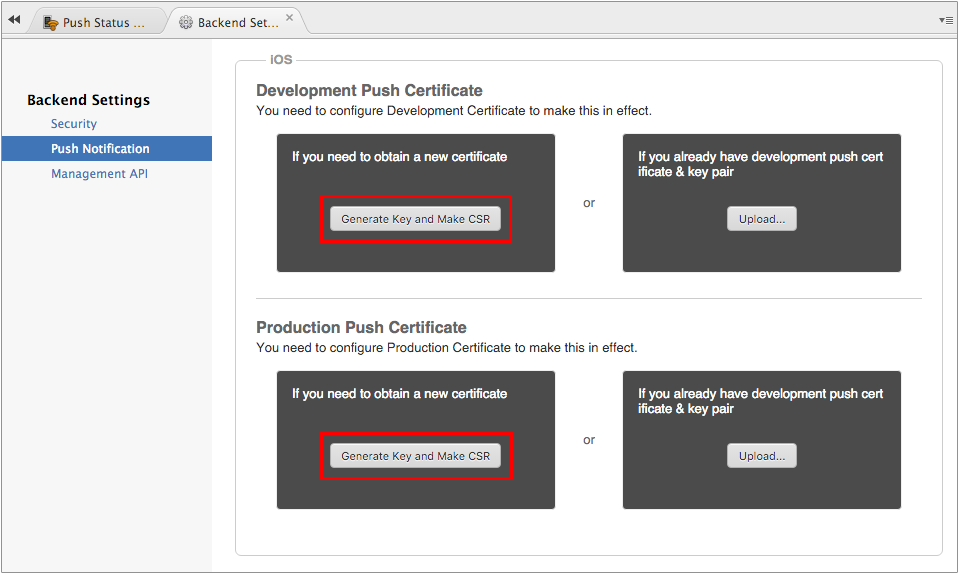

iOS App Push Notification Settings
==================================

APNs (Apple Push Notification Service) is a push notification mechanism
created by Apple to use with iOS apps. In this page, we will show what
you need to do in order to enable push notifications service for iOS
applications with Monaca.

In order to build iOS applications or send iOS push notifications, it is
necessary to join the [iOS Developer
Program](https://developer.apple.com/programs/).

Step 1: Create a Request File in Monaca Cloud IDE
-------------------------------------------------

1.  From the Backend Panel in Monaca Cloud IDE, go to
    Push Notification --&gt; Backend Settings --&gt; Push Configuration.

> 
>
> > width
> >
> > :   600px
> >
> > align
> >
> > :   left
> >
2.  Under iOS section, select Generate Key and Make CSR of Development
    or Production Push Certificate as you prefer.

> 
>
> > width
> >
> > :   600px
> >
> > align
> >
> > :   left
> >
3.  Enter a name (for the key) and email address (the Apple ID you have
    registered with the iOS Dev Center) and click Generate.

> 
>
> > width
> >
> > :   300px
> >
> > align
> >
> > :   left
> >
4.  Please download the CSR file after it's created.

Step 2: Create Push Certificates in iOS Dev Center
--------------------------------------------------

There are two types of Push certificates which can be issued in iOS Dev
Center:

-   Development SSL Certificate: required for Debug build
-   Production SSL Certificate: required for either Ad Hoc or Release
    build.

To create Push certificates, please proceed as follows:

1.  From [Apple Developer page](https://developer.apple.com/), go to
    Member Center.
2.  Sign in using Apple ID and password you used to enroll in the iOS
    Developer Program. If you haven’t enrolled in this program yet,
    please subscribe at
    [here](https://developer.apple.com/programs/ios/).
3.  Go to Certificates, Identifiers & Profiles. Then, the following page
    will appear:

> 
>
> > width
> >
> > :   600px
> >
> > align
> >
> > :   left
> >
4.  Register your App ID as an Explicit App ID and enable Push
    Notifications service in iOS Dev Center. Please refer to
    register\_appID.

> 

>
> Push notification can't be used if your App ID is registered as
> Wildcard or Push Notifications service is disabled.
>
> 

5.  From the list of App IDs, select on your explicit App ID and click
    Edit.

> 
>
> > width
> >
> > :   600px
> >
> > align
> >
> > :   left
> >
6.  Click Create Certificate button of the type of certificate you want
    to create. Then, click Continue.

> 
>
> > width
> >
> > :   600px
> >
> > align
> >
> > :   left
> >
7.  Browse the CSR file you downloaded from Monaca Cloud IDE earlier and
    click Generate.
8.  Once your certificate is generated, please download it. You will
    need to upload this file to Monaca Cloud IDE later.

Step 3: Upload Push Certificates to Monaca Cloud IDE
----------------------------------------------------

1.  From the Backend Panel in Monaca Cloud IDE, go to
    Push Notification --&gt; Backend Settings --&gt; Push Configuration.

> 
>
> > width
> >
> > :   600px
> >
> > align
> >
> > :   left
> >
2.  Under iOS section, select Upload Certificate of Development or
    Production Push Certificate appropriately. After that, the push
    notification configuration for iOS app is completed.

> 
>
> > width
> >
> > :   600px
> >
> > align
> >
> > :   left
> >

