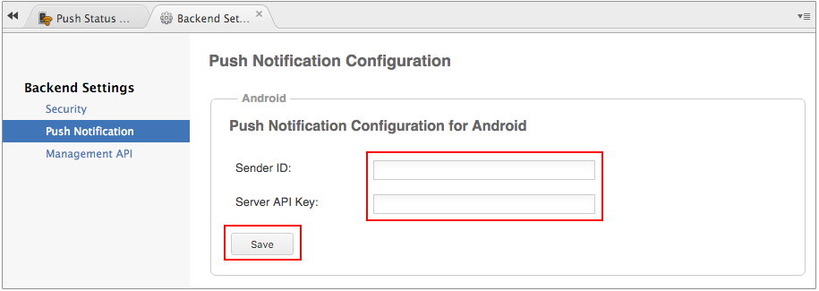

Android App Push Notification Settings
======================================

Monaca sends push notifications via FCM (Firebase Cloud Messaging). FCM
is a cross-platform messaging solution that lets you reliably deliver
messages at no cost. Using FCM, you can notify a client app that new
email or other data is available to sync. You can send notification
messages to drive user reengagement and retention. For use cases such as
instant messaging, a message can transfer a payload of up to 4KB to a
client app.

In this page, we will guide you to enable push notifications service for
Android applications with Monaca.

You are required to have a Google account for this configuration.

Step 1: Get API Key from Firebase Console
-----------------------------------------

`Server API key` and `Sender ID` from Firebase console is required to
integrate FCM with Monaca. To get this API key, please proceed as
follows:

1.  Go to [Firebase Console](https://console.firebase.google.com/) and
    sign in with a valid Google account.
2.  Click on + Add project.

> 
>
> > width
> >
> > :   700px
> >
> > align
> >
> > :   left
> >
3.  Input a project's name and choose your country/region. Then, click
    on CREATE PROJECT.

> 
>
> > width
> >
> > :   450px
> >
> > align
> >
> > :   left
> >
4.  Once your project is created, go to Project settings from the left
    menu.

> 
>
> > width
> >
> > :   550px
> >
> > align
> >
> > :   left
> >
5.  In the Settings page, go to CLOUD MESSAGING. Then, you will be able
    to see the `Server Key` and `Sender ID` which will be used in Monaca
    push notification settings later. The `Server Key` is Server API key
    for the push notification and the `Sender ID` represents a sender.

> 
>
> > width
> >
> > :   700px
> >
> > align
> >
> > :   left
> >
Step 2: Configure FCM Parameters in Monaca
------------------------------------------

1.  From the Backend Panel in Monaca Cloud IDE, go to
    Push Notification --&gt; Backend Settings --&gt; Push Configuration.

> 
>
> > width
> >
> > :   700px
> >
> > align
> >
> > :   left
> >
2.  Under Android section, input the Sender ID and Server API Key and
    click on Save. Now, the Android push notification is enabled and
    ready to use.

> 
>
> > width
> >
> > :   700px
> >
> > align
> >
> > :   left
> >

