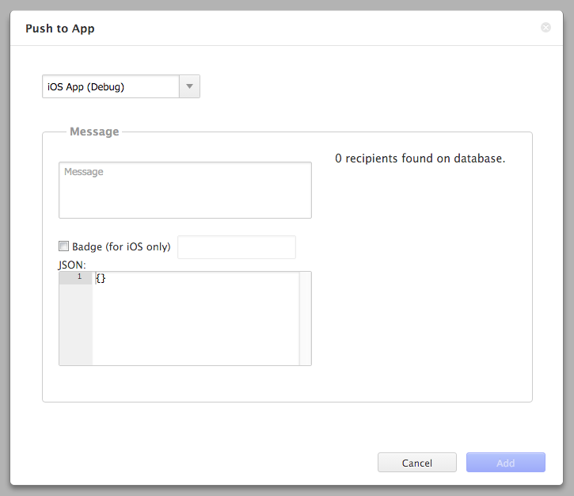

Introduction to Push Notification
=================================

<div class="admonition note">

For release and ad-hoc builds on Cordova 6.2 platform, please select the
release build option when sending push notifications.

</div>

What is Push Notification?
--------------------------

Push notification is the information sent from a software application to
a computing device without a specific request from the client. There are
several types of push notification such as:

1.  *Text*: a pure text message
2.  *Badge*: a round, red, numerical icon that appears on the top right
    corner of an application icon
3.  *Sound*: a sound file played to alert the user of a new notification
4.  *JSON Data*: data in JSON format used by the application

<div class="admonition note">

Currently, sound notifications are not supported in Monaca.

</div>

The behavior of an application upon receiving a push notification
differs depending on the device's platform and whether the application
is opened or closed. In other words, Android notifications are displayed
in the upper part of the screen. On the other hand, iOS notifications
are displayed as a pop-up dialogue box.

Prerequisite
------------

In order to send push notifications from Monaca Cloud IDE, you need to
have a Monaca Backend first. If you don't have one yet, please refer to
Monaca Backend Tutorial &lt;cloud\_ide\_adding\_backend&gt; or
backend\_control\_panel\_getting\_started on how to create a Monaca
Backend.

How to Enable Push Notification with Monaca
-------------------------------------------

Before start using push notification with Monaca, it is necessary to
configure the Push Notification settings for each platform of your
application as follows:

-   ios\_app\_push\_settings
-   android\_app\_push\_settings

<div class="admonition note">

Monaca Debugger can't receive push notifications. You must build your
app to receive push notifications.

</div>

How to Send Push Notification with Monaca
-----------------------------------------

To send push notifications from Monaca Cloud IDE, please proceed as
follows:

1.  From Monaca Cloud IDE, click on Cloud icon and select
    Push Notification.
2.  The Push Status & History tab will appear as shown below:

> {width="600px"}

3.  From the Push Status & History tab, click Push to App. Then the
    following screen will appear:

> {width="400px"}

4.  Choose the intended OS.
5.  Fill in necessary information regarding the push notification as
    shown below:

>   ------------------------------------------------------------------------------------------------------------------------------------------------------------------------
>   Parameter              Description
>   ---------------------- -------------------------------------------------------------------------------------------------------------------------------------------------
>   Title                  \[Android only\] a title of a notification
>
>   Message                the text content of a notification
>
>   Badge                  \[iOS only\] If you enable this option and set its value to an Integer of 1 or greater, the number will be displayed on the top right corner of
>                          the app icon.
>
>   JSON Data              \[Optional\] Once the user opens the notification, the application will receive the JSON data. Please refer to receive\_json\_data.
>   ------------------------------------------------------------------------------------------------------------------------------------------------------------------------
>
6.  Click on Add button to send the push notification. It will be queued
    first and sent afterward. The delivery might delay if there is high
    traffic at our Push Server. Please refer to the next section on how
    to monitor the status of your push notifications.

Monitoring Push Notification Delivery
-------------------------------------

You can monitor your push notification activities in the Push Status &
History page. In this page, you can see various information related to
each push notification such as:

  ---------- -----------------------------------------------------------------------------------------------------------------------------------------------------------------------------------------------------------------------------------------------------------------------------------------------------------------------------------------------------
  Platform   the platform of the recipient
  Status     status of the push notification
  Date       the date and time when sending the push notification
  Devices    the number of successfully sent notifications. It is formatted as `Successful Distribution Number/Total Number of Distribution` in which Successful Distribution represents the number of successfully sent notification while the Total Number of Distribution is the total number of sent notifications (see the screenshot below as an example).
  Message    the text content of the notification
  ---------- -----------------------------------------------------------------------------------------------------------------------------------------------------------------------------------------------------------------------------------------------------------------------------------------------------------------------------------------------------

> {width="700px"}

How to Receive JSON Data
------------------------

JSON data within a push notification can be received by
`monaca.cloud.Push.setHandler` function. The JSON data will be passed to
`data` variable within the callback. Here is an example of how to use
this function:

``` {.sourceCode .javascript}
monaca.cloud.Push.setHandler(function(data) {
  // JSON data within push notification
  console.log(data);
  console.log(data.item)
});
```

<div class="admonition note">

The callback function will be called after the page is loaded; However,
there may be some time lag. Therefore, please be cautious about this.

</div>
