# Usage

In this page, we will describe how to use Monaca Debugger with Monaca
Cloud IDE and other Monaca local development tools such as Monaca
Localkit, Monaca CLI and Monaca for Visual Studio:

-   by\_debugger\_ide
-   debugger\_with\_local\_tools

<div class="admonition note">

Before starting, please install Monaca Debugger on your device or
emulator. Please refer to
How to Install Monaca Debugger &lt;debugger\_installation\_index&gt; for
more information.

</div>

## Monaca Debugger with Monaca Cloud IDE

There are 2 main debugging mechanism can be used to debug Monaca apps
with Monaca Cloud IDE such as:

-   debugger\_debug\_panel: DOM inspection and console debugging.
-   by\_debugger\_usb: DOM inspection, console and JavaScript debugging.

### Monaca Debug Panel

A popular Web debugging tool, [Weinre (WEb INspector
REmote)](https://people.apache.org/~pmuellr/weinre/docs/latest/), is
embedded in debug panel of Monaca Cloud IDE. This tool allows you to
debug your app using console debugging and DOM inspection.

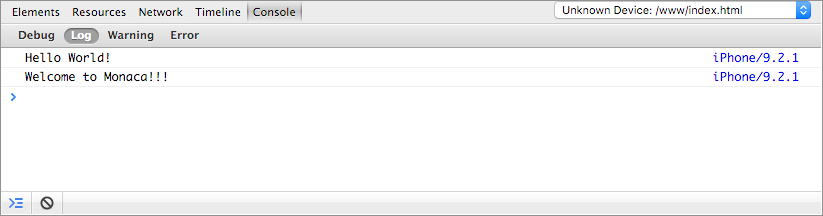

> align
>
> :   center
>
> width
>
> :   600px
>
> Debug Panel inside Monaca Cloud IDE

In order to start debugging your app by using Monaca Debugger with
Monaca Cloud IDE, please follow the following instruction:

1.  Open a project in Monaca Cloud IDE.
2.  Run the project in Monaca Debugger.
3.  Make sure your device is connected with the IDE. For example, if
    your device appears in the debug panel, it is successfully connected
    to the IDE (see the screenshot below). Otherwise, please refresh the
    IDE or debugger until the connection is successfully made. After
    your device is connected to the IDE, you can start debugging your
    app.

> 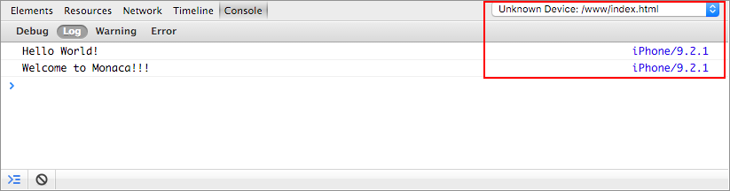{width="600px"}

#### Console Debugging

Console API allows you to write/display message to the Console using
Javascript.

Here are some common used Console APIs:

-   `console.log()`: displays a message to the console.
-   `console.debug()`: displays a message as debug level (you can see
    the message in the debug tab).
-   `console.warn()`: displays a message with yellow warning icon.

<div class="admonition note">

For more information about Console APIs, please refer to [Console API
references](https://developer.chrome.com/devtools/docs/console-api).

</div>

Here is an example of using Console APIs:

1.  Copy and paste the following code into the `index.html` file.

> ``` {.sourceCode .html}
> <!DOCTYPE HTML>
> <html>
>     <head>
>         <meta charset="utf-8">
>         <meta name="viewport" content="width=device-width, height=device-height, initial-scale=1, maximum-scale=1, user-scalable=no">
>         <script src="components/loader.js"></script>
>         <link rel="stylesheet" href="components/loader.css">
>         <link rel="stylesheet" href="css/style.css">
>         <script>
>             var a = 1;
>             var b = 2;
>
>             function debug(){
>                 var c = a + b;
>                 console.log("debug() function is executed!");
>                 console.log("executed! variable c is " + c);
>             }
>
>             debug();
>         </script>
>     </head>
>     <body>
>         <h1>Hello World!</h1>
>     </body>
> </html>
> ```

2.  Save the code and connect Monaca Debugger with Monaca Cloud IDE. Run
    the project in Monaca Cloud IDE. Now you can see those messages in
    the debug panel in Monaca Cloud IDE and in the app log inside the
    Monaca Debugger.

> 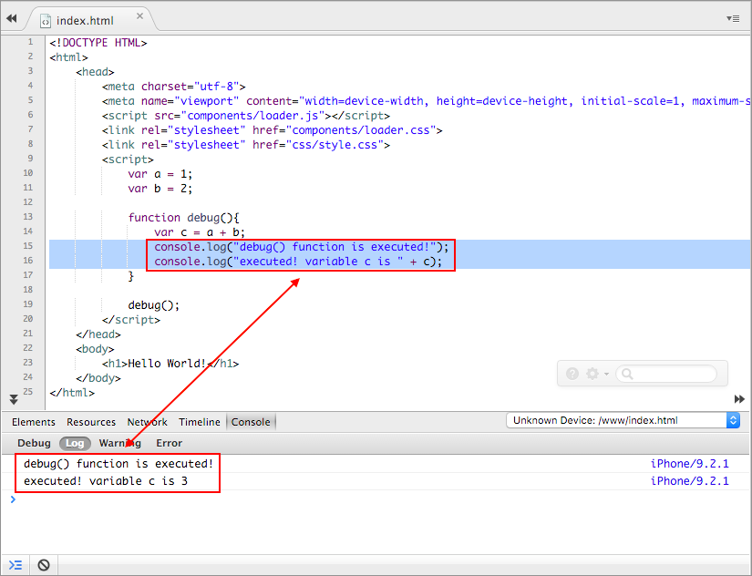{width="600px"}
>
> 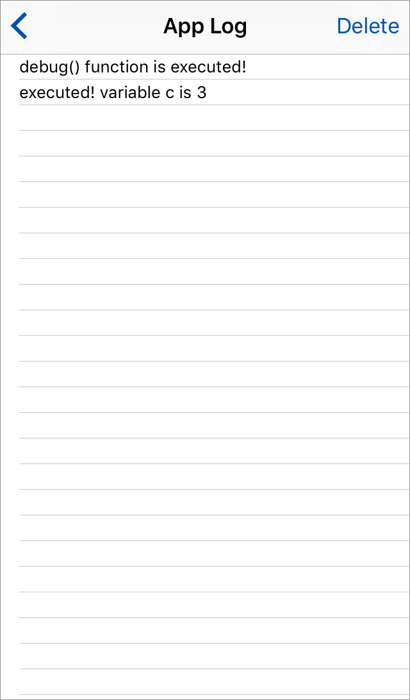{width="250px"}

3.  This debug panel also allows you to see the error log of your app as
    well.

> 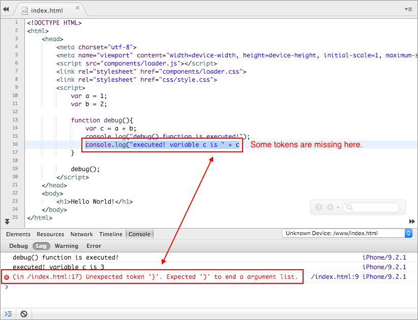{width="600px"}

#### DOM Inspection

DOM (Document Object Model) Inspection allows you to:

-   view DOM structure of the currently active page.
-   modify the DOM structure as well as CSS of the page with live
    update.

For more information, please refer to [DOM Inspection and Style
Editing](https://developer.chrome.com/devtools/docs/dom-and-styles).

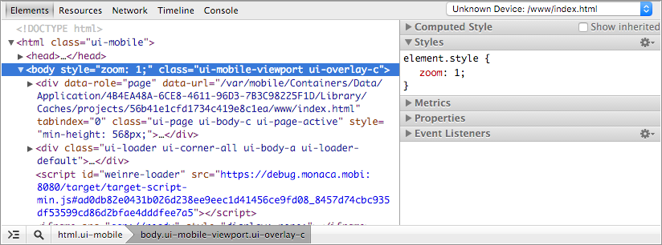

> align
>
> :   center
>
> width
>
> :   600px
>
> DOM Inspection inside Debug Panel

### USB Debugging

With USB debugging, you can:

-   Console debugging: uses console to diplay messages and set debugging
    sessions.
-   DOM inspection: views and modifies DOM structures with live updates.
-   JavaScript debugging: profiles JavaScript performance, sets
    breakpoint and execution control.

There are two ways to implement USB debugging depends on what kind of
device you use:

1.  If you are using iOS device, you can use
    Safari Remote Debugging &lt;usb\_debugging\_ios&gt;.
2.  If you are using Android device, you can use
    Chrome Remote Debugging &lt;usb\_debugging\_android&gt;.

#### Safari Remote Debugging (for iOS and Mac only)

<div class="admonition note">

You are required to do some setups before using USB debugging with
Monaca. Please refer to pre\_debug\_app.

</div>

1.  Connect your iOS device to your Mac via a USB cable.
2.  Run your Monaca project in your Monaca custom built debugger.
3.  Open Safari app and go to Develop menu. Your iOS device's name
    should be shown in the list. Then, you can select each available
    page of Monaca app from a submenu belonged to your device's name.

> 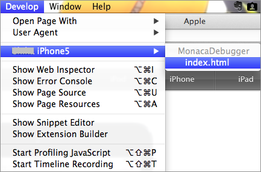{width="400px"}

4.  Then, the Web Inspector window will appear. In this window, you can
    use timing HTTP requests, profiling JavaScript, manipulating the DOM
    tree, and more. In order to learn how to use Web Inspector, please
    refer to [Safari Web
    Inspector](https://developer.apple.com/library/ios/documentation/AppleApplications/Conceptual/Safari_Developer_Guide/Introduction/Introduction.html#//apple_ref/doc/uid/TP40007874).

> 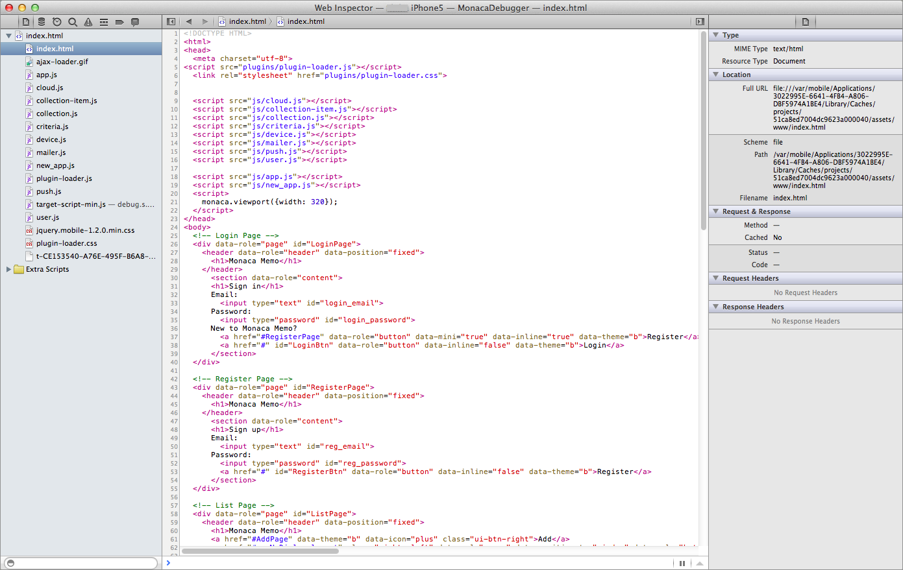{width="700px"}

#### Chrome Remote Debugging (for Android with Google Chrome Browser)

<div class="admonition note">

You are required to do some setups before using USB debugging with
Monaca. Please refer to pre\_debug\_app.

</div>

1.  Connect your Android device to your PC via a USB cable.
2.  Run your Monaca project in Monaca Debugger.
3.  In Chrome address bar, enter `chrome://inspect/`.
4.  Then, the Devices page appears as shown below. Your connected
    Android device should be shown there. Click inspect belonged to your
    device.

> 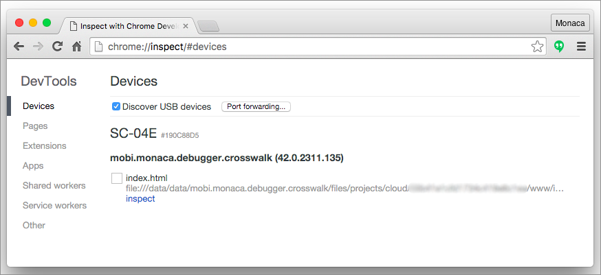{width="600px"}

5.  Then, the Chrome Inspection page should be appeared. Now you can
    start debugging your Monaca app. For more information, please refer
    to [How to Use Chrome
    DevTools](https://developer.chrome.com/devtools).

> 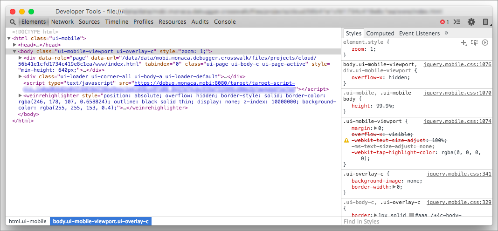{width="600px"}

## <a name="debugger-with-local-tools"></a> Monaca Debugger with Monaca Local Development Tools

Monaca local development tools are Monaca CLI, Monaca Localkit and
Monaca for Visual Studio.

### <a name="pre-debug-app"></a> Prerequisite for USB Debugging with Monaca

### USB Debugging with Monaca Local Development Tools

In order to start this debugging, please do as follows:

1.  Pair Monaca Debugger with the host PC (running Monaca local tool
    such as Monaca Localkit, Monaca CLI or Monaca for Visual Studio).
    You may want to refer to:

> -   Pairing in Monaca Localkit &lt;localkit\_pairing\_debugging&gt;
> -   Pairing in Monaca CLI &lt;cli\_pairing&gt;
> -   Pairing in Monaca for Visual Studio &lt;monaca\_vs\_pairing&gt;

2.  Choose a project to run.
3.  Click on the debugger menu as shown below:

> 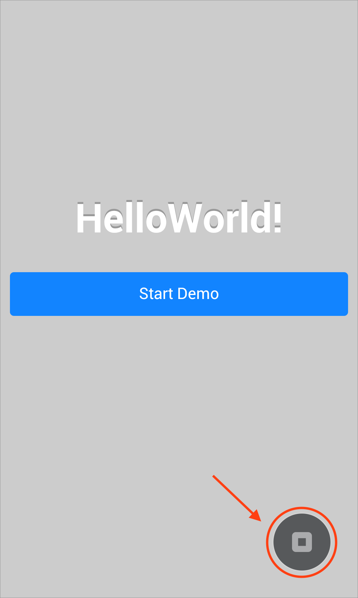
>
> > width
> >
> > :   250px
> >
> > align
> >
> > :   left
> >
4.  Click the Inspector button to start the USB debugging.

> 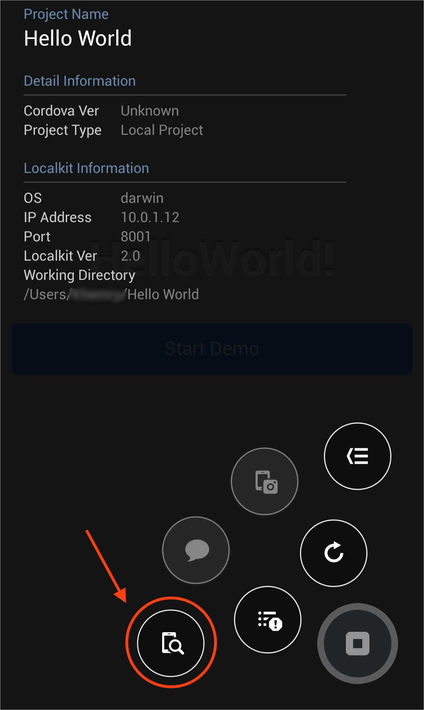
>
> > width
> >
> > :   250px
> >
> > align
> >
> > :   left
> >
5.  The Chrome DevTools/Safari Web Inspector should be opened in the
    host PC; otherwise, please refer to troubleshoot\_inspector. For
    more information, please refer to:

> -   [How to Use Safari Web
>     Inspector](https://developer.apple.com/library/safari/documentation/AppleApplications/Conceptual/Safari_Developer_Guide/Introduction/Introduction.html)
> -   [How to Use Chrome
>     DevTools](https://developer.chrome.com/devtools)
>
> 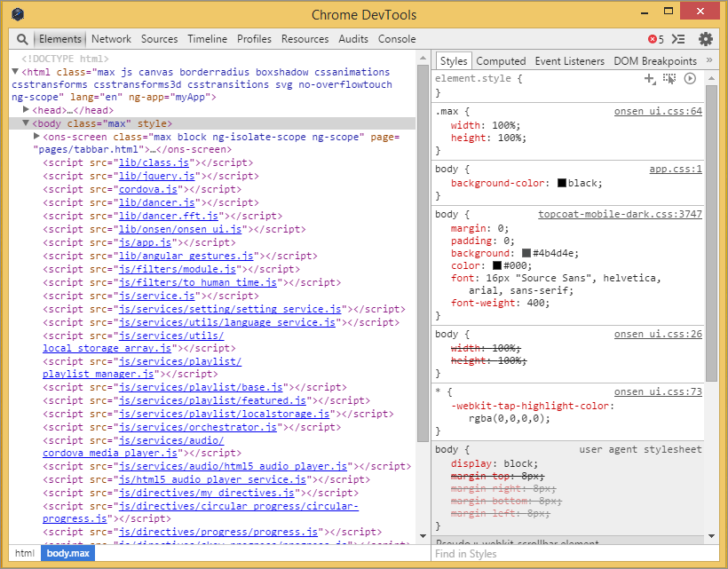
>
> > width
> >
> > :   600px
> >
> > align
> >
> > :   left
> >

