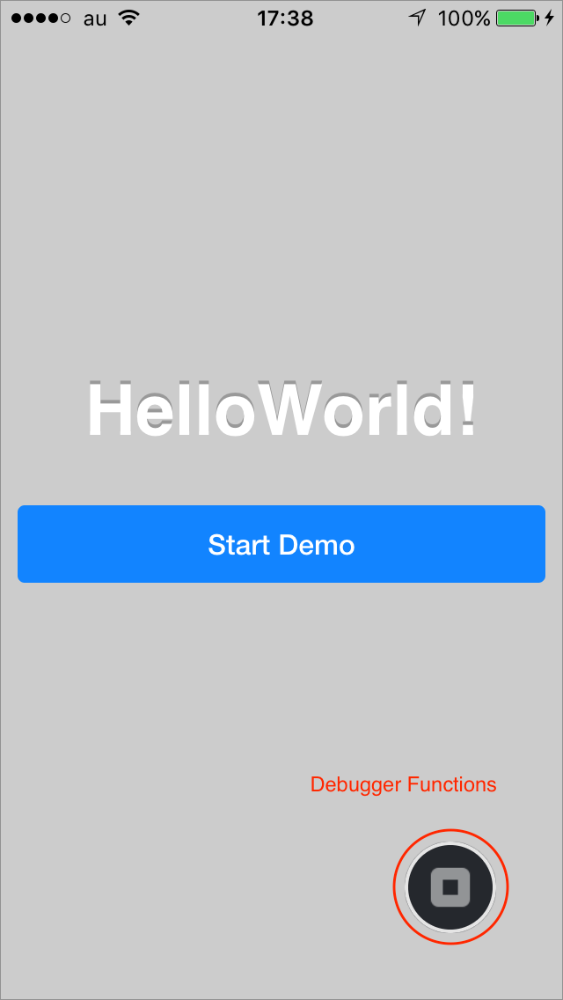
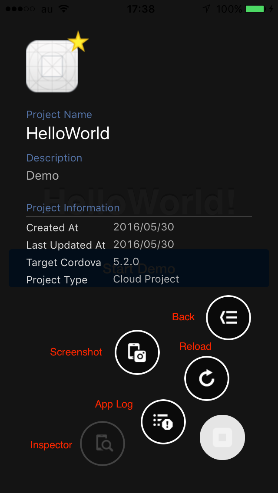
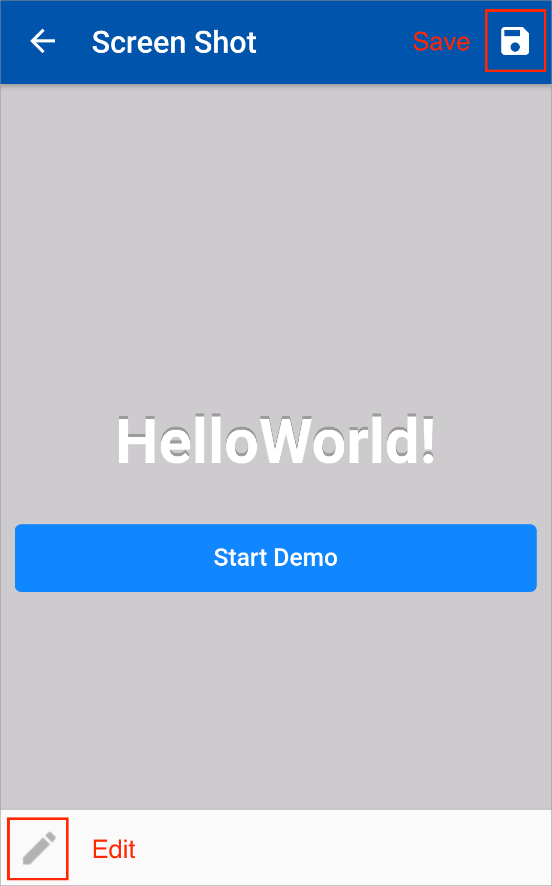
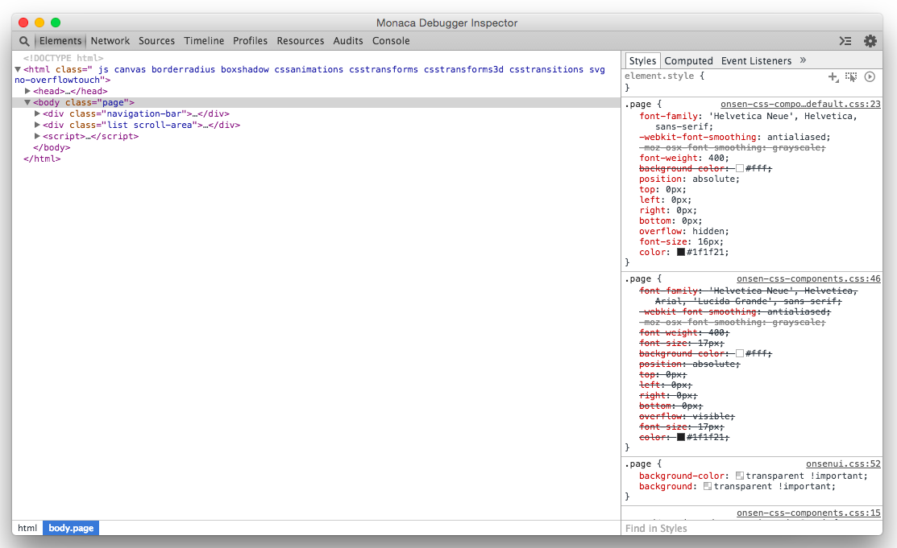
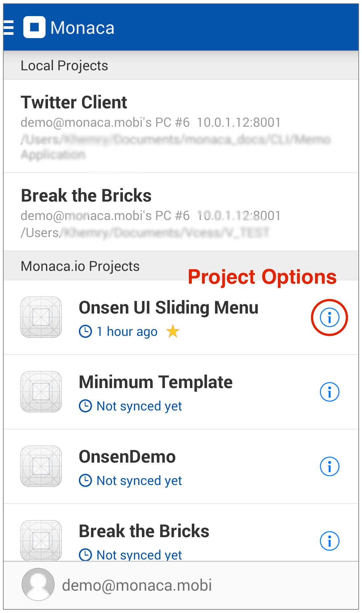
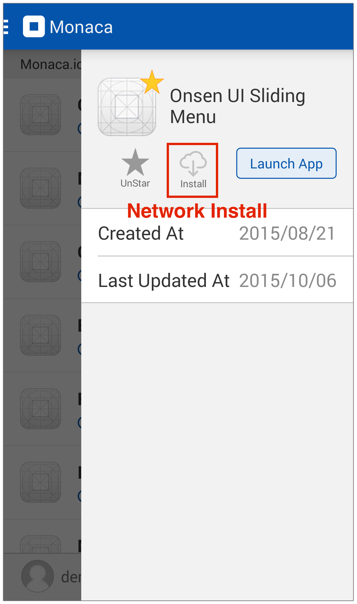

Functionalities
===============

Debugger Functions
------------------

Monaca Debugger provides useful functions for testing/debugging your
apps. You can find Debugger Functions button when you run a project in
Monaca Debugger. When you click on Debugger Functions button, you will
see:

> -   Back button
> -   Reload button
> -   Screenshot button \<screenshot\>
> -   App Log button \<app\_log\>
> -   Inspector button \<debugger\_inspector\>
>
> 
>
> > width
> > :   250px
> >
> > align
> > :   left
> >
> 
>
> > width
> > :   250px
> >
> > align
> > :   left
> >
### Screenshot

While using Monaca Debugger, you can also take screenshots and save them
on the device's storage. In the screenshot screen, you can:

> -   edit the screenshot.
> -   save it on the device's storage.
>
> 
>
> > width
> > :   250px
> >
> > align
> > :   left
> >
### App Log

Monaca Debugger allows you to see the log of the app which will show the
progress and errors of the app while running.

### Inspector

Inspector function allows you to debug/inspect your project using
[Chrome Dev Tools](https://developer.chrome.com/devtools/index). Before
started, you need to enable USB debugging on your device. For more
information, please refer to
USB Debugging with Monaca \<pre\_debug\_app\>.

> width
> :   700px
>
> align
> :   center
>
> **note**
>
> Inspector function is only available when you are using
> Monaca Localkit \<monaca\_localkit\_index\> or
> Monaca CLI \<monaca\_cli\_index\>. Please refer to
> USB debugging with Monaca Localkit \<localkit\_debug\_app\> or
> USB debugging with Monaca CLI \<cli\_debug\_app\>.

Debugger Menu
-------------

Inside Debugger Menu, there are:

### All Projects

Shows a list of all Monaca projects which can be run on Monaca Debugger.
There are two types of projects in Monaca Debugger such as:

> -   Monaca.io projects: projects created in Monaca Cloud IDE.
> -   Local projects: projects created in
>     Monaca Localkit \<monaca\_localkit\_index\> or
>     Monaca CLI \<monaca\_cli\_index\> and stored in your local PC.
>     Local projects appear only when the debugger is paired with Monaca
>     Localkit/CLI.

### Local Computers

Shows a list of all currently paired and available computers. Paired
computers are local computers running Monaca Localkit/CLI and currently
connected to the debugger. You may want to see to the following
documentations:

> -   Pairing Monaca Debugger with Monaca Localkit \<localkit\_pairing\_debugging\>
> -   Pairing Monaca Debugger with Monaca CLI \<cli\_pairing\_debugging\>
> -   Pairing Monaca Debugger with Monaca for Visual Studio\<monaca\_vs\_testing\_debugging\>

### Debugger Settings

Shows debugger's configurations such as memory usage, splash screen
(Android only), storage usage and so on. Synced files are synced project
files while storage data is previously stored data (local storage data)
created by your projects on your device's memory.

> 

### Debugger Information

Shows detailed information of the debugger such as version, platform,
CLI version, WebView Engine (Android only) and available plugins.

Project Options
---------------

From the project list inside Monaca Debugger, there is a Project Options
button for each Monaca.io project.　Inside this Project Options button,
you can:

-   favorite current project: moves it to the top of the project list.
-   lunch app: runs current project in the debugger.
-   use network install: installs a built app of the current project
    directly from Monaca debugger.

    

    

> **note**
>
> In order to use network install, you need to create a debug build of
> the project from Monaca Cloud IDE first. Please refer to
> debug build for iOS \<types\_of\_build\_ios\> or
> debug build for Android \<types\_of\_build\_android\>.

> **note**
>
> For iOS debugger, network install is only available for the
> custom built debugger \<custom\_debugger\_ios\>. The App store version
> doesn't have this function.
