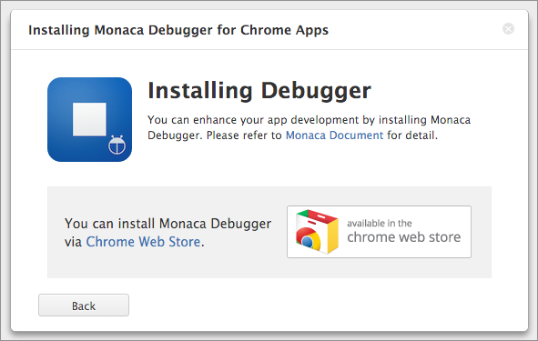
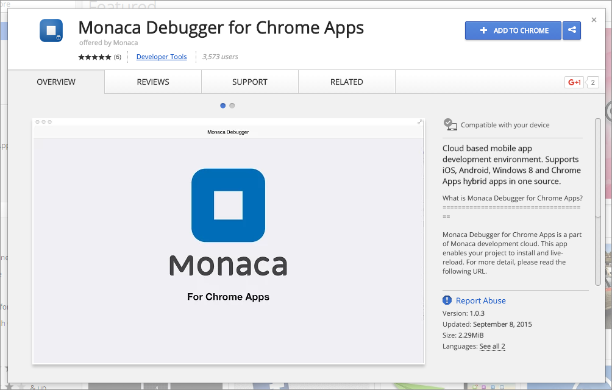
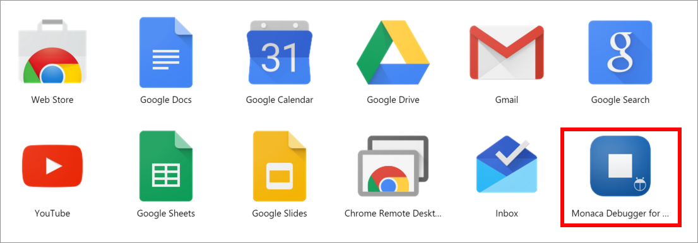
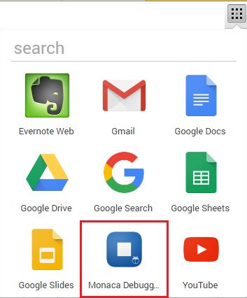
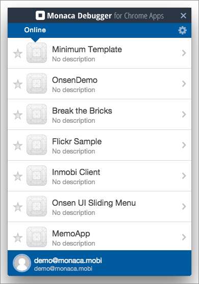
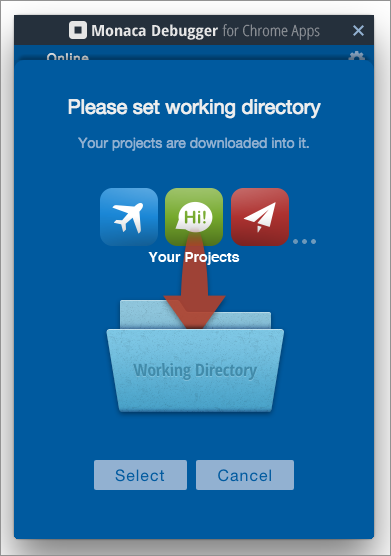
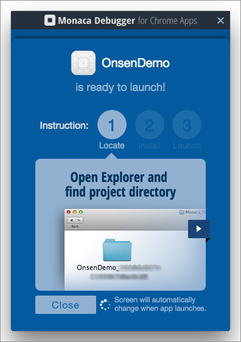
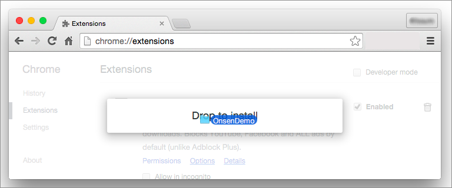
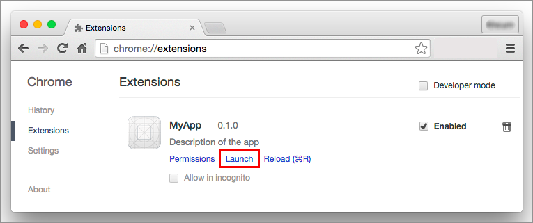
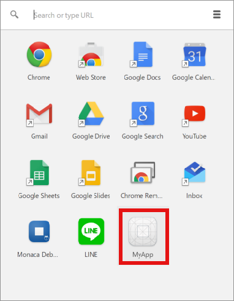

Monaca Debugger for Chrome Apps
===============================

Monaca Backend plugin is not included in Monaca Debugger.

Chrome Apps are web apps running by Chrome Engine. The installed Chrome
Apps can also be used offline. All Chrome Apps are published in Chrome
Web Store.

Installation
------------

1.  You can install [Monaca debugger for Chrome Apps via Chrome Web
    Store](https://chrome.google.com/webstore/detail/eampeimhpjmnimjbfajnbegjnafjadld).
    Or from Monaca Cloud IDE menu, go to
    Debug --&gt; Setup Monaca Debugger --&gt; Debugger for Chrome Apps.

> {width="400px"}

2.  Click on ADD TO CHROME button to add Monaca Debugger to your Chrome.

> {width="700px"}

3.  Then, a dialog will appear. Click Add app button to finalize the
    installation process.

Running Monaca Debugger
-----------------------

1.  From the bookmarks bar, click on Apps or go to chrome://apps from
    the address bar. A list of installed Chrome Apps will appear.

> {width="600px"}

2.  You can also use Chrome App Launcher to access all of your Chrome
    Apps right from your desktop. You can install Chrome App Launcher
    from [Chrome Web Store](https://chrome.google.com/webstore).

> {width="350px"}

3.  After launching the app, log into Monaca with your Monaca account.
    Then, the list of your Monaca projects will be shown in the
    debugger.

> {width="350px"}

4.  You can now select a project to run in the debugger. If it's the
    first time you run that project, you will be asked to set a working
    directory representing a location to store your downloaded projects
    from the cloud.

> {width="350px"}

5.  Wait for the selected project to be downloaded. When the download is
    completed, the following screen will appear.

> {width="350px"}

6.  Open Chrome browser and go to chrome://extensions from the address
    bar. Then, go to the downloaded project folder. Then, drag and drop
    that folder into Chrome Extensions page.

> {width="600px"}

7.  Now your app is installed and ready to launch. Click Launch to run
    the app.

> {width="600px"}

8.  It can also be found in Chrome App Launcher.

> {width="350px"}
