Monaca Debugger for Android Emulator
====================================

In this page, we will describe how Monaca Debugger works on AVD (Android
Virtual Device) called Android Emulator. With this, you can simulate
Android apps on a PC. Moreover, it is useful when you want to test your
apps on more than one Android device.

Monaca Backend plugin is not included in Monaca Debugger.

In this page, the instruction is made on a Mac OS X. Internet is needed
in order to run Monaca Debugger on emulator.

Step 1: Setting up an Android Virtual Device
--------------------------------------------

1.  Download and install [Android
    Studio](http://developer.android.com/sdk/index.html).
2.  Run Android Studio.
3.  Create a new project or open an existing one.
4.  Click on AVD Manager. Then, Android Virtual Device Manager dialog
    will appear.

> 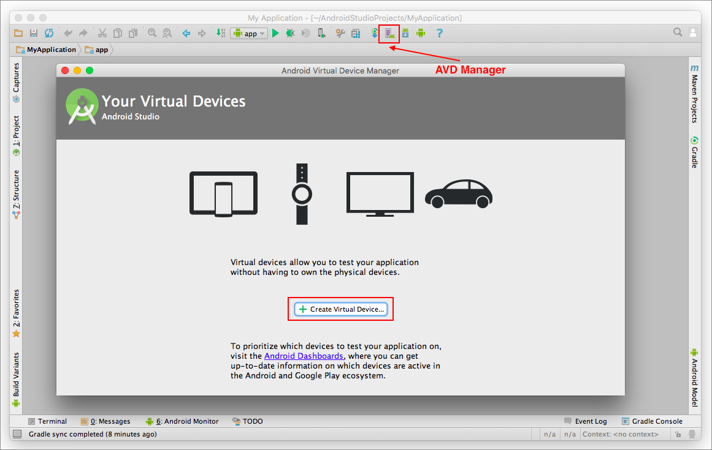
>
> > width
> >
> > :   600px
> >
> > align
> >
> > :   left
> >
5.  Click + Create Virtual Device.
6.  Select an Android device and click Next.

> 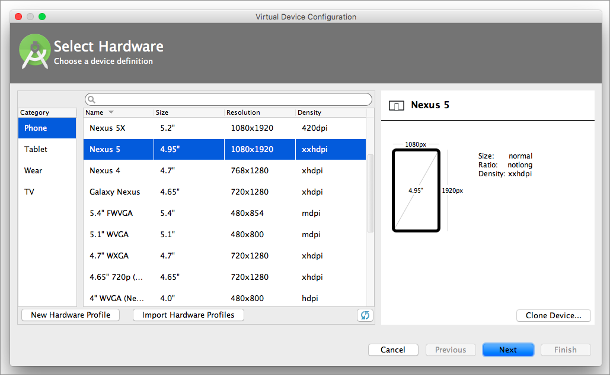
>
> > width
> >
> > :   600px
> >
> > align
> >
> > :   left
> >
7.  Select a system image (you may need to download it first) and click
    Next.

> 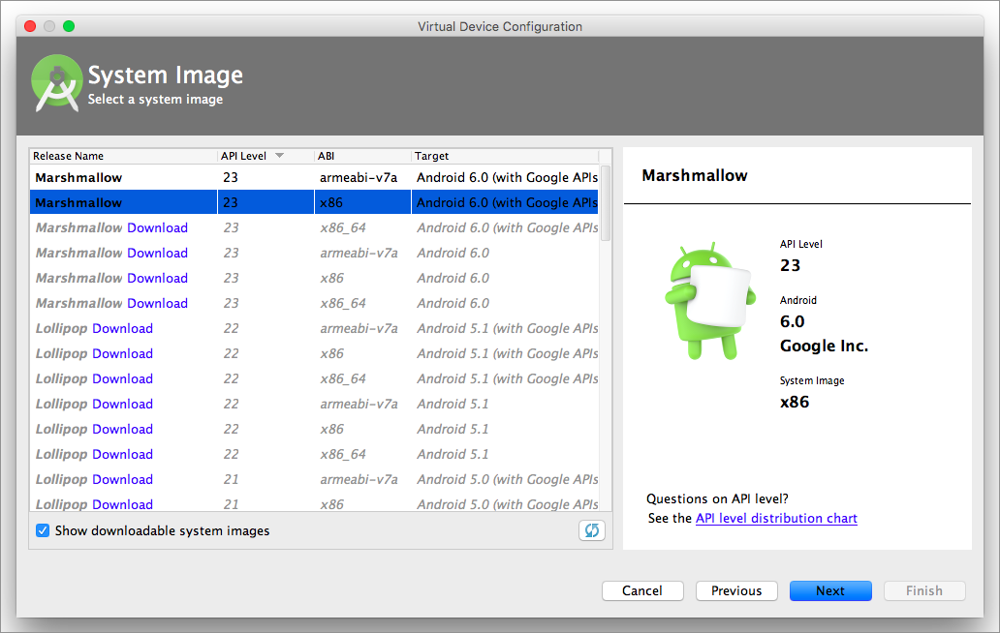
>
> > width
> >
> > :   600px
> >
> > align
> >
> > :   left
> >
8.  Make the virtual device's configurations. Go to
    Show Advanced Settings for other settings such as Memory and
    Storage, Device Frame and Keyboard.

> 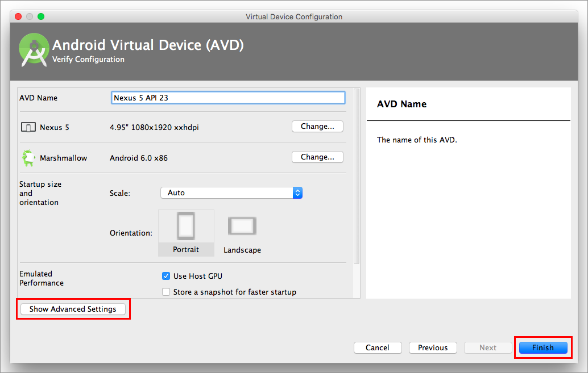
>
> > width
> >
> > :   600px
> >
> > align
> >
> > :   left
> >
> 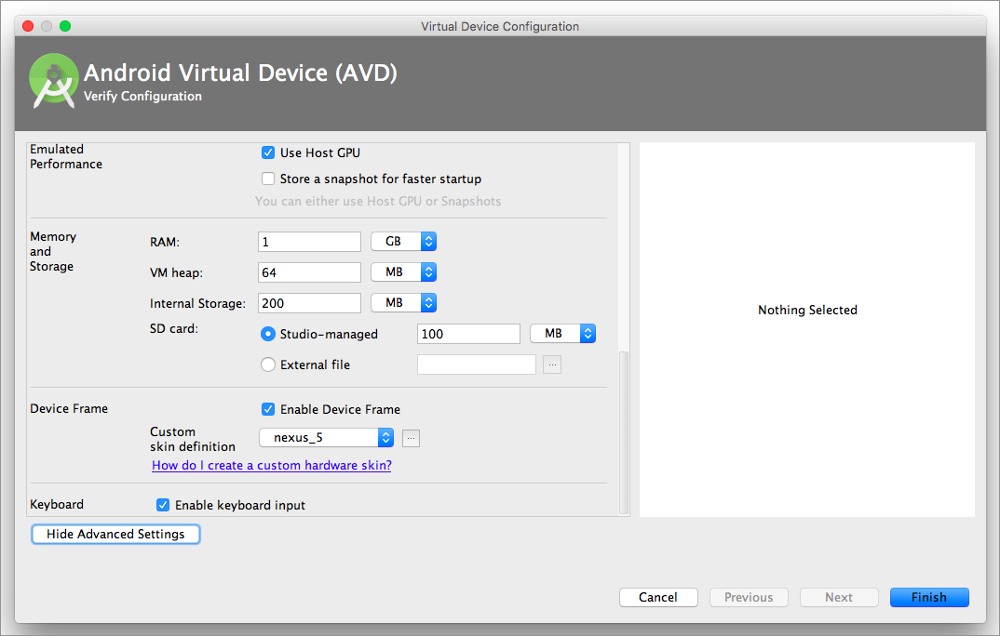
>
> > width
> >
> > :   600px
> >
> > align
> >
> > :   left
> >
9.  After completing the configurations, click Finish.

Step 2: Building Custom Monaca Debugger for Android
---------------------------------------------------

1.  Go Monaca Cloud IDE and build custom Monaca Debugger for Android.
    For more information, please refer to custom\_debugger\_and.
2.  Download the debugger file and upload it to any file hosting
    services such as Google Drive, Dropbox and so on.
3.  Get a download link of the uploaded file. You will need to use this
    link later in the virtual device.

Step 3: Installing Monaca Debugger
----------------------------------

1.  Go to AVD Manager and launch the virtual device.

> 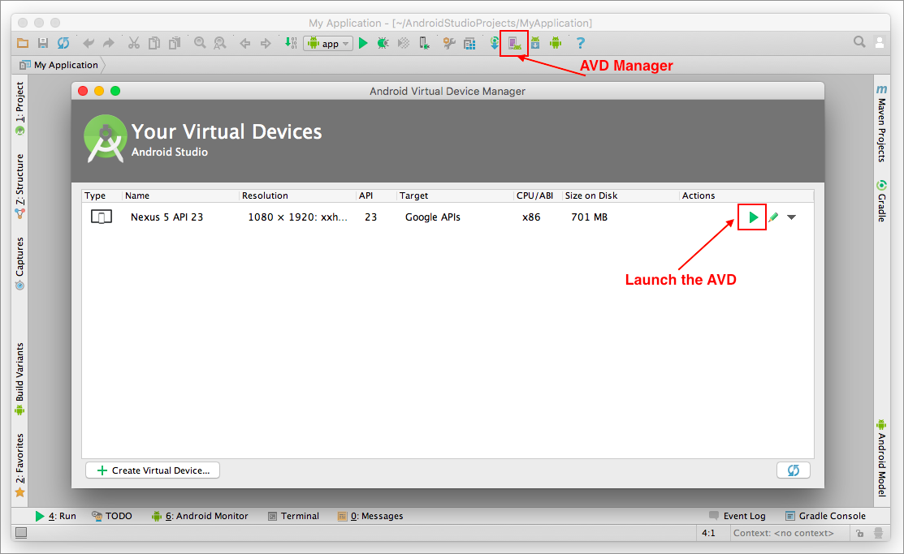
>
> > width
> >
> > :   600px
> >
> > align
> >
> > :   left
> >
2.  From your virtual device, open a browser and go to the download link
    you created in Step 2&lt;step\_2&gt; to download custom Monaca
    Debugger for Android.

> 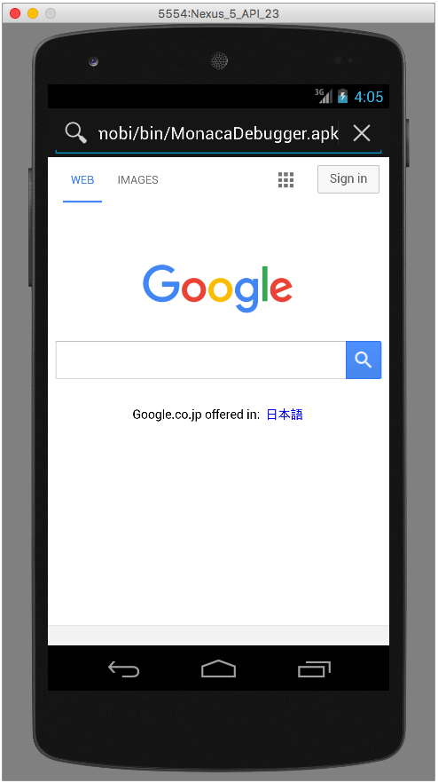
>
> > width
> >
> > :   350px
> >
> > align
> >
> > :   left
> >
3.  After the download is completed, click on the downloaded file to
    start installing the debugger.

> 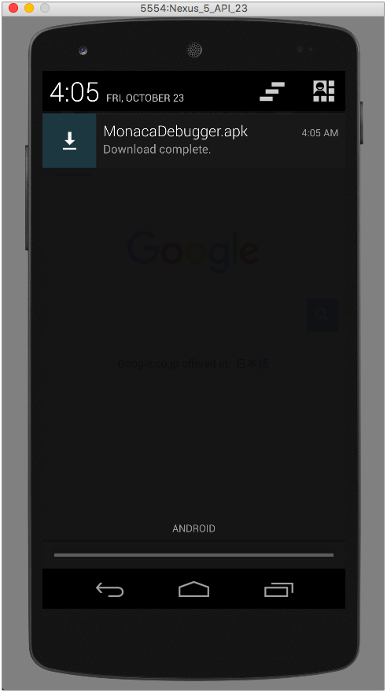
>
> > width
> >
> > :   350px
> >
> > align
> >
> > :   left
> >
4.  Follow the installation wizard.

> 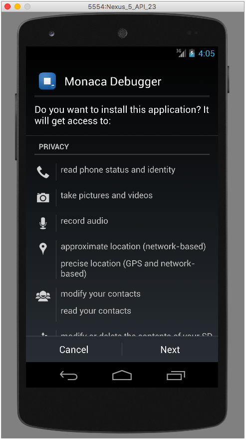
>
> > width
> >
> > :   350px
> >
> > align
> >
> > :   left
> >
5.  Once the installation is completed, you can find Monaca Debugger in
    your apps page.

> 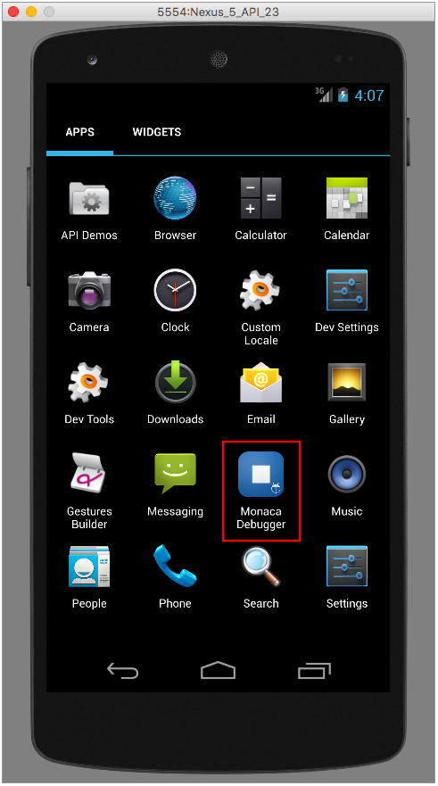
>
> > width
> >
> > :   350px
> >
> > align
> >
> > :   left
> >
Step 4: Running a Project on Monaca Debugger
--------------------------------------------

1.  Open Monaca Debugger and sign in with your Monaca account.

> 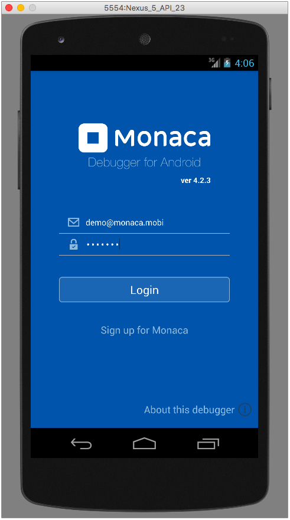
>
> > width
> >
> > :   350px
> >
> > align
> >
> > :   left
> >
2.  Click on a project you want to run in Monaca Debugger.

> 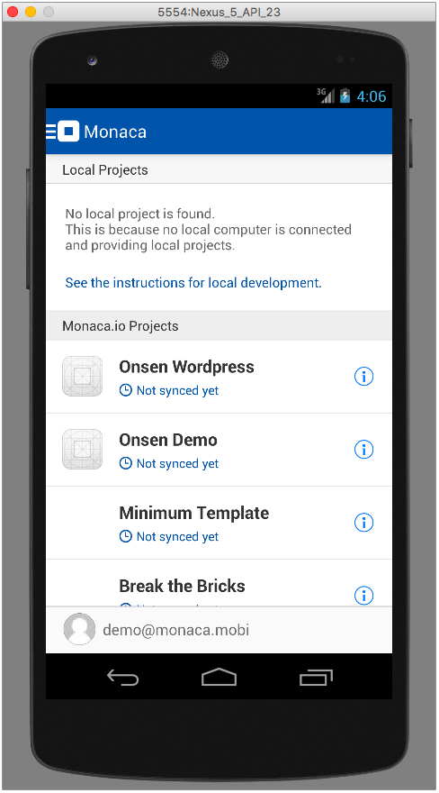
>
> > width
> >
> > :   350px
> >
> > align
> >
> > :   left
> >
3.  Now, your project is running. You can start testing your project.
    Please refer to monaca\_debugger\_features and
    debugging\_monaca\_app on what you can do with Monaca Debugger in
    order to help enhancing your app development processes.

> 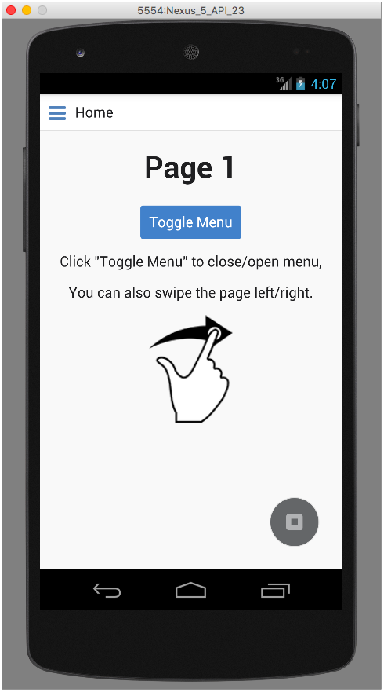
>
> > width
> >
> > :   350px
> >
> > align
> >
> > :   left
> >

