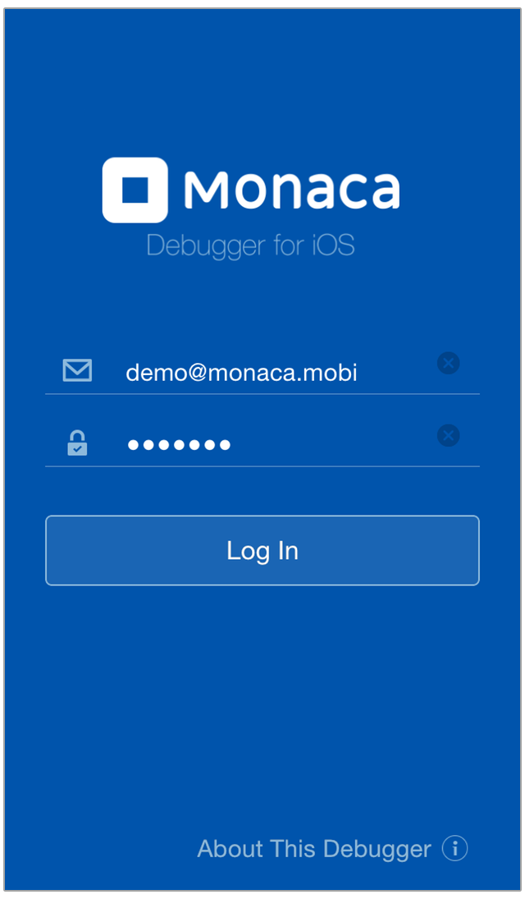
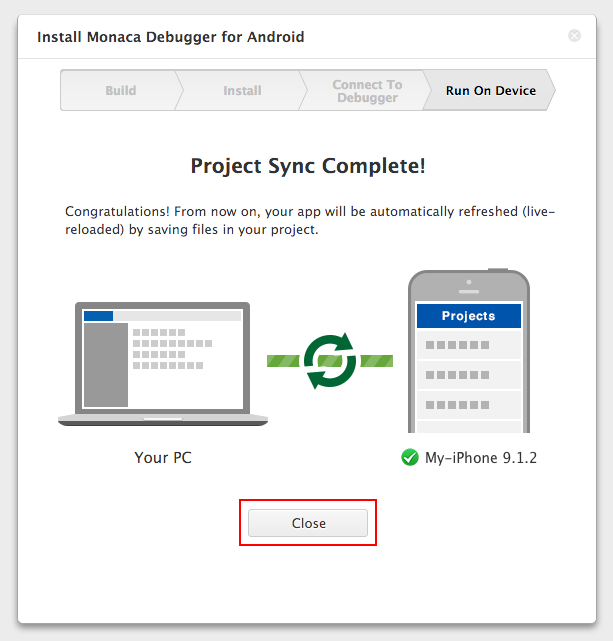

Monaca Debugger for iOS
=======================

> height
>
> :   250px
>
> align
>
> :   center
>
> Monaca Debugger for iOS

Monaca Backend plugin is not included in both Monaca Debugger (store
version) and Custom Monaca Debugger.

If the Cordova version of your project is lower than 5.2, it might not
work properly with Monaca Debugger 5.X.X. There are two ways to fix this
issue:

1.  upgrade Cordova version &lt;changing\_cordova\_version&gt; of your
    project.
2.  use Custom Monaca Debugger &lt;custom\_debugger\_ios&gt;.

Cordova Plugins
---------------

In Monaca Debugger, core and third-party Cordova plugins are
automatically included.

Monaca includes Core cordova plugins which are a minimal set of APIs
such as Battery Status, Camera, Contacts, Device and so on. For a
complete list of core Cordova plugins, please refer to
cordova\_core\_plugins.

Monaca also includes some third-party Cordova plugins such as Statusbar,
DatePicker, BarcodeScanner, Bluetooth and so on. For a complete list of
currently included third-party Cordova plugins, please refer to
third\_party\_cordova\_index.

While developing your project, you may need to add other third-party or
custom &lt;custom\_cordova\_plugin&gt; Cordova plugins to your project.
The standard Monaca Debugger (Store Version) doesn't have these newly
added plugins. For this reason, your project might not run properly in
the debugger. Therefore, you need to use Custom Monaca Debugger. Custom
Monaca Debugger is a debugger which is built from a Monaca Project
within Monaca Cloud IDE. Please refer to custom\_debugger\_ios.

USB Debugging
-------------

Monaca Debugger for iOS supports USB debugging functions with Safari
browser such as:

-   console debugging: using console to diplay message.
-   DOM inspection: viewing and modifying DOM structure with live
    updates.
-   JavaScript debugging: profiling JavaScript performance, setting
    breakpoint and execution control.

For more information, please refer to
USB Debugging with Monaca Debugger for iOS Apps&lt;usb\_debugging\_ios&gt;.

Localkit Inspector Function
---------------------------

Inspector can be used when developing either on Windows or Mac OS.

Network Install
---------------

Network Install is a feature provided by Custom Monaca Debugger for iOS
allowing you to install the built app (debug build only) using the
debugger. For more information, please refer to
how to use Network Install feature&lt;debugger\_project\_options&gt;.

This feature is not available for Monaca Debugger for iOS available at
App Store.

##  How to Build Custom Monaca Debugger

### Preparation

You are required to have:

-   a valid private key
-   Developer certificate
-   Development provisioning profile

Please refer to building\_for\_ios (Step 1 and Step 2) on how to get the
above items and make necessary configurations before start building the
custom debugger. After obtaining the above necessary files, start
building with the following instruction:

### Start Building

1.  From Monaca Cloud IDE menu, go to
    Debug --&gt; Setup Monaca Debugger.
2.  Select Debugger for iOS --&gt; Build and Install.

> 
>
> > width
> >
> > :   400px
> >
> > align
> >
> > :   left
> >
3.  Upload the development provisioning profile and click Next button.
4.  This may take sometimes until your building is completed. The
    following screen will appear after the build is successfully
    completed. Then, you can download the built file to your PC and
    install it to your iOS device using iTune.

> 
>
> > width
> >
> > :   400px
> >
> > align
> >
> > :   left
> >
5.  After installing the debugger on your device, sign in with your
    Monaca account. Then, tick
    I've installed Monaca Debugger and logged in and click Next.
6.  Monaca Cloud IDE will then try looking for the debugger. Once it's
    found and connected, click Run on Device to start running the
    current app in your debugger right away.

> 
>
> > width
> >
> > :   400px
> >
> > align
> >
> > :   left
> >
7.  By now your app should be running in your debugger. Try testing your
    app in the debugger and making some changes in the IDE. You will be
    able to see the changes reflected in the debugger once you save the
    changes.

> 
>
> > width
> >
> > :   400px
> >
> > align
> >
> > :   left
> >

