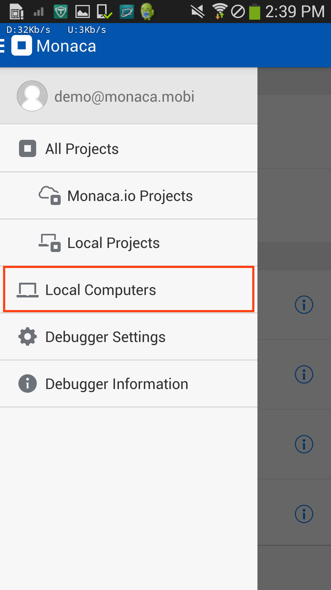
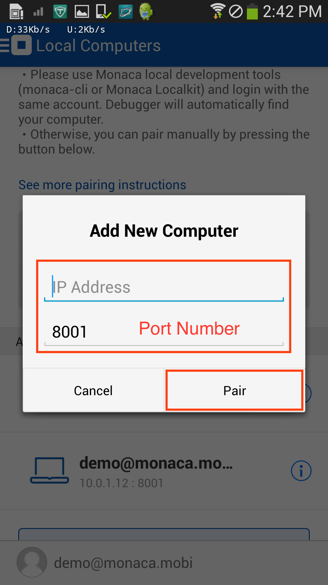

##  Fail to Pair Monaca Debugger

Several reasons can be considered when Monaca Debugger fails to pair
with the host PC such as:

1.  Monaca Debugger can see the host PC but fail to pair: this is most
    likely a firewall problem in the host PC. The host PC needs to
    accept TCP connection from the debugger. Port 8001 will be used, and
    you can change the server port in
    Preferences dialog&lt;localkit\_preference&gt;. Please change the
    port or configure your firewall settings to try agian.
2.  Monaca Debugger does not detect the host PC: please check and see if
    your device and the host PC are connected to the same network. If
    they are connected to the same network but Monaca Debugger still
    can't detect the host PC, please do a manual pairing.

You can manually pair Monaca Debugger with the host PC as follows:

1.  From Monaca Debugger, click on the toggle menu on the top-left
    corner and select Local Computers button.

> 
>
> > width
> >
> > :   250px
> >
> > align
> >
> > :   left
> >
2.  Click Pair the New Computer button.
3.  Input the IP address of the host PC and port number&lt;ip\_port&gt;.
    Then, click Pair button.

> 
>
> > width
> >
> > :   250px
> >
> > align
> >
> > :   left
> >
4.  Once the pairing is successfully completed, the host PC should
    appear under "Paired computers" as shown below:

> 
>
> > width
> >
> > :   250px
> >
> > align
> >
> > :   left
> >

Some Wi-Fi access points (usually that is available for public access)
don't allow the connected clients to communicate each other. In this
case, please try pairing on another local network.

*IP Address and Port Number*

IP address and port number are needed to establish the communication
path between Monaca Debugger and the host PC. IP address represents the
host PC and port number (set to 8001 by default) represents Monaca local
development tool (such as Monaca CLI, Localkit or Monaca for Visual
Studio). Please note that the communication can't be established if the
port number you use is not opened or is already used.

In case, you are using more than one of Monaca local development tools
at the same time on the same host PC, you are required to use different
port for each tool. Otherwise, the pair will fail.

+---------+----------------------------------+-------------------------+
| *OS*    | Mac                              | Windows                 |
+---------+----------------------------------+-------------------------+
| *IP     | Find IP address:                 | Find IP address:        |
| Address |                                  |                         |
| *       | 1.  Open "Terminal" window.      | 1.  Open "Command       |
|         | 2.  Type `ifconfig`.             |     Prompt" window.     |
|         |                                  | 2.  Type `ipconfig`.    |
+---------+----------------------------------+-------------------------+
| *Port   | Check if a port number is        | Check if a port number  |
| Number* | available:                       | is available:           |
|         |                                  |                         |
|         | 1.  Open "Terminal" window.      | 1.  Open "Command       |
|         | 2.  Type `lsof -i :PORT_NUMBER`. |     Prompt" window.     |
|         |                                  | 2.  type `netstat`.     |
+---------+----------------------------------+-------------------------+

##  Inspector Isn't Loaded

If the inspector does not open, please try the following actions:

-   verify if you have done all necessary setups described
    here&lt;localkit\_debug\_app&gt;.
-   verify that you are running the application on the debugger.
-   try plug off & in to see if the computer can find the device.
-   check if the device and the host PC are connected via USB cable.
-   check if you use the right Monaca Debugger.
    Read more&lt;localkit\_debug\_app&gt;.
-   kill all `adb` processes if multiple of them are running.
-   kill all `iosWebKitDebugProxy` processes if multiple of them are
    running.
-   restart the host PC.

