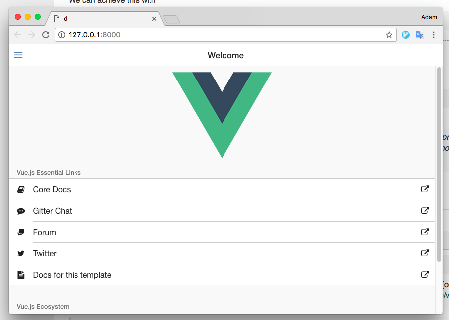
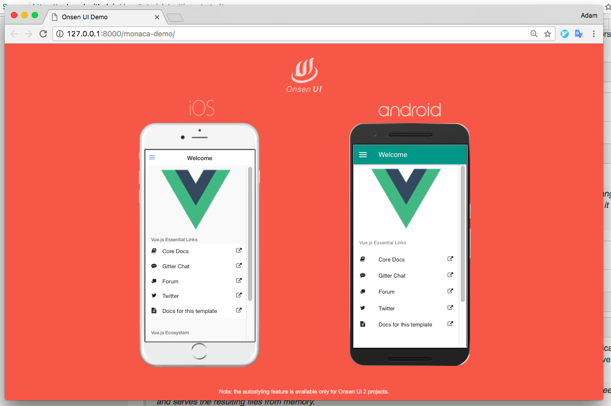
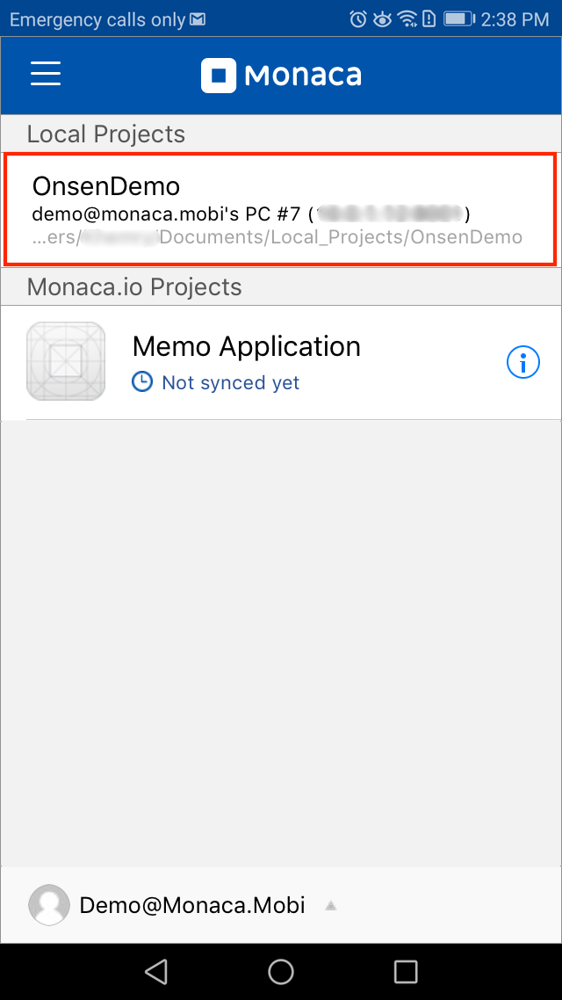
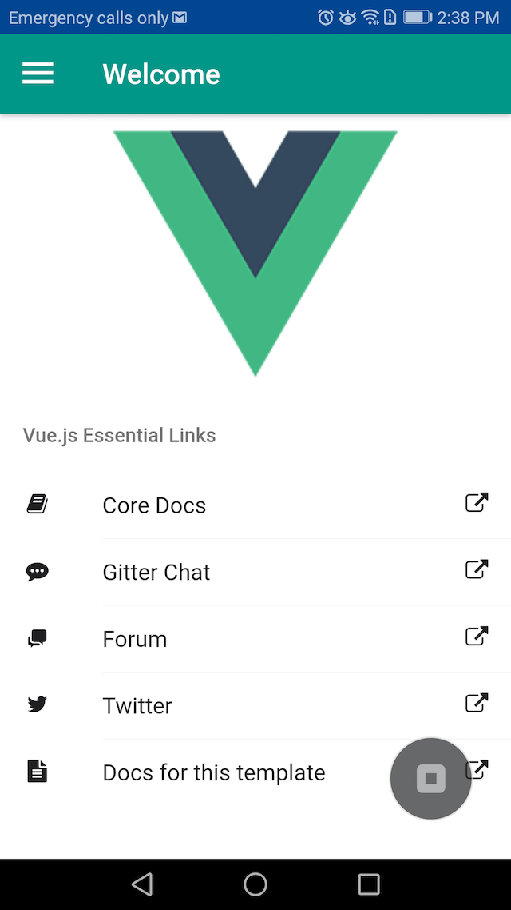
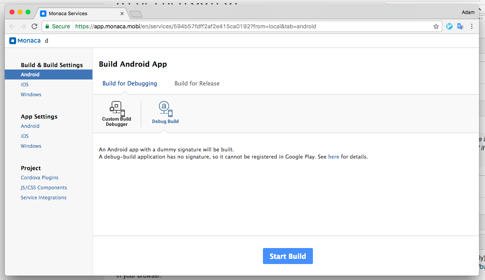

Getting Started with Vue 2 & Onsen UI 2 Template
================================================

The new [Vue with Onsen UI
template](https://github.com/OnsenUI/vue-cordova-webpack) is a great way
to approach mobile development and can easily be integrated with Monaca
CLI in order to take advantage of all its features.

In this page, we will demonstrate how to import Vue with Onsen UI
template into Monaca CLI.

Step 1: Installing Vue CLI
--------------------------

Open a Command Prompt window (for Windows) or Terminal window (for Mac)
and type the following command:

> ``` {.sourceCode .bash}
> npm install -g vue-cli
> ```

Step 2: Importing the Template
------------------------------

1.  Create a new project based on the template by using the command
    below:

> ``` {.sourceCode .bash}
> vue init OnsenUI/vue-cordova-webpack projectName
> ```

2.  Navigate to the project folder and run `npm install`

> ``` {.sourceCode .bash}
> cd projectName
> npm install
> ```

Step 3: Running the Template in Monaca CLI
------------------------------------------

With Monaca CLI, you can:

-   create new local projects, import or clone existing projects in
    [Monaca Cloud](https://monaca.io/cloud.html) into your host PC.
-   develop Monaca apps with your favourite local code editors.
-   debug your app either with [Monaca
    Debugger](https://monaca.io/debugger.html) or inspector integration.
-   remote build your projects without any setups locally.

### Prerequisite

If you haven't install Monaca CLI yet, please run the following command:

``` {.sourceCode .bash}
npm install -g monaca
```

### Start Running the Template

In this section, we will briefly show how you could make use of Monaca
CLI with Vue template. Please follow the instruction below to take
advantage of Monaca's features:

1.  Build the template for production and generate `www` files:

> ``` {.sourceCode .bash}
> npm run build
> ```

2.  Run in development mode and load the bundles in memory with hot
    module replacement:

> ``` {.sourceCode .bash}
> npm run dev
> ```
>
> {width="700px"}
>
> Or use `monaca demo` to preview your project in iOS and Android
> simultaneously in a browser:
>
> ``` {.sourceCode .bash}
> npm run build:watch  // In a different terminal
> monaca demo
> ```
>
> {width="700px"}

3.  Want to test your template on a real device? Install [Monaca
    Debugger](https://monaca.io/debugger.html) and run the following
    command:

> ``` {.sourceCode .bash}
> npm run build:watch  // In a different terminal
> monaca debug
> ```
>
> {width="300px"}
>
> {width="300px"}

4.  Then, you can build your template for either iOS and Android easily
    with this command:

> ``` {.sourceCode .bash}
> monaca remote build --browser
> ```
>
> {width="700px"}

These are just a brief view of what you can do with Monaca CLI. If you
would like to learn more about it, please refer to the following
contents:

-   monaca\_cli\_tutorial
-   Monaca CLI Manual &lt;monaca\_cli\_manual&gt;

