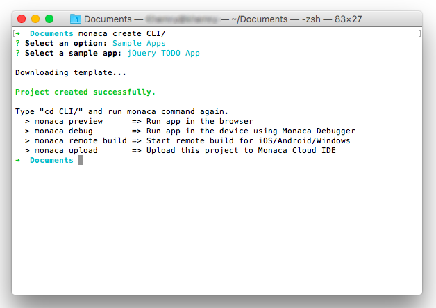
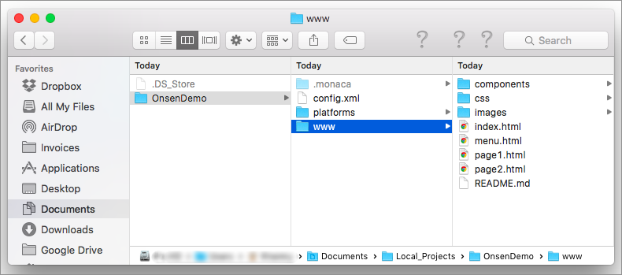

Part 1: Starting a Project
==========================

Step 1: Logging into Monaca
---------------------------

1.  Open a Command Prompt window (for Windows) or Terminal window (for
    Mac) and type the following command:

> ``` {.sourceCode .bash}
> $ monaca login
> ```

2.  Then, you will be asked to input email and password of your Monaca
    account.

> {width="500px"}

<div class="admonition note">

You can use `monaca signup` command if you need to sign up.

</div>

Step 2: Creating a New Project
------------------------------

1.  Create a new project by using the command below:

> ``` {.sourceCode .bash}
> $ monaca create PROJECT_DIRECTORY
> ```

2.  Then, you will be asked to choose either `Sample Apps` or
    `Templates` to create a new Monaca project. In this tutorial, let's
    choose the `Sample Apps` option. Then, select `jQuery TODO App`.

> {width="600px"}

3.  After creating the project, the project's folder will be created on
    your PC. You can then use any local editors to develop your Monaca
    projects.

> {width="600px"}

<div class="admonition note">

You can also use Monaca CLI to import&lt;monaca\_import&gt; or
clone&lt;monaca\_clone&gt; your existing projects from Monaca Cloud.

</div>
