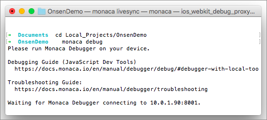
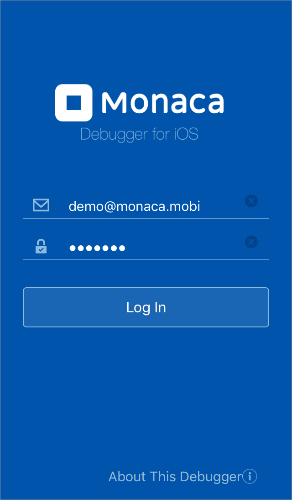
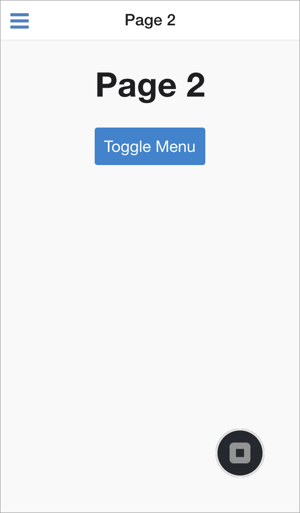

Part 2: Running Monaca Debugger with Monaca CLI
===============================================

Monaca Debugger &lt;monaca\_debugger\_index&gt; is a powerful
application for testing and debugging your Monaca applications on real
devices in real time.

When developing Monaca apps on your local PC, assuming that your local
PC is successfully paired with Monaca Debugger, all changes made to your
project files will be pushed into your Monaca Debugger as soon as you
save those changes.

Before Getting Started
----------------------

Please install Monaca Debugger on your device.

> {width="100px"}
>
> {width="100px"}

<div class="admonition note">

Please refer to
Monaca Debugger Installation &lt;debugger\_installation\_index&gt; for
other platforms.

</div>

Step 1: Pairing Monaca Debugger with Local PC
---------------------------------------------

In order to debug/test a local Monaca app, you need to pair local PC
with Monaca Debugger.

<div class="admonition note">

Before connecting Monaca Debugger to the local PC, please pay attention
to the following points:

1.  Monaca Debugger and the local PC have to connect to the same network
    connection (LAN or Wi-Fi).
2.  Use the same Monaca account for either Monaca Debugger and the local
    PC.
3.  Disable the local PC's firewall.

</div>

1.  In the command window, navigate to your project folder and type
    monaca\_debug command to connect to your Monaca Debugger. Then,
    Monaca CLI will wait for requests from debugger.

> {width="500px"}

2.  Launch Monaca Debugger app and sign in using your Monaca account
    information. Make sure you are using the same account information
    you use for Monaca CLI earlier.

> {width="250px"}

3.  Then, a popup message prompting you to pair the debugger with the
    local PC will appear.

> {width="250px"}

4.  If your pairing is successful, your local project name will appear
    under `Local Projects` in Monaca Debugger. However, if you fail the
    pairing, please refer to troubleshoot\_pair.

> {width="250px"}

Step 2: Running a Project on Monaca Debugger
--------------------------------------------

1.  From the Local Projects list in Monaca Debugger, click on your
    project name to run it.
2.  Now the project should be running as shown in the screenshot below.
    Use Back button within Debugger Menu button to go back to the
    Project List screen.

> {width="250px"}
>
> {width="250px"}

Step 3: Real-time Update between Monaca CLI and Debugger
--------------------------------------------------------

1.  Run the project on the debugger.
2.  You can now try making some changes to your file. For example, try
    changing the starting page of the sample app to Page 2. In order to
    do this, please open the `index.html` file. Then, change the
    `main-page` attribute (inside `<ons-sliding-menu>` tag) to
    `page2.html` and save your changes. The updated code should look
    like this:

> ``` {.sourceCode .html}
> ...
>   <ons-sliding-menu
>       var="app.slidingMenu"
>       menu-page="menu.html"
>       main-page="page2.html"
>       side="left" type="overlay"
>       max-slide-distance="200px">
>   </ons-sliding-menu>
> ...
> ```

3.  If your PC is still connected to Monaca Debugger, it will
    automatically refresh the updates. Now your starting page should be
    Page 2.

> {width="250px"}
