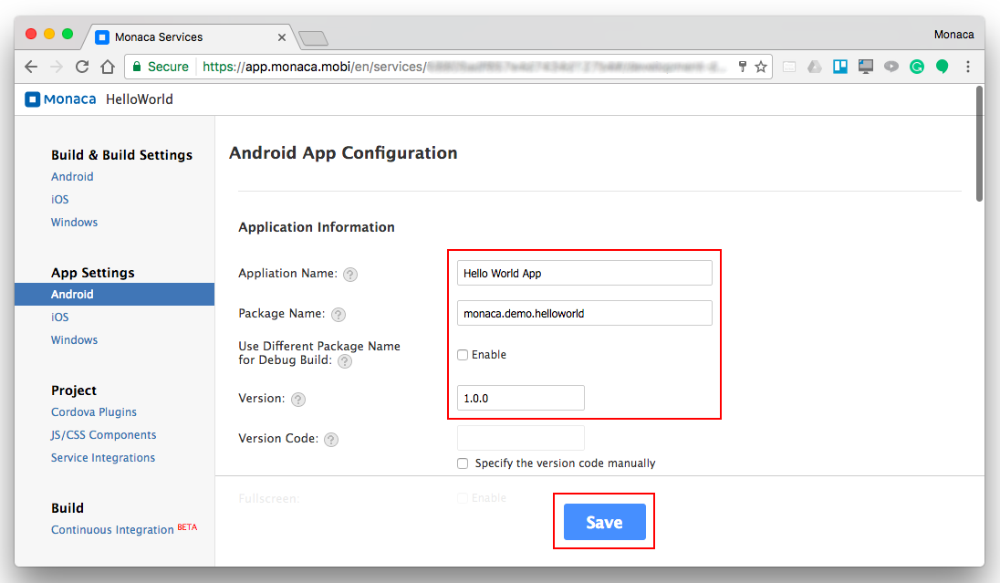
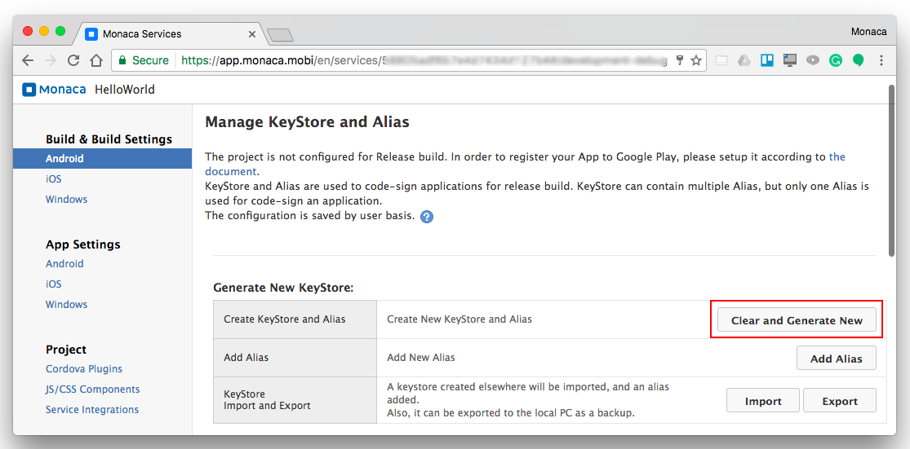
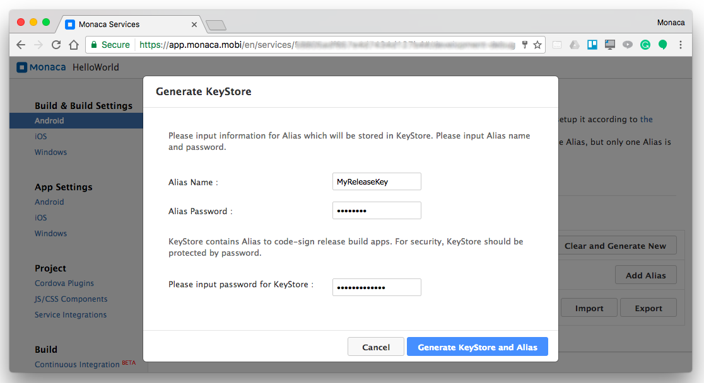
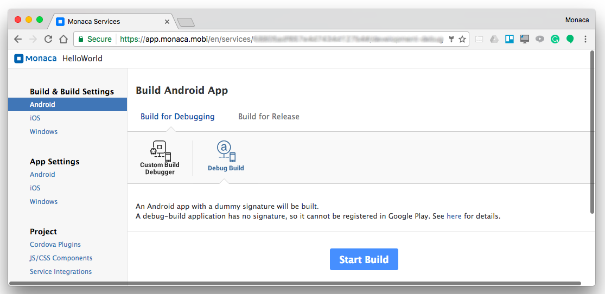
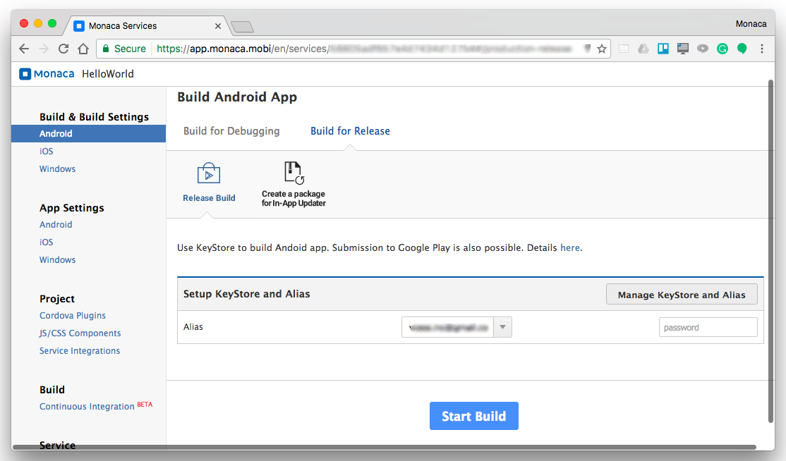
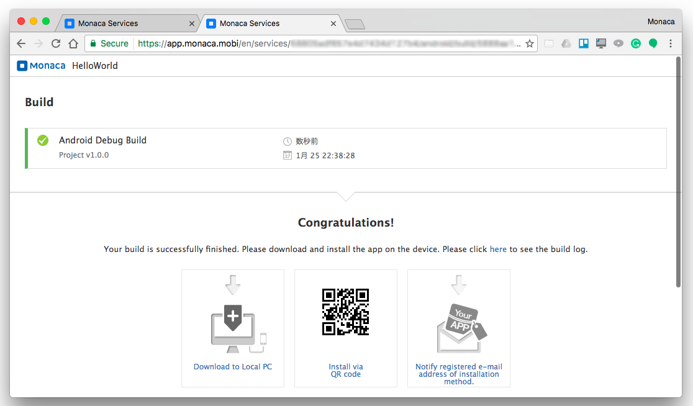

Building for Android
====================

Types of Build
--------------

In Monaca, Android app has two types of build: debug version and release
version. The differences between these types of build are as follows:

+-----------+-------------------------+--------------------------------+
| Types of  | Description             | Installation                   |
| Build     |                         |                                |
+===========+=========================+================================+
| *Debug    | An unsigned package     | -   QR Code                    |
| Build*    | which cannot be         | -   Network Install &lt;debugg |
|           | distributed in the      | er\_project\_options&gt;       |
|           | market                  | -   Sideloading                |
+-----------+-------------------------+--------------------------------+
| *Release  | A signed package with   | -   Sideloading                |
| Build*    | the developer's code    | -   Google Play Store and      |
|           | sign which can be       |     other eligible markets     |
|           | distributed in the      |                                |
|           | market                  |                                |
+-----------+-------------------------+--------------------------------+

Sideloading means installing an application package in APK format onto
an Android device. After building your app, you can download the APK
file and install it.

Step 1: Configure Android App
-----------------------------

1.  From the Monaca Cloud IDE menu, go to
    Config --&gt; Android App Settings.
2.  Fill in the necessary information of your app:

> -   General settings:
>
>     
>
>     > width
>     >
>     > :   700px
>     >
>     > align
>     >
>     > :   left
>     >
> -   Misc: various settings regarding your Android app such as:
>
3.  After finishing the configurations, click Save.

Currently, when you update either iOS's App ID or Android's Package
Name, both of them will change. In other words, they are configured to
be the same. However, it is possible to make them different. Please
refer to faq05-019

Step 2: Configure Android Keystore
----------------------------------

A keystore is a binary file that contains a set of private keys. A
private key represents the entity to be identified with the app, such as
a person or a company. A keystore is encrypted with a password and it
cannot be restored if the password is lost. When a keystore is lost or
it overwrites another keystore, it is impossible to use the same key to
re-sign the signed package.

A keystore is required for the building of a release version for your
Android app. In Monaca, you can either create a new keystore or import
an existing one. In order to create a new keystore, please do as
follows:

1.  From the Monaca Cloud IDE menu, go to
    Config --&gt; Android KeyStore Settings.
2.  Then, Manage KeyStore and Alias page will appear.

> 
>
> > width
> >
> > :   700px
> >
> > align
> >
> > :   left
> >
3.  Click on Clear and Generate New button. Then, the following screen
    will appear:

> 
>
> > width
> >
> > :   700px
> >
> > align
> >
> > :   left
> >
4.  Fill in the necessary information as shown in the above screen such
    as

> -   Alias: a name representing a private key that you will use later
>     when signing your app. Multiple aliases can be stored within one
>     keystore.
> -   Password: a password for the private key (alias).
> -   Password of the keystore: a password for the keystore. You will
>     need this password when importing this keystore.

5.  Then, click Generate Keystore and Alias button to Generate the
    keystore.

When a keystore is lost, it is impossible to use the same key to re-sign
the signed package. Therefore, always back up and keep the keystore
which is used to sign application(s). Use the Export button to download
your keystore.

Step 3: Start Building
----------------------

1.  From the Monaca Cloud IDE menu, go to
    Build --&gt; Build App for Android.
2.  Select appropriate type of build you want and click Start Build.

> 
>
> > width
> >
> > :   700px
> >
> > align
> >
> > :   left
> >
3.  If you choose Release Build, you will also need to select an alias
    to sign your package before start building.

> 
>
> > width
> >
> > :   700px
> >
> > align
> >
> > :   left
> >
5.  It may take several minutes for the build to complete. Please wait.
    Once the build is completed, your built app is ready to be
    installed/downloaded. See below screenshot as an example:

> 
>
> > width
> >
> > :   700px
> >
> > align
> >
> > :   left
> >

