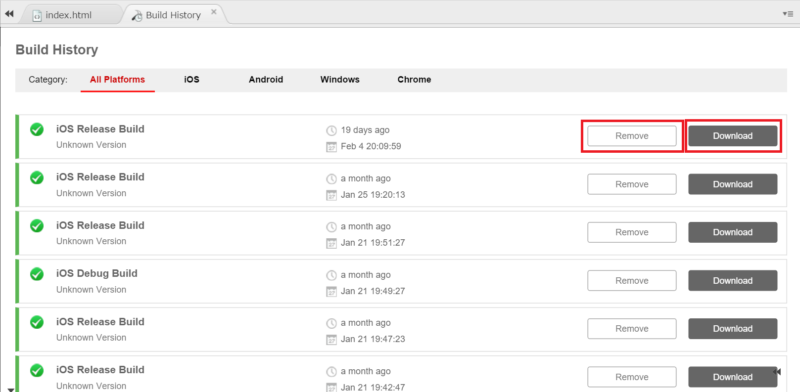

Build History
=============

Everytime you build your app through Monaca IDE, Monaca saves your build
history where you can see your build detail and error logs.

View build history
------------------

You can view your build history as following:

1.  From the Monaca Cloud IDE menu, go to Build --&gt; Build History.
2.  Your built history will be displayed as following.

    > 
    >
    > > width
    > >
    > > :   600px
    > >
    > > align
    > >
    > > :   left
    > >
3.  Click on Remove button to remove particular item from your history
    or Download button to download the built app. Once you click on
    Remove button, it cannot be undone.

