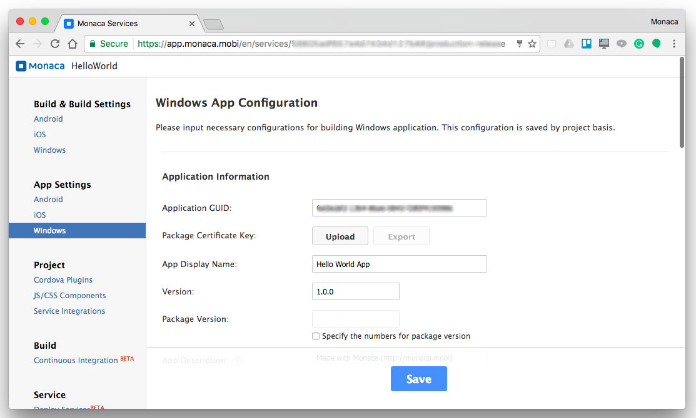
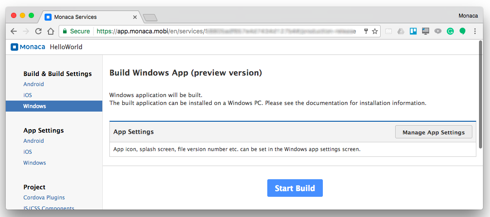
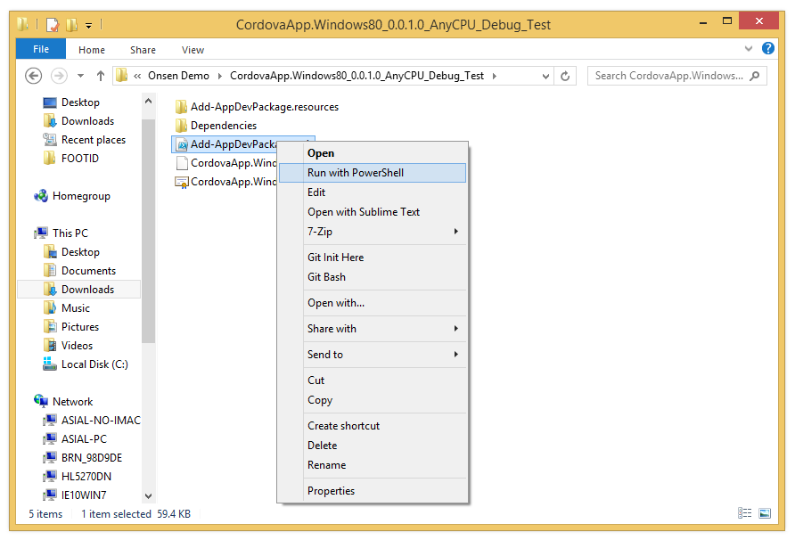
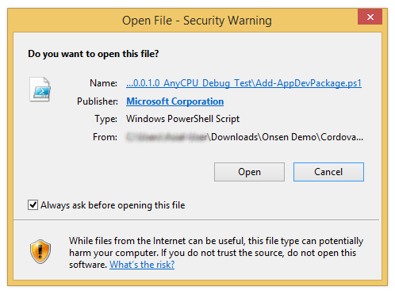
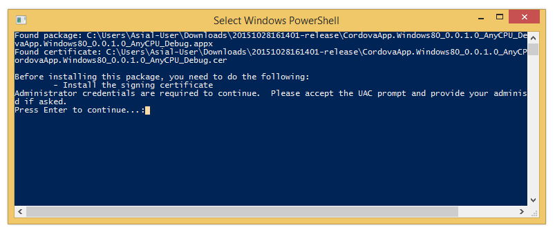
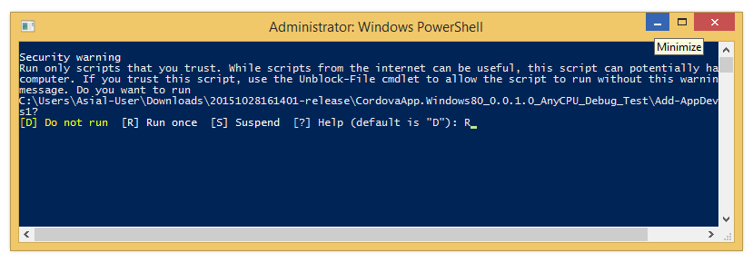
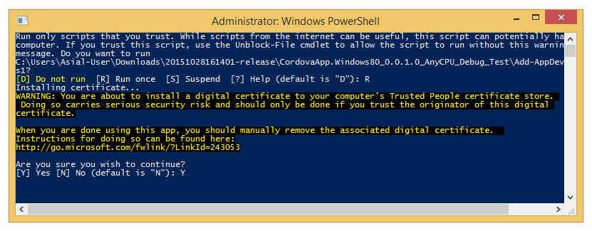
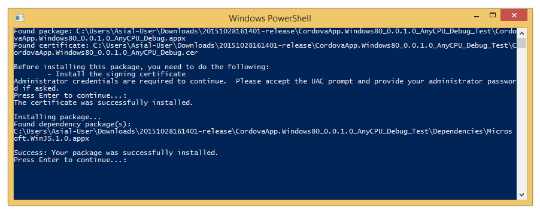
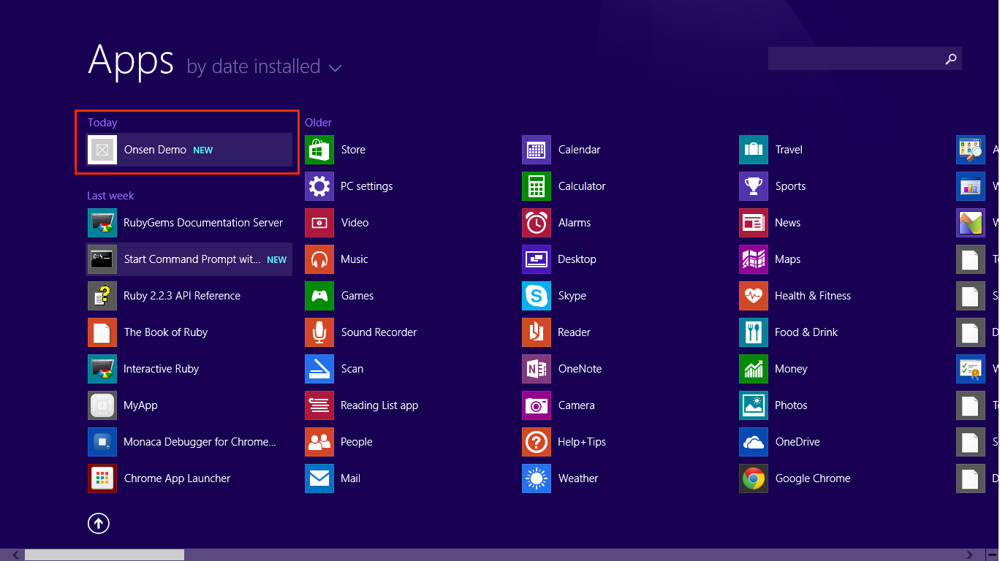
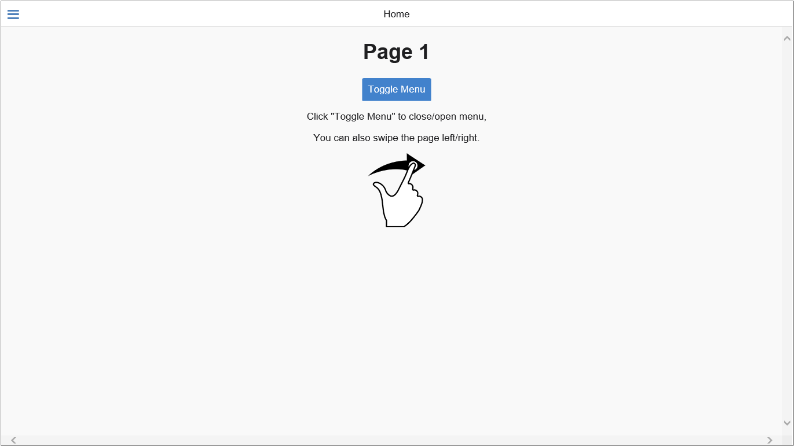

Building for Windows
====================

Windows Store Apps
------------------

Windows Store apps are created by using HTML5 and JavaScript , and they
run natively on the WinRT architecture. Therefore, applications created
by using Monaca are equipped with the same functionalities as created by
development tools such as Visual Studio, and can use all native features
including WinJS.

Windows Store apps run on PCs and tablets installed with Windows and
Windows RT. However, if you want to publish the app to the Windows
Store, you will need to rebuild it separately by using Visual Studio or
other development tools since the release build from Monaca are not
supported yet.

On the other hand, Windows Store apps have various constraints that are
not found on Android or iOS such as:

-   There are some methods or features that are not supported since
    HTML5 or JavaScript runs in Trident/Chakra application mode. For
    more details, please refer to HTML, CSS, and JavaScript Features and
    Difference on
    <http://msdn.microsoft.com/en-us/library/windows/apps/hh465380.aspx>.

Prerequisite
------------

You are required to have a valid Microsoft Developer License in order to
build Windows apps. It's free but you need to have a Microsoft account.
If you don't have the license, please register
[here](https://dev.windows.com/en-us/programs/join).

Step 1: Configure Windows App Settings
--------------------------------------

1.  From the Monaca Cloud IDE menu, go to
    Config --&gt; Windows App Settings.
2.  Fill in the necessary information of your app:

> 
>
> > width
> >
> > :   700px
> >
> > align
> >
> > :   left
> >
3.  After finishing the configurations, click Save.

Step 2: Start Building
----------------------

1.  From the Monaca Cloud IDE menu, go to
    Build --&gt; Build App for Windows.
2.  Click Start Build.

> 
>
> > width
> >
> > :   700px
> >
> > align
> >
> > :   left
> >
3.  After the build is successfully completed, download the zip file of
    the built app.

Step 3: Install the App
-----------------------

1.  Extract the downloaded zip file.
2.  In the extracted folder, Right-click on the Add-AppDevPackage.ps1
    file and select Run with PowerShell. Then, the installation will
    begin.

> 
>
> > width
> >
> > :   600px
> >
> > align
> >
> > :   left
> >
3.  Then, you might be asked to confirm the opening of the selected
    file. Click Open.

> 
>
> > width
> >
> > :   400px
> >
> > align
> >
> > :   left
> >
4.  Press Enter to continue.

> 
>
> > width
> >
> > :   600px
> >
> > align
> >
> > :   left
> >
5.  Then, the UAC (User Account Control) prompt will appear asking you
    to grant the Administrative privilege. Click Yes.
6.  Confirm the running of the app by typing `R` in the PowerShell
    windows.

> 
>
> > width
> >
> > :   600px
> >
> > align
> >
> > :   left
> >
7.  Then, press `Y`.

> 
>
> > width
> >
> > :   600px
> >
> > align
> >
> > :   left
> >
8.  Once, the installation is completed, press Enter.

> 
>
> > width
> >
> > :   600px
> >
> > align
> >
> > :   left
> >
9.  Now, your app should be successfully installed. Find your app in the
    App windows.

> 
>
> > width
> >
> > :   600px
> >
> > align
> >
> > :   left
> >
10. Click on it to launch the app. Then, your app should be running.

> 
>
> > width
> >
> > :   600px
> >
> > align
> >
> > :   left
> >

