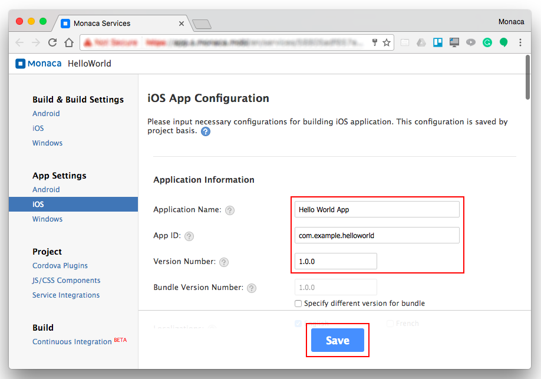
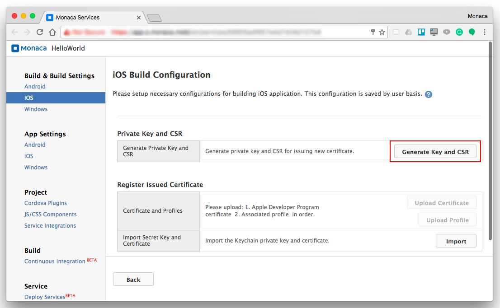
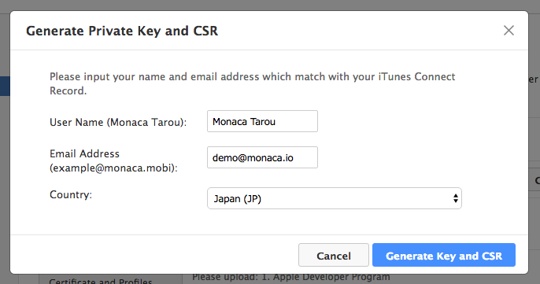
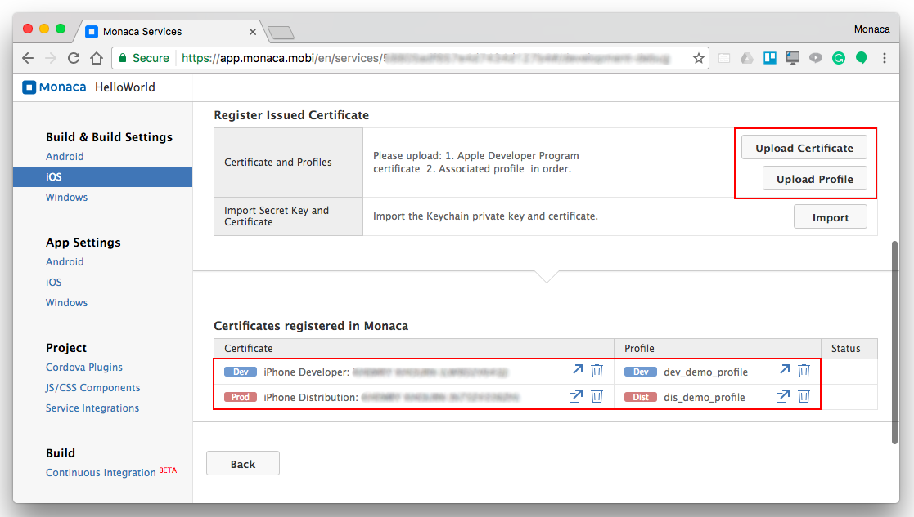
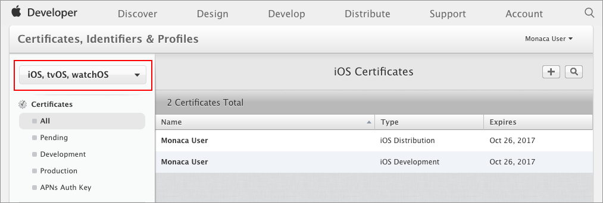
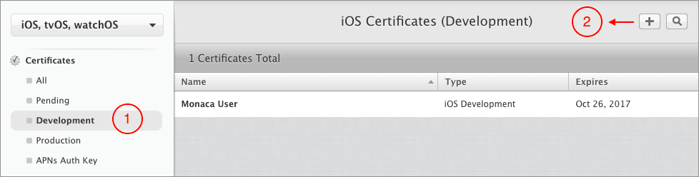
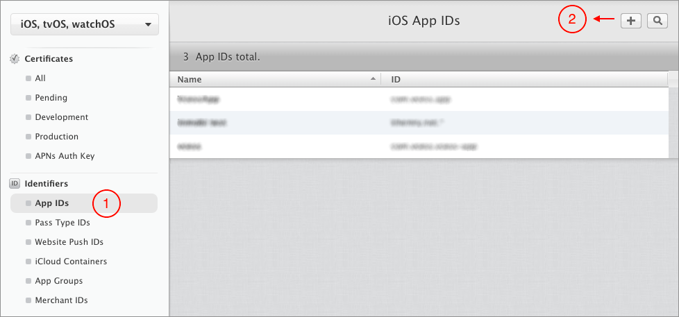
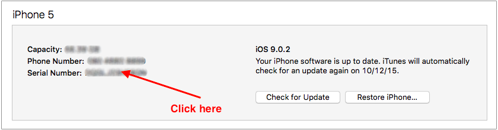
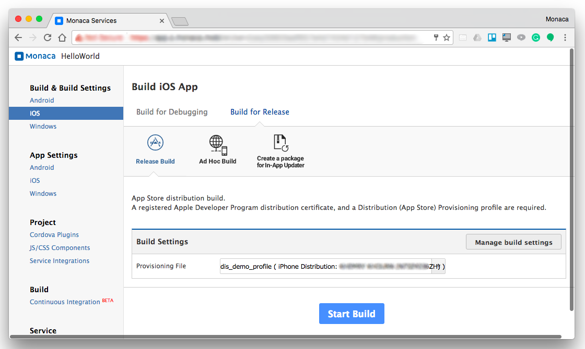
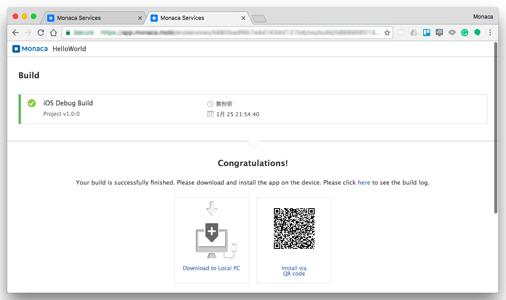

Building an iOS App
===================

Prerequisites
-------------

Before getting started, you are required to:

-   subscribe to [iOS Developer
    Program](https://developer.apple.com/programs/ios/).
-   understand types of build &lt;types\_of\_build\_ios&gt; and their
    requirements.

### Types of Build

In Monaca, iOS app has three types of build: debug version, test version
and release version. The differences between these types of build are as
follows:

Ad Hoc distribution is a way to distribute your applications without
going through the App Store. Currently, up to *100* applications which
are built by using Ad Hoc provisioning profile can be shared with other
iOS devices through Ad Hoc distribution. However, the application
distribution from the developer organization will be limited to the
development stakeholders.

Step 1: Configure iOS App in Monaca
-----------------------------------

### Configure iOS App Settings

1.  From the Monaca Cloud IDE menu, go to
    Config --&gt; iOS App Settings.
2.  Fill in the necessary information of your app:

> 
>
> > width
> >
> > :   600px
> >
> > align
> >
> > :   left
> >
> 

>
> The App ID (set in Monaca App Settings) cannot contain asterisk (`*`);
> otherwise, the build will fail. This App ID must be the same as the
> explicit App ID you will register (or have registered) in iOS Dev
> Center. Read more on register\_appID.
>
> 

3.  After finishing the configurations, click Save.

Currently, when you update either iOS's App ID or Android's Package
Name, both of them will change. In other words, they are configured to
be the same. However, it is possible to make them different. Please
refer to faq05-019.

### Configure iOS Build Settings

1.  From the Monaca Cloud IDE menu, go to
    Config --&gt; iOS Build Settings.

> 
>
> > width
> >
> > :   600px
> >
> > align
> >
> > :   left
> >
2.  You need to create a new private key or import an existing one. To
    create a new private key, click on Generate Key and CSR button and
    fill in a username (a name representing this new private key), email
    address (Apple ID) and your country.

> 
>
> > width
> >
> > :   400px
> >
> > align
> >
> > :   left
> >
> 

>
> If you import an existing private key, you will also need to upload
> the certificate associated with this private key to Monaca. Please
> refer to import\_into\_monaca.
>
> 

3.  After creating a new private key, CRS file associated with the
    private key is also created. Download the CRS file by clicking on
    Export button. It will be used to issue the certificates later in
    iOS Dev Center.
4.  Issue certificates in iOS Dev Center &lt;create\_cer&gt; and
    download them.
5.  Create provisioning profiles in iOS Dev Center &lt;register\_provisioning&gt;
    and download them.
6.  Upload the certificates and corresponding provisioning profiles to
    Monaca Cloud.

> 
>
> > width
> >
> > :   700px
> >
> > align
> >
> > :   left
> >
> 

>
> You can upload multiple certificates with multiple corresponding
> provisioning profiles with Monaca build interface.
>
> 

Step 2: Configure iOS App in iOS Dev Center
-------------------------------------------

1.  From [Apple Developer page](https://developer.apple.com/), go to
    Account.
2.  Sign in using Apple ID and password you used to enroll in the Apple
    Developer Program. If you haven’t enrolled in this program yet,
    please subscribe at [here](https://developer.apple.com/programs/).
3.  Go to Certificates, Identifiers & Profiles. Then, the following page
    will appear.

> 
>
> > width
> >
> > :   700px
> >
> > align
> >
> > :   left
> >
3.  In this page, we are going to do 4 important things:

> -   create\_cer
> -   register\_appID
> -   register\_dev\_device
> -   register\_provisioning

### Generate Certificates

There are two types of certificates which can be issued in iOS Dev
Center:

-   Development: required for Debug build
-   Production: required for either Ad Hoc or Release build

After downloading the CSR file (refer to config\_ios\_build), you are
now able to issue and download the certificates in iOS Dev Center.

In the following example, we will show you how to issue and download a
Development certificate:

1.  Under Certificates section, go to Development.
2.  Click the Add button + in the upper-right corner (see the screenshot
    below).

> 
>
> > width
> >
> > :   700px
> >
> > align
> >
> > :   left
> >
3.  Choose iOS App Development and click Continue.

> 

>
> Choose App Store and Ad Hoc if you want to issue Production
> certificate.
>
> 

4.  Click Continue again and upload the CSR file that you've downloaded
    from Monaca Cloud IDE earlier. Then, click Generate.
5.  By now, your development certificate has been issued. Please
    download this certificate. You will need to upload it to Monaca
    Cloud IDE later.

Follow similar instruction in order to create a Production certificate.

### Register App ID

App IDs are primarily used when creating development and distribution
provisioning profiles. You can create a wildcard App ID that matches one
or more apps or an explicit App ID that exactly matches your bundle ID.

In order to register your App ID, please follow the instruction below:

1.  Under Identifiers section, go to App IDs.
2.  Click the Add button + in the upper-right corner (see the screenshot
    below).

> 
>
> > width
> >
> > :   700px
> >
> > align
> >
> > :   left
> >
3.  The App ID string contains two parts (Prefix and Suffix) separated
    by a period (`.`). Fill in the information of your App ID such as:

> -   App ID Description: Description of your App ID. You cannot use
>     special characters such as `@, &, *, ', "`.
> -   App ID Prefix: It is defined as your Team ID by default.
> -   App ID Suffix: It is defined as a Bundle ID search string. There
>     are two types of App ID Suffixes:
> -   App Services: Select the services you want to enable in your app.

4.  Then, click Continue. After reviewing your App ID’s info, click
    Submit. By now, you have completed your App ID registration into iOS
    Dev Center.

### Register Development Devices

You are required to register your development device(s) before creating
development and distribution provisioning profiles.

In order to register a device that you will be using during your app
development, please follow the instruction below:

1.  Under Devices section, select a type of device(s) you want to
    register.
2.  Click the Add button (+) in the upper-right corner (see the
    screenshot below).

> 
>
> > width
> >
> > :   700px
> >
> > align
> >
> > :   left
> >
3.  Fill in the information of your device.

> -   Name: a name represent your device (Example: MyiPhone)
> -   UDID: a unique device identifier of your device. You can find this
>     identifier by connecting your iOS device to your computer. Then,
>     open iTunes and see the summary of your device. After that, click
>     on the device’s *Serial Number* to reveal the UDID which consists
>     of *40* characters. Right-click on it to copy this UDID. (See
>     below)
>
>     {width="500px"}
>
4.  Then, press Continue. After reviewing your device’s info, click
    Register. By now, you have completed your device registration into
    iOS Dev Center.

### Create Provisioning Profiles

One last step before building your iOS app is creating a provisioning
profile. There are two types of provisioning profile:

-   Development: used with Development certificate for Debug build
-   Distribution: used with Production certificate for Ad Hoc and
    Release build

In the following example, we will show you how to create a Development
provisioning profile:

1.  Under Provisioning Profiles section, go to Development.
2.  Click the Add button + in the upper-right corner.
3.  Choose iOS App Development and click Continue.

> 

>
> -   
>
>     Choose Ad Hoc if you want to create Distribution provisioning profile for Ad Hoc build.
>
>     :   -   Choose App Store if you want to create Distribution
>             provisioning profile for Release build.
>
> 

4.  Select your App ID and click Continue.
5.  Select the certificate(s) you want to include in this profile and
    click Continue.
6.  Select the device you have previously registered for development and
    click Continue.
7.  Input a name for the provisioning profile and click Generate.
8.  Now your Development provisioning profile is ready. Please download
    it. You will need this file when building your iOS app in Monaca
    later.

Follow similar instruction in order to create a Distribution
provisioning profile.

Step 3: Start Building
----------------------

1.  From the Monaca Cloud IDE menu, go to
    Build --&gt; Build App for iOS.
2.  Select appropriate type of build you want and click Start Build.

> 
>
> > width
> >
> > :   700px
> >
> > align
> >
> > :   left
> >
3.  It may take several minutes for the build to complete. Please wait.
    Once the build is completed, your built app is ready to be
    installed/downloaded. See below screenshot as an example:

> 
>
> > width
> >
> > :   700px
> >
> > align
> >
> > :   left
> >

