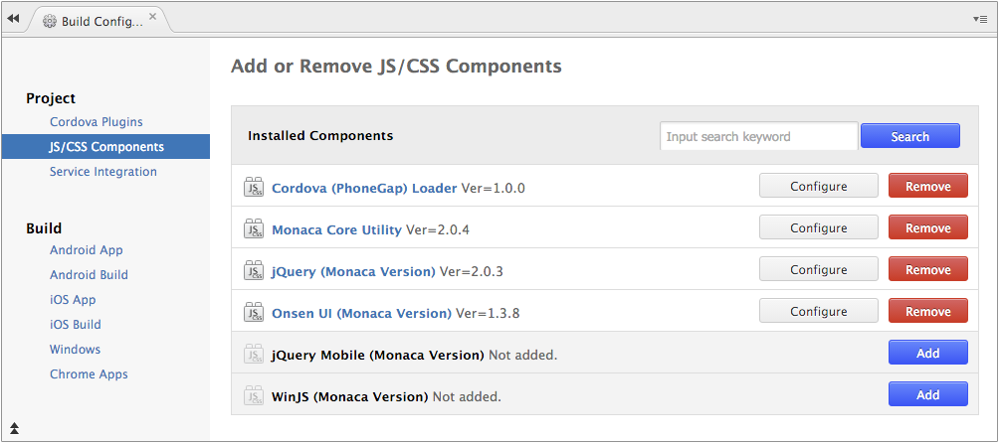
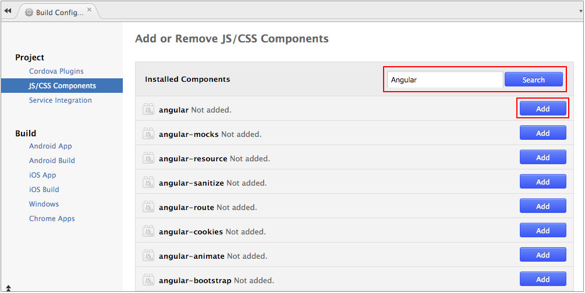
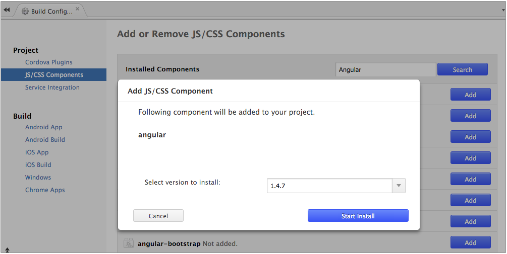
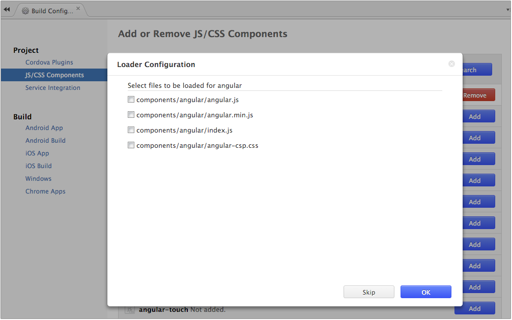
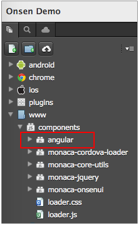

JS/CSS Components
=================

JS/CSS components are JavaScript and CSS libraries you may need to
include to your project such as jQuery, jQuery mobile, Onsen UI and so
on.

In order to add a JavaScript/CSS library, please do as follows:

1.  From Monaca Cloud IDE, go to Config --&gt; Manage JS/CSS Components.
2.  Then, "Add or Remove JS/CSS Components" page will be shown. You can
    see several libraries listed there. If you can't find the library
    you want, input the library's name in a search box to find it.

> {width="700px"}

3.  Assuming you are searching for Angular, a list of matched libraries
    will be shown. Click Add to include the library to your project.

> {width="700px"}

4.  Then, you can choose which version of the library to include in your
    project.

> {width="700px"}

5.  Next, select which files of the library you want to include and
    click OK.

> {width="700px"}

6.  After that, you will find your newly added library in the list.
    Select guilabel:Configure when you want to change the library's
    version and selected files.

> {width="700px"}

When a library is added, its files are added into `www/components`
folder. The following JavaScript and CSS files will also be
automatically updated. These files will always be presented regardless
of which libraries are added into your project.

  ------------------------- -----------------------------------------------------------
  `components/loader.js`    A JavaScript file to load for all active libraries
  `components/loader.css`   A Style sheet file for all active libraries
  ------------------------- -----------------------------------------------------------

> {width="220px"}

Therefore, libraries can be loaded by simply referencing the two files
(as shown above) in the HMTL file. More specifically, all you need to do
is include the following descriptors within the `<head>` tag of the HTML
file.

``` {.sourceCode .html}
<script src="components/loader.js"></script>
<link rel="stylesheet" href="components/loader.css">
```

<div class="admonition note">

If you would like to use images within your libraries, you can directly
load those image files from the components folder.

</div>
