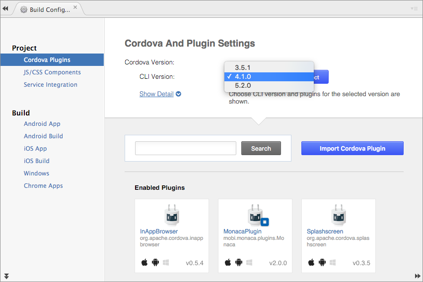
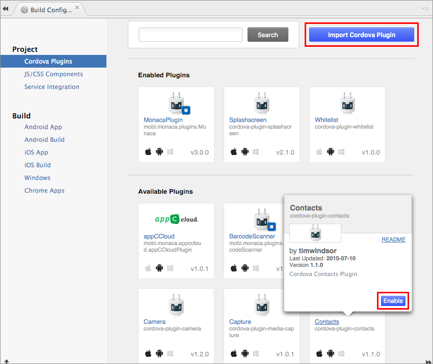
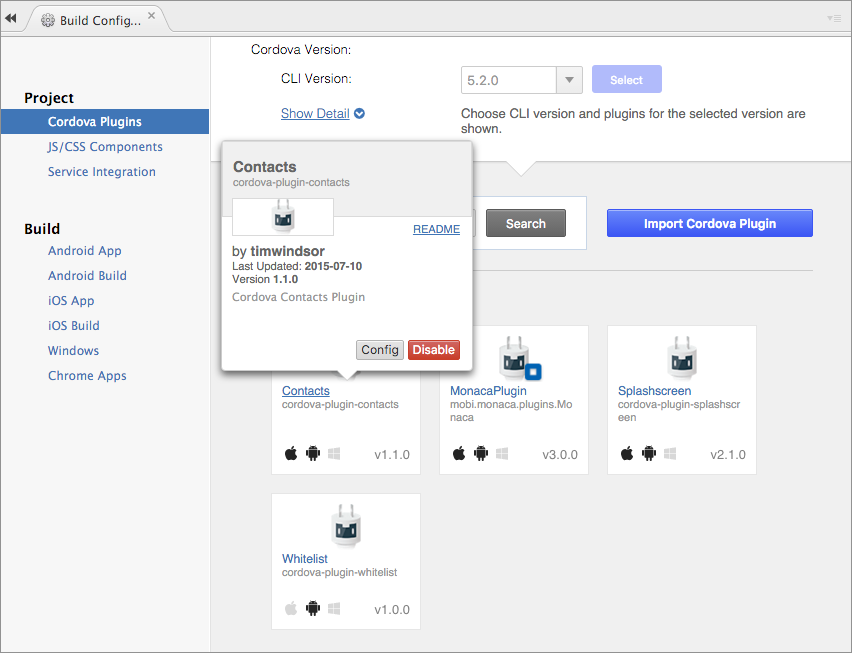
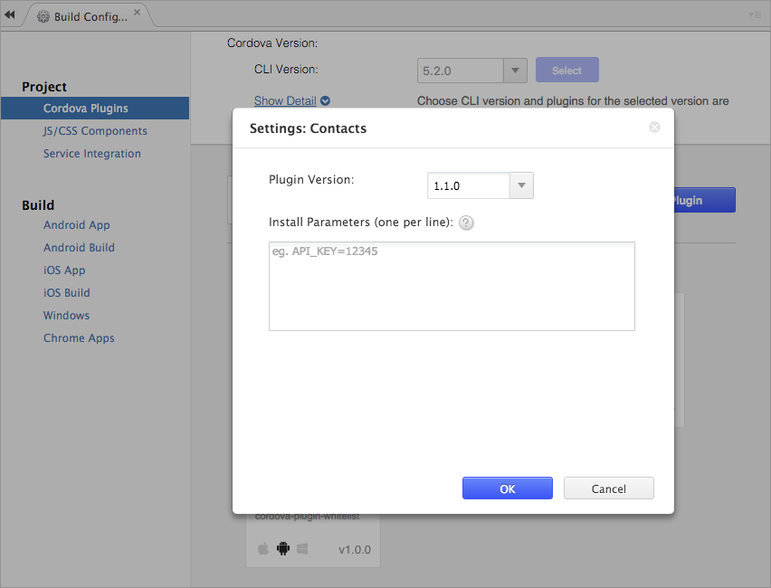

Cordova Plugins
===============

Introduction
------------

Usually, you need native code (Java for Android, Objective-C for iOS,
etc) to access native device function such as Cameras, FileSystem,
Device Storage, etc. However, you can access these native functions
using JavaScript with Cordova.

Cordova is a set of device APIs that allow a mobile app developer to
access native device function such as the camera or accelerometer from
JavaScript. Therefore, Monaca uses Cordova to enable your hybrid apps to
access native device functions from JavaScript.

For more information about Cordova, please refer to
[here](https://cordova.apache.org/).

### Loading Cordova

You can't use device APIs before Cordova is fully loaded. It is very
important to use onDeviceReady() function. This function runs when
Cordova is loaded.

As a trial, let's start up Camera functions by using device APIs. Please
copy and paste the code below to your project in Monaca Cloud IDE then
you can run it on monaca\_debugger\_index.

<div class="admonition note">

This code was written for Cordova 4.1. We apologize in advance in case
the code may behave differently on various devices.

</div>

``` {.sourceCode .html}
<!DOCTYPE HTML>
<html>
<head>
    <meta charset="utf-8">
    <meta name="viewport" content="width=device-width, height=device-height, initial-scale=1, maximum-scale=1, user-scalable=no">
    <script src="components/loader.js"></script>
    <script>
        document.addEventListener ("deviceready", onDeviceReady, false);

        //these functions runs when Cordova is ready
        function onDeviceReady () {
            alert ('Cordova is ready!');
        }

        function snapPicture () {
            navigator.camera.getPicture (successCallback, FailCallback, {destinationType: Camera.DestinationType.DATA_URL});

            //Success Callback
            function successCallback (imageData) {
                //Display image
                var image = document.getElementById ('picture');
                image.src = "data:image/jpeg;base64, " + imageData;
            }

            //Error CallBack
            function FailCallback (message) {
                alert ('Error!!!: ' + message);
            }
        }
    </script>
</head>
<body>
    <h1>Camera Sample</h1>
    <input type="button" onclick="snapPicture()" value="Snap" ><br><br>
    
</body>
</html>
```

Changing Cordova Version
------------------------

<div class="admonition note">

You can't downgrade to older Cordova versions once your projects are
upgraded. A backup of the project is automatically created before
conversion.

</div>

For new created projects, the latest Cordova version available in Monaca
will be automatically applied. However, you can upgrade your existing
projects to the latest Cordova version as following:

1.  From Monaca Cloud IDE, go to Config --&gt; Manage Cordova Plugins.
2.  Select the preferred Cordova Version from the dropdown list as shown
    below.

> 
>
> > width
> >
> > :   600px
> >
> > align
> >
> > :   left
> >
Cordova Plugins in Monaca
-------------------------

Right from Monaca Cloud IDE, you can easily include standard (core) and
third-party Cordova plugins.

-   Standard Cordova plugins refer to a minimal set of Cordova APIs such
    as Battery, Camera, Contacts, Devices and so on. Please refer to
    cordova\_core\_plugins.
-   Third-party Cordova plugins refer to other existing Cordova plugins.
    There are
    some third-party Cordova plugins &lt;third\_party\_cordova\_index&gt;
    which you can add to your project right from Monaca Cloud IDE. You
    can also import other third-party Cordova plugins. Let's call these
    imported third-party Cordova plugins as external third-party Cordova
    plugins.

Add/Import Cordova Plugins
--------------------------

In order to add a Cordova plugin into your project, please do as
follows:

1.  From Monaca Cloud IDE, go to File --&gt; Manage Cordova plugin or
    Config --&gt; Manage Cordova plugin.
2.  Then, Manage Cordova Plugins page will be shown. In this page,
    standardard and some third-party Cordova plugins are listed.
    Mouseover a plugin and click on Enable to add the plugin. If you
    cannot find the plugin you want in the list, you can import other
    third-party Cordova plugins by using Import Cordova Plugin button. A
    project containing external third-party Cordova plugin(s) requires a
    custom built Monaca Debugger. Please refer to
    debugger\_for\_custom\_plugins.

> {width="600px"}

3.  Once a plugin is enabled/imported, you might want to configure it.
    Mouseover a plugin you want to config and click Config to open a
    plugin's settig dialog where you can change the plugin's version and
    set plugin's parameter(s).

> {width="600px"}
>
> {width="600px"}
