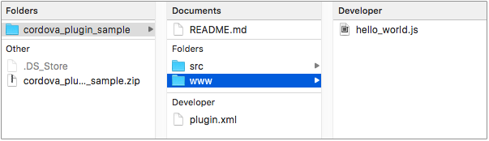
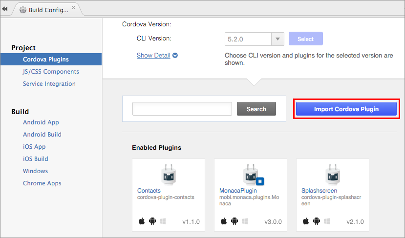
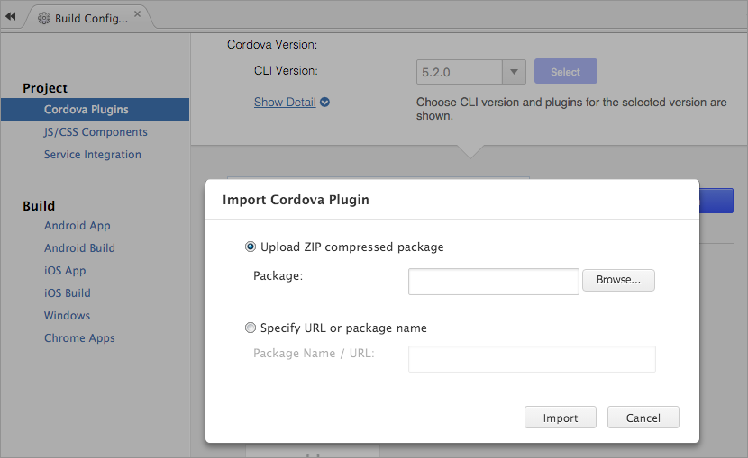
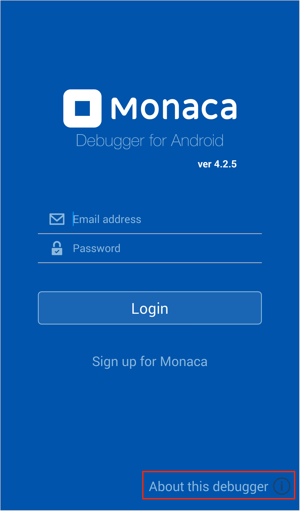
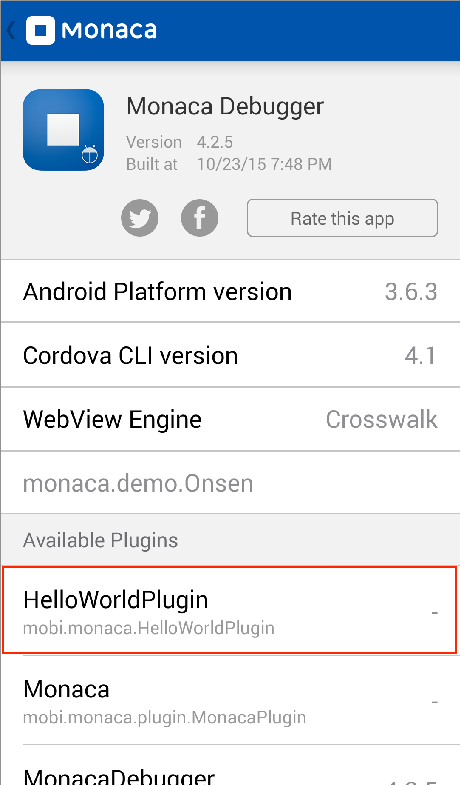
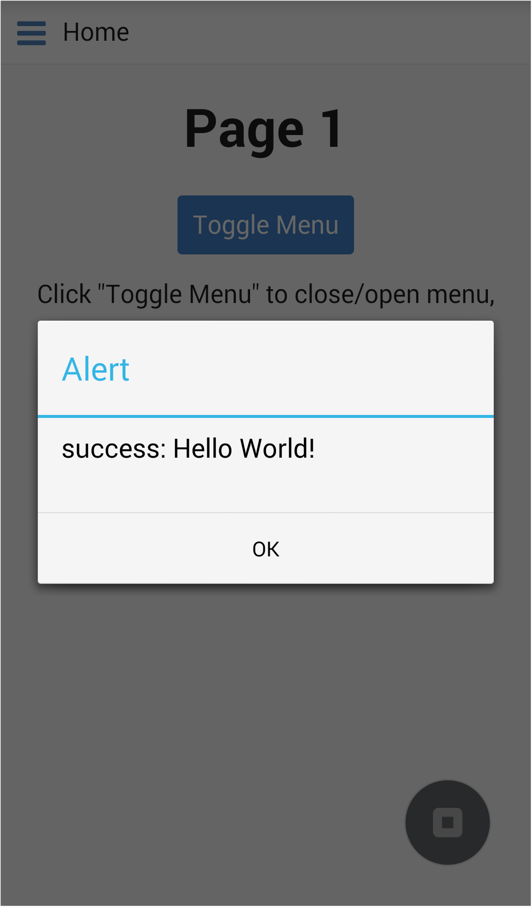

Custom Cordova Plugins
======================

Custom Cordova Plugin
---------------------

Cordova Plugin provides a simple way to write a native code onto your
program. In this page, we will describe how to create and add a custom
Cordova plugin into your Monaca project.

<div class="admonition note">

You need to subscribe to a valid plan in order to use custom Cordova
plugins. Please refer to [Monaca
Pricing](https://monaca.io/pricing.html).

</div>

Your custom Cordova plugin need to follow the requirements below:

-   It should be compatible with Cordova 4.2 or higher.
-   It must have a `plugin.xml` file and is installable with `plugman`
    command line tool.
-   It must support iOS and Android platforms.

You can find various Cordova Plugins in the Internet, but it is likely
that they are either obsolete or their version would not match.
Therefore, how to create a custom Cordova plugin from scratch is covered
in this page.

### Structure of a Cordova Plugin

A typical structure of a Cordova plugin is as follows (directories are
displayed in bold letters):

+----------------------------+
| -   *plugin\_name*         |
|     -   *src*              |
|         -   *ios*          |
|             -   plugin\_na |
| me.h                       |
|             -   plugin\_na |
| me.m                       |
|     -   *www*              |
|         -   plugin\_name.j |
| s                          |
|     -   plugin.xml         |
+----------------------------+

Before getting started, please download the following zip file
containing sample plugin code.

> Sample Cordova Plugin &lt;download/cordova\_plugin\_sample.zip&gt;

When you extract the package, you will see a directory structure as
follows:

> {width="500px"}

### plugin.xml file

plugin.xml file is a plugin specification file containing plugin's
definitions. For more details, please refer to [Cordova Plugin
Specification](http://cordova.apache.org/docs/en/latest/plugin_ref/spec.html).

Below is a plugin.xml file from the downloaded sample plugin.

``` {.sourceCode .xml}
<?xml version="1.0" encoding="UTF-8"?>
<plugin xmlns="http://apache.org/cordova/ns/plugins/1.0"
  id="jp.co.asial.helloworld"
  version="0.0.1">

    <name>HelloWorldPlugin</name>
    <description>HelloWorldPlugin Description</description>
    <author>Asial Corporation</author>
    <license>Apache 2.0 License</license>
    <engines>
        <engine name="cordova" version=">=3.5.0" />
    </engines>
    <js-module src="www/hello_world.js" name="helloworld">
        <clobbers target="HelloWorld" />
    </js-module>

    <platform name="ios">
        <config-file target="config.xml" parent="/*">
            <feature name="HelloWorldPlugin">
                <param name="ios-package" value="HelloWorldPlugin"/>
            </feature>
    </config-file>
    <header-file src="src/ios/HelloWorldPlugin.h" target-dir="src/ios" />
        <source-file src="src/ios/HelloWorldPlugin.m" target-dir="src/ios" />
    </platform>
    <platform name="android">
        <config-file target="res/xml/config.xml" parent="/*">
            <feature name="HelloWorldPlugin">
                <param name="android-package" value="mobi.monaca.HelloWorldPlugin"/>
            </feature>
        </config-file>
        <source-file src="src/android/mobi/monaca/HelloWorldPlugin.java" target-dir="src/mobi/monaca" />
    </platform>

</plugin>
```

### hello\_world.js file

hello\_world.js is defined as `js-module` in plugin spec. Therefore, it
will be automatically loaded by `cordova.js`, which is included in
`loader.js`.

``` {.sourceCode .javascript}
var HelloWorld = function() {};

HelloWorld.prototype.say = function(success, fail) {
    cordova.exec(success, fail, "HelloWorldPlugin","say", []);
};

var helloWorld = new HelloWorld();
module.exports = helloWorld;
```

For more details about how to write Cordova callback function, please
refer to [Plugin Development
Guide](http://cordova.apache.org/docs/en/latest/guide/hybrid/plugins/index.html).

### iOS and Android Native Code

Native code must be written in either Objective-C or Java, depending on
the platform. It must have the same function as defined in the
JavaScript file. Also, please be aware that all callbacks are
asynchronous.

Here are the guides about native code development.

-   [Android Plugin Development
    Guide](http://cordova.apache.org/docs/en/latest/guide/platforms/android/plugin.html).
-   [iOS Plugin Development
    Guide](http://cordova.apache.org/docs/en/latest/guide/platforms/ios/plugin.html).

Import Custom Cordova Plugin
----------------------------

To import a custom Cordova plugin into your Monaca project, please do as
follows:

1.  Compress your custom Cordov plugin files as a zip file.
2.  From Monaca Cloud IDE, go to Config --&gt; Manage Cordova plugin.
3.  Then, "Manage Cordova Plugins" page will be shown. Click on
    Import Cordova Plugin button.

> {width="600px"}

4.  Then, browse your plugin file (zip file) and click Import.

> {width="600px"}

Monaca Debugger with Custom Cordova Plugin
------------------------------------------

The standard Monaca Debugger, which can be found in the store such as
App Store or Google Play, includes the standard (core) and several
third-party Cordova plugins (refer to third\_party\_cordova\_index for
the list of all third-party Cordova plugins pre-included in Monaca). For
this reason, the standard Monaca Debugger cannot be used with Monaca
projects containing custom or other external third-party Cordova
plugins. In this case, custom built Monaca Debugger is required to run
such projects properly.

Custom built Monaca Debugger is a debugger which is built within Monaca
Cloud IDE inside a project containing custom or external third-party
Cordova plugins. Please refer to the following links on how to build
custom built debugger and the differences between the standard and
custom built debugger:

-   debugger\_on\_ios
-   debugger\_on\_android

<div class="admonition note">

Please make sure to import the custom or external third-party Cordova
plugins before building the custom built debugger.

</div>

We also offer technical support (fee required) for developing your
custom Cordova Plugin. Please contact our support team
[here](https://monaca.mobi/en/support/index).

Testing Custom Cordova Plugin
-----------------------------

1.  Create a project in Monaca Cloud IDE using the
    Minimum Project Template &lt;minimum\_project&gt;.
2.  Import a sample custom Cordova plugin you downloaded earlier in
    plugin\_structure.
3.  Then, add the following snippet into index.html file. The code below
    is simply just to show a message dialog using the sample custom
    Cordova plugin:

> ``` {.sourceCode .javascript}
> ...
> <script>
>   document.addEventListener("deviceready", onDeviceReady, false);
>   function onDeviceReady() {
>     window.HelloWorld.say(
>       function(result) { alert( "success: " + result ); },
>       function(error) { alert( "error: " + error ); }
>     );
>   }
> </script>
> ...
> ```

4.  Now, run the project in the standard Monaca Debugger. You will see
    that the message dialog will not be shown.
5.  Build a custom built Monaca Debugger. Please refer to the following
    links on how to build a custom built Monaca Debugger:

> -   custom\_debugger\_ios
> -   custom\_debugger\_and

6.  Install the custom built Monaca Debugger.
7.  Open the debugger and check the debuggers' information by clicking
    on About this debugger button.

> {width="350px"}

8.  You should be able to find the custom Cordova plugin in there as
    shown in the screenshot below:

> {width="350px"}

9.  Login to the debugger and run the project containing the custom
    Cordova plugin. The message dialog should be shown if the project is
    run properly.

> {width="350px"}
