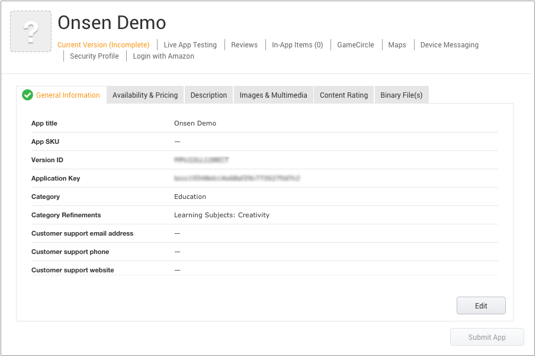

Amazon Appstore Distribution
============================

Prerequisite
------------

In order to publish Android apps at Amazon Appstore, you will need to
create a developer account at [Amazon Apps Developer
Portal](https://developer.amazon.com/appsandservices). The registration
is free.

Create a Release Build of the App
---------------------------------

Using Monaca Cloud IDE build feature, you can build a release version of
your app and upload it to Amazon Appstore. Follow the steps in
building\_for\_android to build the app with “Release Build”. Then,
download the built app (APK file).

Register the Apps in Amazon AppStore
------------------------------------

1.  Go to [Amazon Apps Developer
    Portal](https://developer.amazon.com/appsandservices) and login with
    a valid Amazon developer account.
2.  Under DASHBOARD tab, click Add a New App.

> 
>
> > width
> >
> > :   600px
> >
> > align
> >
> > :   left
> >
3.  Select Android and click Next.
4.  The New App Submission page will appear. In this page, you will need
    to fill in the necessary information such as:

5.  Click Save. Then, the following page will appear:

> 
>
> > width
> >
> > :   600px
> >
> > align
> >
> > :   left
> >
6.  Go to Availability & Pricing tab, select appropriate type of your
    app and answer listed questions. Then, click Save.

> 
>
> > width
> >
> > :   600px
> >
> > align
> >
> > :   left
> >
> 

>
> Amazon covers over 200 countries. Your app can only be released after
> it has been approved.
>
> 

7.  Go to Description tab. In this page, you will need to fill in the
    following necessary information and click Save.

8.  Go to Images & Multimedia tab. In this page, you will need to upload
    at least 3 screenshots, a small icon (114x114 PNG file) and a large
    icon (512x512 PNG file) of your app and click Save.
9.  Go to Content Rating tab. In this page, you will be asked to
    complete a questionnaire regarding content rating for your app.
    Complete the questionaire and click Save.
10. Go to Binary File(s) tab. In this page, you will need to fill in the
    following necessary information and click Save.

11. After completing the configuration, click Save draft. At this point,
    your app should be ready to be published.

Release the App
---------------

You can't publish your app unless you properly fill in necessary
information related to your app. Once, you successfully complete the
required information, click on Submit App to release your app. This
button is disable if the required information is not completed properly.

After submission is complete, Amazon will review your app. The security
of the app will be the primary concern. Review typically takes 1-2 days
to complete.

After approved by Amazon, your app will be published on the Amazon
Appstore for Android. The release date will be the specified date and
time you have set in Step 6 in register\_app\_in\_amazon, or as soon as
it’s approved if you haven’t set any date or time yet.

> 
>
> > width
> >
> > :   600px
> >
> > align
> >
> > :   left
> >
Inquiry
-------

You can contact [Amazon customer
support](https://developer.amazon.com/public/support/contact/contact-us)
at the Amazon Appstore for Android with any inquiries. They can assist
you with various issues including how to submit your app or use the API.

Amazon Badges for Amazon Appstore for Android
---------------------------------------------

You can use Amazon badges to promote the availability of your app on the
Amazon store. Badges are available from [Amazon
Badges](https://developer.amazon.com/public/support/legal/tuabg).
