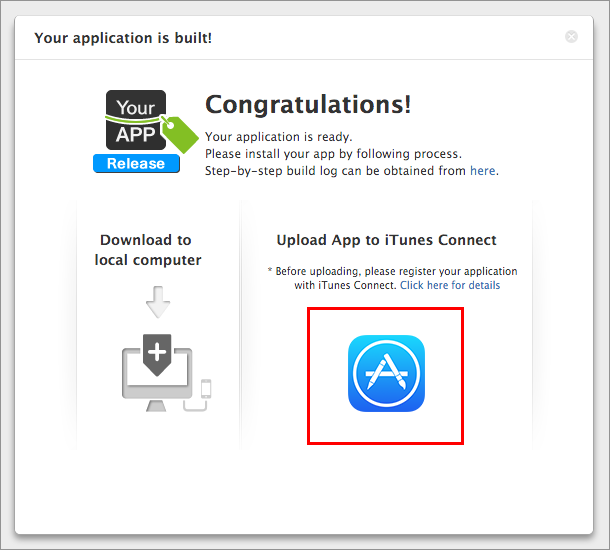
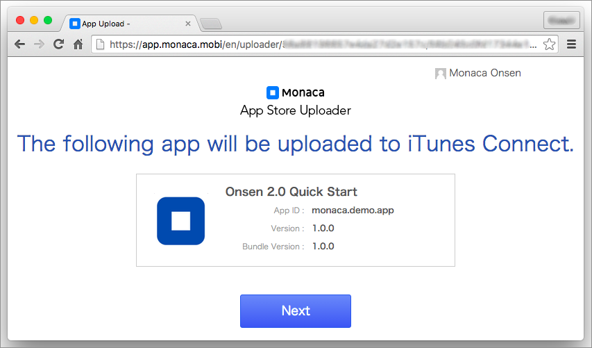
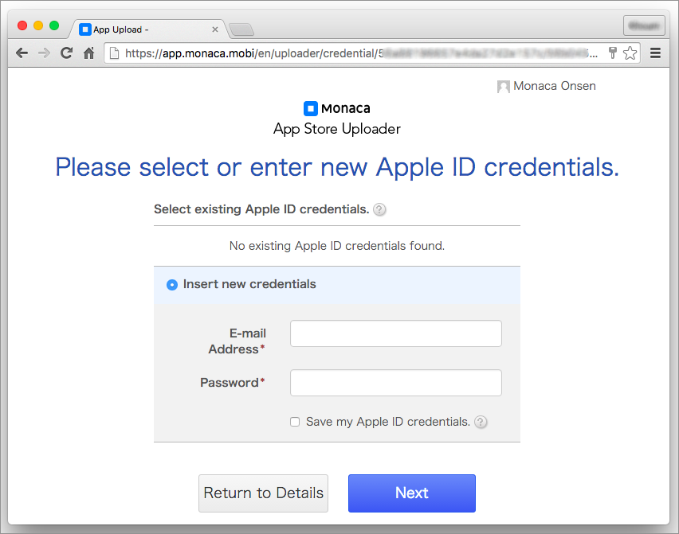
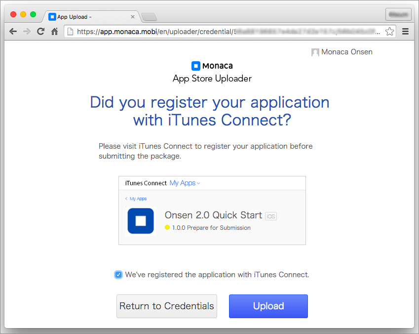
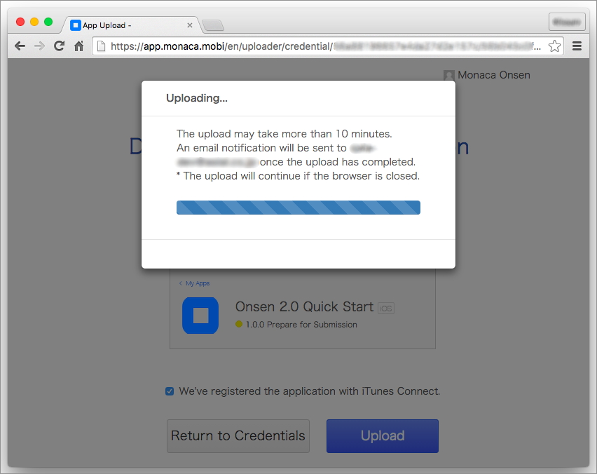
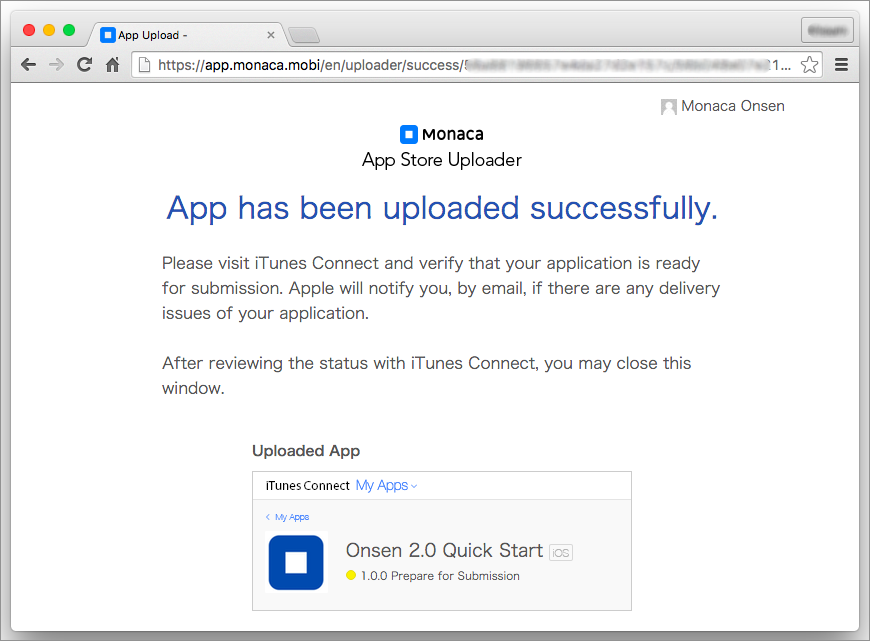

Monaca Upload Feature
=====================

In order to use this upload feature, you are required to subscribe to a
valid plan. Please refer to [Pricing](https://monaca.io/pricing.html).

For shared projects, only project owner can use Monaca Upload Feature.

If you use activation code to upgrade your account, you can use Monaca
upload feature in case your plan supports this feature. Please [contact
us](https://monaca.mobi/en/support/inquiry) for more details.

Monaca allows you to upload your app to iTunes Connect right from Monaca
IDE. In order to do this, please do as follows:

1.  Create a release build version of your app through Monaca. Please
    refer to building\_for\_ios.
2.  When you successfully build a release version of your app, the
    following screen will appear. Click on the Upload button as shown in
    the screen below.

> 
>
> > width
> >
> > :   400px
> >
> > align
> >
> > :   left
> >
3.  Then, the App Upload window will appear. Click Next.

> 
>
> > width
> >
> > :   600px
> >
> > align
> >
> > :   left
> >
4.  Fill in a valid Apple account information. Click Next.

> 
>
> > width
> >
> > :   600px
> >
> > align
> >
> > :   left
> >
5.  Make sure you've
    registered this app with iTunes Connect &lt;apply\_itune\_connect&gt;
    before uploading your app. Then, tick
    We've registered the application with iTunes Connect.. Click Upload.

> 
>
> > width
> >
> > :   600px
> >
> > align
> >
> > :   left
> >
6.  The uploading will start. Please wait.

> 

>
> If you upload multiple versions of the app, please make sure that each
> app file has different version number. Otherwise, the upload will
> fail.
>
> 

>
> 
>
> > width
> >
> > :   600px
> >
> > align
> >
> > :   left
> >
7.  If your upload is successful, the following screen will appear. It
    may take sometimes until the app shows up in the iTunes Connect.

> 
>
> > width
> >
> > :   600px
> >
> > align
> >
> > :   left
> >
> 

>
> Sometimes Monaca is successfully uploaded your app to iTunes Connect
> but Apple may find error(s) on their end and report to you via email.
> If this happens, please see the report and fix the error(s)
> appropriately. Then, re-upload your app.
>
> 

8.  Now that you successfully uploaded your app, you can start selecting
    it in iTunes Connect. Please refer to
    Selecting the Uploaded App&lt;select\_uploaded\_app&gt;.

