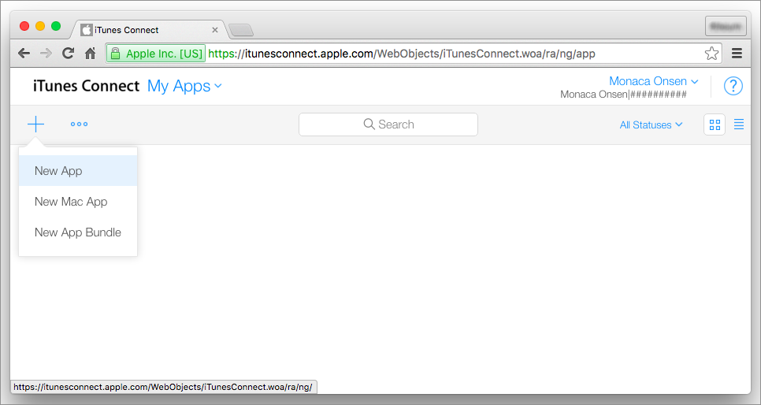
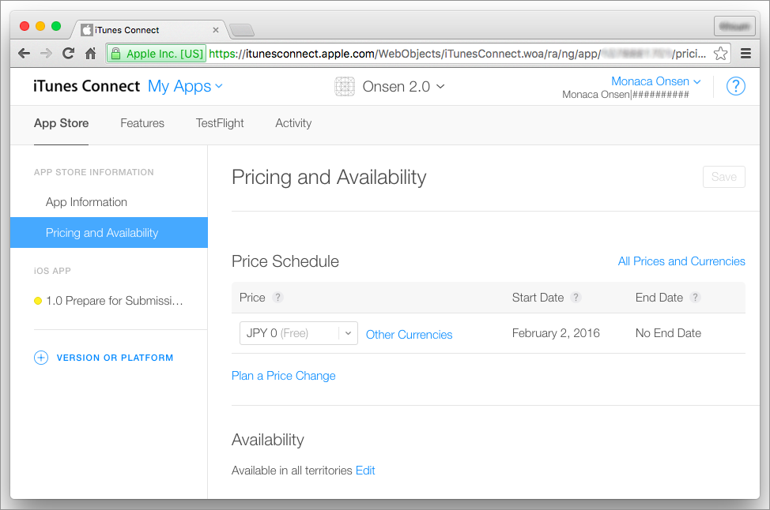
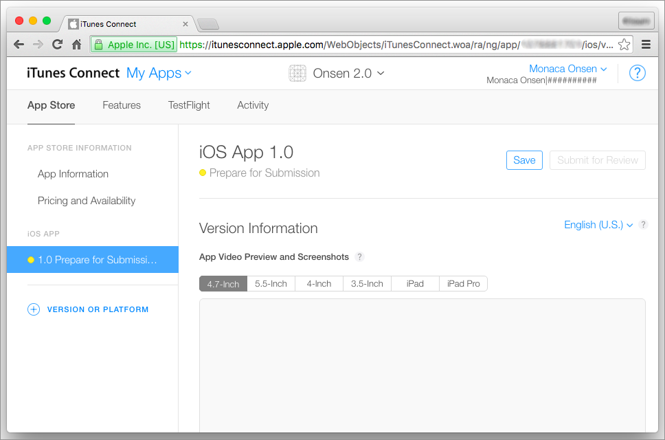
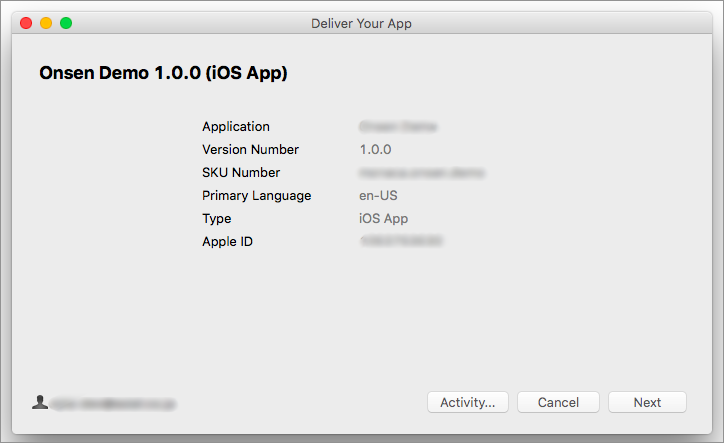

iTunes Connect Guide
====================

  
<b>Last Updated: </b> January 28th, 2016

   

This document describes how to use iTunes Connect to submit an app for
distribution through the App Store.

Prerequisite
------------

You are required to have a [Team Agent
account](https://developer.apple.com/support/roles/) under [iOS
Developer Program](https://developer.apple.com/).

Registering the App
-------------------

In order to register your app in iTunes Connect, please do as follows:

1.  Login to [iTunes Connect](https://itunesconnect.apple.com/) with
    your Team Agent account.
2.  Go to My Apps.
3.  Select + --&gt; New App.

> 
>
> > width
> >
> > :   600px
> >
> > align
> >
> > :   left
> >
4.  Enter the information about the app on the form that appears as seen
    below:

> 
>
> > width
> >
> > :   600px
> >
> > align
> >
> > :   left
> >
5.  Click Create. Then, you will be redirected to the App Information
    page.
6.  In the App Information page, choose a category for your app and
    click Save.

> 
>
> > width
> >
> > :   600px
> >
> > align
> >
> > :   left
> >
7.  Go to Pricing and Availability. In this page, you will need to
    configure 3 main points such as price schedule, available areas for
    your app and volume purchase program. Then, click Save.

> 
>
> > width
> >
> > :   600px
> >
> > align
> >
> > :   left
> >
8.  Go to Prepare for Submission. In this page, you will need to
    configure:

> -   App video preview and screenshots: at least one screenshot is
>     required.
> -   Description
> -   Keywords
> -   Support URL
> -   App icon
> -   Copyright
> -   Contact information.
>
> 
>
> > width
> >
> > :   600px
> >
> > align
> >
> > :   left
> >
9.  After the configuration, click Save.

Uploading the App
-----------------

In the past, it was not necessary to have a Mac environment for
submission. However, since August 2012, a Mac environment has become
necessary as the Application Loader is needed to upload the apps to
iTunes Connect and it is only compatible with Mac.

Fortunately, Monaca allows you to upload your app to iTunes Connect
right from Monaca IDE. In other words, you don't need a Mac to upload
your apps anymore.

For more information on how to use this upload feature, please refer to
upload\_via\_ide.

Alternatively, you can use the Application Loader as described below:

1.  Create and download a release build version of your app through
    Monaca. Please refer to building\_for\_ios.
2.  From iTunes Connect, download and install Application Uploader.

> 
>
> > width
> >
> > :   600px
> >
> > align
> >
> > :   left
> >
3.  Open Application Uploader and login with your Apple account.
4.  Select Deliver Your App and click Choose.

> 
>
> > width
> >
> > :   500px
> >
> > align
> >
> > :   left
> >
5.  Browse the release build file of your app. Then, the following
    screen will apear. Click Next to start uploading your app.

> 
>
> > width
> >
> > :   500px
> >
> > align
> >
> > :   left
> >
6.  Once, the uploading is completed, click Next and Done. It may take
    sometimes until the app shows up in the iTunes Connect.

> 

>
> If you upload multiple versions of the app, please make sure that each
> app file has different version number. Otherwise, the upload will
> fail.
>
> 

Selecting the Uploaded App
--------------------------

Once you successfully uploaded your app to iTunes Connect, it can be
selected to submit to the App Store. Please do as follows:

1.  From iTunes Connect, go to Prepare for Submission. Under Build
    section, click +.

> 
>
> > width
> >
> > :   600px
> >
> > align
> >
> > :   left
> >
2.  Select your build and click Done.

> 
>
> > width
> >
> > :   600px
> >
> > align
> >
> > :   left
> >
3.  Click Save.

Submitting the App
------------------

Now that you have completed the necessary configurations, your app is
ready to be submitted.

1.  From iTune Connect, go to Prepare for Submission.
2.  Click Submit for Review.

After you've successfully submitted the app, you will need to wait for
the review from Apple. Apple will review your app and see if it is
eligible or qualified to be in App Store. Usually, it takes two weeks
for the review. Therefore, please wait patiently for it.

Publishing the App
------------------

When your app is accepted by Apple, it will be up in the App Store.

The large app icon, which was not necessary before, is now required for
the submission. In fact, the required environment and information have
changed in the submission procedure for the registration. If a
registration/submission is not successful, please make sure you complete
necessary configurations properly.

