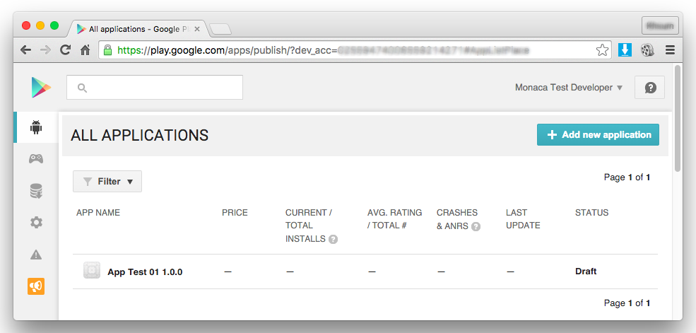

Google Play Distribution
========================

Prerequisite
------------

In order to distribute your apps through Google Play, you must register
as a *Google Play Developer Console* account. The registration fee is
`$25` (one-time only). It will take `48` hours for your *Google Play
Developer Console* registration to be fully processed. To register,
please go [here](https://play.google.com/apps/publish/).

If you want to sell your apps, you will also need to register as a
Google Checkout merchant as well. To register, please visit [this
link](https://support.google.com/googleplay/android-developer/answer/answer.py?hl=en&answer=2972701).

Create a Release Build of the App
---------------------------------

Using Monaca Cloud IDE build feature, you can build a release version of
your app and upload it to Google Play.

Follow the steps in building\_for\_android to build the app with
“Release Build”. Then, download the built app (APK file).

Register the Apps in Google Play
--------------------------------

1.  Go to [Google Play Developer
    Console](https://play.google.com/apps/publish/) and login with a
    valid Google Developer account.
2.  Select Add new application.

> 
>
> > width
> >
> > :   600px
> >
> > align
> >
> > :   left
> >
3.  Choose a default language and enter a title for your app. Then,
    click Upload APK.

> 
>
> > width
> >
> > :   600px
> >
> > align
> >
> > :   left
> >
4.  In this page, you can upload your APK files for testing (beta and
    alpha) and production. Under PRODUCTION tab, select
    Upload your first APK to Production.

> 
>
> > width
> >
> > :   600px
> >
> > align
> >
> > :   left
> >
5.  Browse your APK file and upload it. A single APK file can be up to
    `100MB`.

> 

>
> For more details on how to upload multiple APKs, please go [multiple
> apk
> upload](http://developer.android.com/guide/google/play/publishing/multiple-apks.html)
> .
>
> 

>
> 

>
> Package names for app files are unique and permanent. They can't be
> deleted or re-used in the future. Therefore, you must be wise in
> choosing package names. Moreover, if you lost your keystore, you'll
> have to publish the app with a new package name and a new key. Then,
> update the description of the original app and unpublish it.
>
> 

6.  Once, the uploading is successfully completed, the page should look
    similar to the screenshot below:

> 
>
> > width
> >
> > :   600px
> >
> > align
> >
> > :   left
> >
7.  Go to Store Listing section. In this page, you will need to fill in
    some necessary information such as:

> 
>
> > width
> >
> > :   600px
> >
> > align
> >
> > :   left
> >
8.  After completing the configuration, click Save draft.
9.  Go to Content Rating section. In this page, you will be asked to
    complete a questionnaire regarding content rating for your app.
    Click Continue to start the questionaire.

> 
>
> > width
> >
> > :   600px
> >
> > align
> >
> > :   left
> >
10. Fill in your email address and choose a category for your app. Then,
    fill in the answer for the questionaire and click Save questionaire.
11. Click Calculate rating. Then, click Apply rating. Now, the page
    should look similar to this:

> 
>
> > width
> >
> > :   600px
> >
> > align
> >
> > :   left
> >
12. Go to Pricing & Distribution section. In this page, you are required
    to complete the following information:

> 
>
> > width
> >
> > :   600px
> >
> > align
> >
> > :   left
> >
13. After completing the configuration, click Save draft. At this point,
    your app should be ready to be published.

Release the App
---------------

You can't publish your app unless you properly fill in necessary
information related to your app. Once, you successfully complete the
required information, click on Publish app to release your app. This
button is disable if the required information is not completed properly.

> 
>
> > width
> >
> > :   600px
> >
> > align
> >
> > :   left
> >

