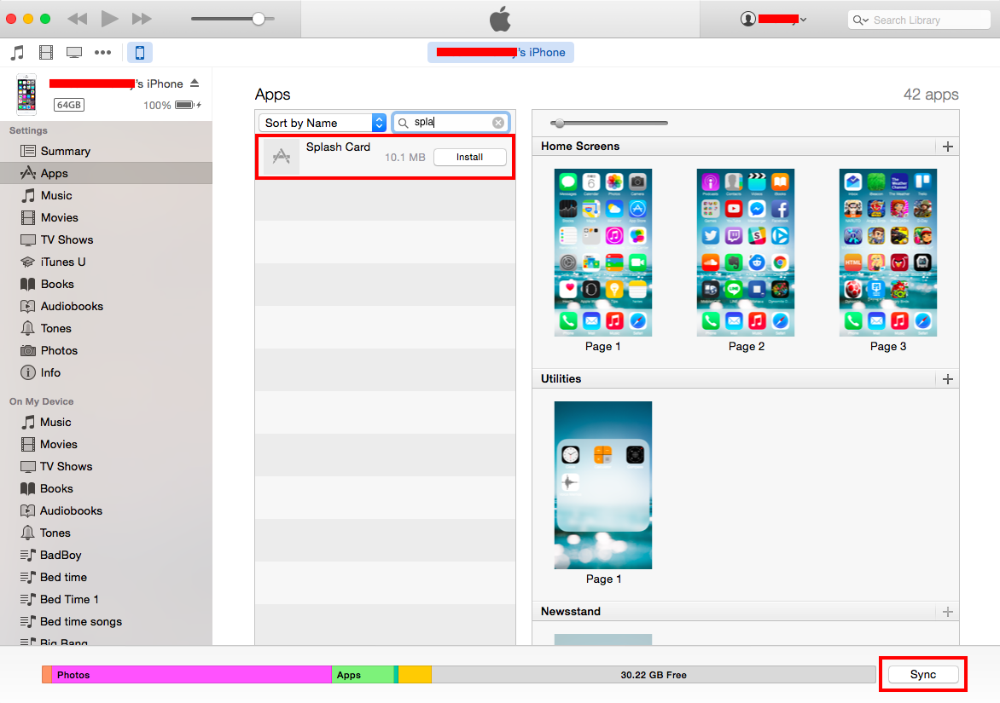

Non-market App Distribution
===========================

For iOS Apps
------------

There are two cases which you want to distribute your applications
outside the App Store:

1.  Testing Purpose: Before releasing your apps, you would want to test
    them as much as you can. Thus, you would want to distribute your
    apps to users (testers) by various ways besides the App Store.
2.  In-house Applications: The applications are made for internal uses
    (in a company or organization) only.

<div class="admonition note">

For in-house distribution, you will need to have an [iOS Developer
Enterprise
Program](https://developer.apple.com/programs/ios/enterprise/) account.

</div>

The differences between iOS Developer and iOS Developer Enterprise
programs regarding apps distribution:

+---------------------+-------------------+----------------------------+
|                     | iOS Developer     | iOS Developer Enterprise   |
|                     | Program           | Program                    |
+=====================+===================+============================+
| TestFlight Beta     | > Yes             | > No                       |
| Testing             |                   |                            |
+---------------------+-------------------+----------------------------+
| Ad Hoc Distribution | > Yes             | > Yes                      |
+---------------------+-------------------+----------------------------+
| App Store           | > Yes             | > No                       |
| Distribution        |                   |                            |
+---------------------+-------------------+----------------------------+
| Custom B2B App      | > Yes             | > No                       |
| Distribution        |                   |                            |
+---------------------+-------------------+----------------------------+
| In-house            | > No              | > Yes                      |
| Distribution        |                   |                            |
+---------------------+-------------------+----------------------------+

For more information about the differences between the two programs,
please refer to [here](https://developer.apple.com/programs/).

There are two ways to distribute your pre-release apps for testing:

-   using iTunes Connect: it's required iOS Developer Account and takes
    time since it needs approval from Apple Review prior to the
    distribution.
-   using Ad Hoc distribution: it can be done with either iOS Developer
    and iOS Developer Enterprise accounts. Plus, it doesn't require the
    approval from Apple Review.

In-house distribution is to securely distribute your iOS apps to your
employees. In other words, you can distribute your app to any company
devices. However, if you want someone outside of your company to test
your app or restrict distribution to specific devices, you can use Ad
Hoc distribution.

Ad Hoc distribution is to distribute your apps using Ad Hoc provisioning
profile to registered devices up to 100.

Both types of distribution have the same ways for app installation. The
difference is the provisioning profile.

There are several ways you can install your applications outside the App
Store as shown in the following sections.

### Install using iTunes

1.  Build your application with with debug or ad-hoc build. For more
    details about iOS build process, please refer to building\_for\_ios.
2.  Download the `.ipa` file after the build completes.
3.  Open iTunes, go to App library.
4.  Drag and drop the downloaded `.ipa` file into the App library.
5.  Connect your device to iTunes and go to your device apps.
6.  Click install button of the app and click Sync button. See the
    example below:

{width="600px"}

### Install using Xcode

You can install your iOS app (`.ipa` file) via Xcode as follows:

1.  Connect your device to your PC.
2.  Open Xcode, go to Window --&gt; Devices.
3.  Then, the Devices screen will appear. Choose the device you want to
    install the app on.
4.  Drag and drop your `.ipa` file into the Installed Apps as shown
    below:

{width="600px"}

### Install using OTA Deployment

OTA (Over-The-Air) Deployment enables you to install your built apps
(ad-hoc build) via HTTPS.

1.  Build your application with either debug or ad-hoc build. For more
    details about iOS build process, please refer to building\_for\_ios.
2.  Download the `.ipa` file after the build completes.
3.  Upload the `.ipa` file to the site you want.
4.  Create a `.plist` file for this built application. The `.plist` file
    should look like this:

> ``` {.sourceCode .html}
> <?xml version="1.0" encoding="UTF-8"?>
> <!DOCTYPE plist PUBLIC "-//Apple//DTD PLIST 1.0//EN" "http://www.apple.com/DTDs/PropertyList-1.0.dtd">
> <plist version="1.0">
> <dict>
>     <key>items</key>
>     <array>
>         <dict>
>             <key>assets</key>
>             <array>
>                 <dict>
>                     <key>kind</key>
>                     <string>software-package</string>
>                     <key>url</key>
>                     <string>https://www.anysite.com/application/your_app.ipa</string>
>                 </dict>
>             </array>
>             <key>metadata</key>
>             <dict>
>                 <key>bundle-identifier</key>
>                 <string>com.example.helloworld</string>
>                 <key>bundle-version</key>
>                 <string>1.0.0</string>
>                 <key>kind</key>
>                 <string>software</string>
>                 <key>title</key>
>                 <string>HELLO</string>
>             </dict>
>         </dict>
>     </array>
> </dict>
> </plist>
> ```
>
> <div class="admonition note">
>
> While creating `.plist` file, please pay attention to these points:
>
> -   `.plist` file must be accessed via https protocol.
> -   update bundle-identifier with the App ID.
> -   specify correct path to the .ipa file.
>
> </div>

5.  Upload the `.plist` file to the site you want. Make sure this file
    must be accessed via HTTPS protocol.
6.  Create a webpage embedded the link to the uploaded `.plist` file
    using special `itms-services://` protocol. See blow example:

> ``` {.sourceCode .html}
> <a href="itms-services://?action=download-manifest&amp;url=https://www.anysite.com/application/your_app.plist">
>     Download
> </a>
> ```

7.  After you get the link, use your device to access the link. Then,
    you will be prompted to install the application. See below example:

> {width="250px"}
>
> {width="250px"}

For Android Apps
----------------

There are two cases which you want to distribute your applications
outside the offical markets such as Google Play Store, Amazon AppStore
and so on:

1.  Testing Purpose: Before releasing your apps, you would want to test
    them as much as you can. Thus, you would want to distribute your
    apps to users (testers) by various ways besides the official
    markets.
2.  Personal/Internal Purpose: The applications are made for your own
    personal uses or just for internal uses.

### Install using ADB command

ADB (Android Debug Bridge) is a tool enabling you to use various
terminal commands to your phone.

Prerequisite:

-   install Android SDK on your computer
-   locate the ADB path after Android SDK installation
-   enable USB Debugging and allow installation of apps from sources
    other than the Play Store on your device.

In order to install your built app via ADB command:

1.  Build your application with debug build. For more details about
    Android build process, please refer to building\_for\_android.
2.  Download the `.apk` file after the build completes.
3.  Plug your device via USB to your computer.
4.  Run below command on your computer in command window. Make sure to
    use the correct path to your `.apk` file.

> ``` {.sourceCode .html}
> adb install foo.apk
> ```

### Install using Direct Link

This is simply an installation through direct link to your `.apk` file:

1.  Build your application with debug build. For more details about
    Android build process, please refer to building\_for\_android.
2.  Download the `.apk` file after the build completes.
3.  Upload the downloaded file to any sites you want.
4.  Go the link of the uploaded file from your device. Then, you will be
    prompted to install the applicaiton.

<div class="admonition note">

Please make sure make these settings on your device beforehand:

-   enable USB Debugging
-   allow installation of apps from sources other than the Play Store.

</div>
