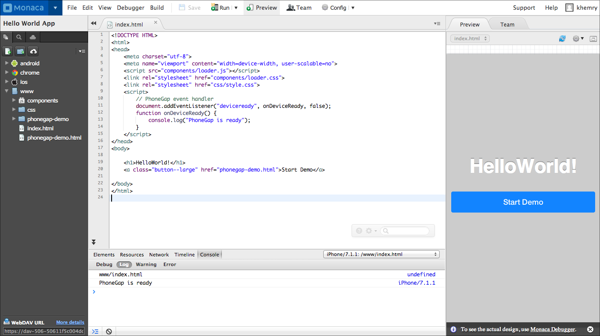

Manual
======

> width
>
> :   500px
>
> class
>
> :   center
>
Monaca IDE comprises of the interface to work from the development of
the project to the build consistently. Here, we will describe about
screen structure, editor's shortcuts and project files management.

> glob
>
> :   
>
> maxdepth
>
> :   2
>
> overview code\_editor/index dependencies/index version\_control
> monaca\_ci/index build/index deploy/index
