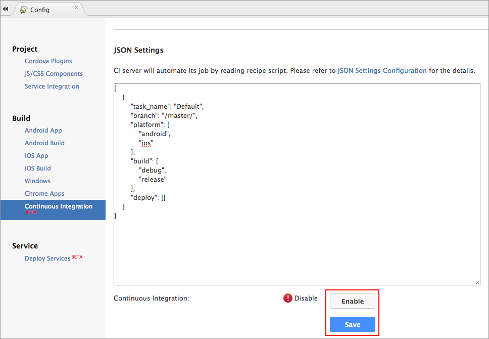
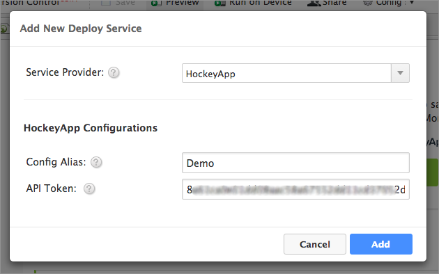
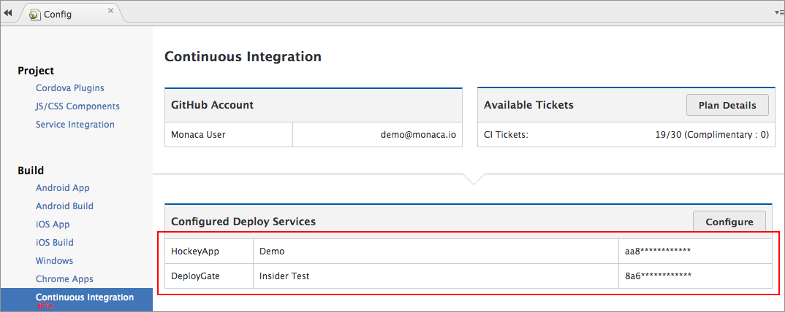
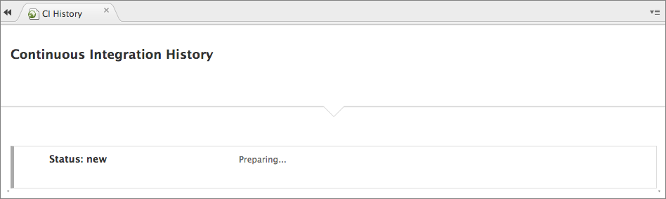
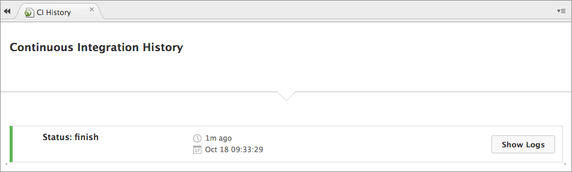
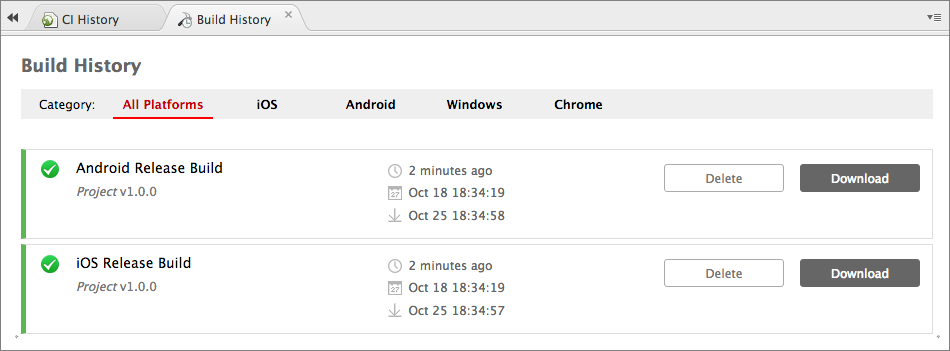
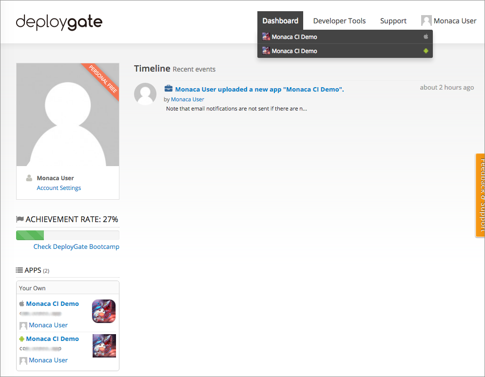
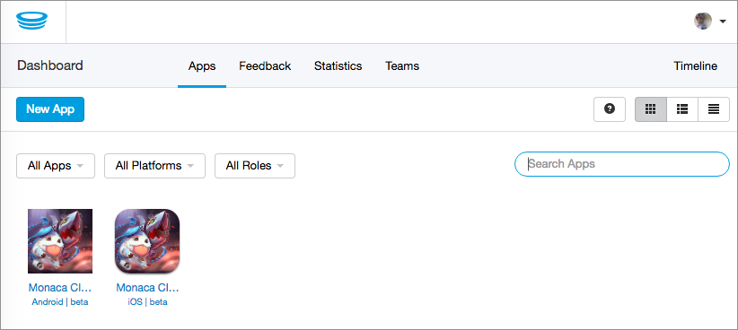

Overview
========

Introduction
------------

Monaca CI (Continuous Integration & Deployment) is a service that has
been integrated within the current Monaca development environment stack
to automate building and deployment cycles. This automation process is
done by using webhooks. Webhooks allow you to build or set up
integrations which subscribe to certain events (code commit, branch/tag
creation and so on) on GitHub and many other Git services. For Monaca
CI, every time you push your project code to GitHub, GitHub will send a
HTTP POST payload to Monaca server. If the received information meets
the Monaca CI configuration, the automation will begin.

Therefore, Monaca CI lets developers focus more on the code and less on
the backend process of building, testing and deploying an app.

Prerequisite
------------

In order to use Monaca CI, you will need to integrate GitHub with your
Monaca account. If you haven't done it, please follow the instruction
below:

1.  Link your Monaca account to GitHub. Please refer to
    github\_integration.
2.  Connect your project to your GitHub repository. Please refer to
    version\_control\_configuration.

<div class="admonition note">

In order to use Monaca CI, Cordova 6.2 or higher is required.

</div>

Getting Started with Monaca CI
------------------------------

Assuming you have successfully linked a GitHub repository to your
project, you are now ready to enable Monaca CI. Please do as follows:

1.  From Monaca Cloud IDE menu, go to
    Config --&gt; Continuous Integration.
2.  Under JSON Settings section, you will see the following default
    JSON script &lt;monaca\_ci\_json&gt;. This script controls the
    automation behaviours of Monaca CI. For example, with this default
    JSON script, Monaca CI will tell Monaca server to generate both
    debug and release builds of your project for iOS platform every time
    you push your project code to a valid GitHub's branch/tag as
    configured using regular expression inside the script. Once the
    build process is completed, you can find these built files under
    Build History panel (Build --&gt; Build History).

> ``` {.sourceCode .javascript}
> [
>         {
>             "task_name": "Default",
>             "branch": "/master/",
>             "platform": [
>                 "android",
>                 "ios"
>             ],
>             "build": [
>                 "debug",
>                 "release"
>             ],
>             "deploy": []
>         }
>     ]
> ```

3.  Monaca CI is disabled by default. To enable it, click Enable and
    then Save it. That's it! Now your Monaca CI is ready. You can start
    pushing your project code to the valid branch or tag as configured
    in JSON settings. Then, you should be able to find the built files
    under Build History panel. It may take some time for the build
    process to be completed.

> {width="600px"}

<div class="admonition warning">

For release build (iOS & Android), you have to start building manually
in the IDE first (one time only) before the Monaca CI can start the
automatic build later. This is because you will need to input a valid
keystore (for Android) and upload the right provisioning profile (for
iOS) for release build.

</div>

Automating Deploy Services
--------------------------

You can also automate your app distribution process with Monaca CI. In
order to do this, please do as follows:

1.  From Monaca Cloud IDE menu, go to Config --&gt; Deploy Services.
2.  Click Add Deploy Service.
3.  Choose a deploy service and fill in the required information. Then,
    click Add. Here is the information you will need to input:

> -   Config Alias: a unique identifier for each service.
> -   Username (DeployGate only): app's owner's username or organization
>     name registered in DeployGate.
> -   API Key (DeployGate) or API Token (HockeyApp): API key provided
>     the deployment service prvider. For more information on how to get
>     the API key for each service, please refer to
>     How to Get API Key from DeployGate &lt;api\_key\_deploygate&gt;
>     and How to Get API Key from HockeyApp &lt;api\_key\_hockeyapp&gt;.
>
> 
>
> > width
> >
> > :   600px
> >
> > align
> >
> > :   left
> >
> > DeployGate
>
> 
>
> > width
> >
> > :   600px
> >
> > align
> >
> > :   left
> >
> > HockeyApp

4.  Go to Continuous Integration panel, you will see your newly added
    service under Configured Deploy Services.

> 
>
> > width
> >
> > :   700px
> >
> > align
> >
> > :   left
> >
5.  Configure your deploy service in JSON script. Assuming that you want
    to generate debug build of your project for both iOS and Android
    platforms when you push the project code to the GitHub's branch
    called `"release"`. Then, distribute the built files to
    `Deploy Gate` service which has a release note and disable the email
    notification for iOS devices. Therefore, your JSON script should
    look like this:

> ``` {.sourceCode .javascript}
> [
>     {
>         "task_name": "Beta Test",
>         "branch": "/release/",
>         "platform": [
>             "ios",
>             "android"
>         ],
>         "build": [
>             "debug"
>         ],
>         "deploy": [
>             {
>                 "type": "DeployGate",
>                 "alias": "Insider Test",
>                 "default": {
>                     "release_note": "This is a beta test for insider testing."
>                 },
>                 "ios": {
>                     "disable_notify": "yes"
>                 }
>             }
>         ]
>     }
> ]
> ```

6.  Once you are done with the configuration, click Save.

<div class="admonition note">

You can have multiple deploy services configured in Monaca CI. You can
also have multiple aliases for each deploy service. Please refer to
supported\_services regarding currently supported and upcoming deploy
services.

</div>

JSON Settings Configuration
---------------------------

Monaca CI will automate its job by reading the JSON recipe script. In
other words, you will need to configure the JSON settings according to
what you want Monaca CI to do for you.

### Parameters

In the following table, there are necessary parameters you will need to
use in the recipe script.

+--------+-------------------------------------------------------------+
| Param  | Description                                                 |
+========+=============================================================+
| `task_ | > a name representing your build process.                   |
| name`  |                                                             |
+--------+-------------------------------------------------------------+
| `branc | > GitHub branch of the project you want to build. It has to |
| h`     | > be written in a regular expression format.                |
+--------+-------------------------------------------------------------+
| `tag`  | > GitHub tag of the project you want to build.              |
+--------+-------------------------------------------------------------+
| `platf | > The platform you want to build for. Valid values are:     |
| orm`   | > `ios`, `android` & `winrt`.                               |
+--------+-------------------------------------------------------------+
| `build | > The build type. Valid values are: `debug` & `release`.    |
| `      |                                                             |
+--------+-------------------------------------------------------------+
| `deplo | > The deployment service(s) you will use to deliver your    |
| y`     | > app.                                                      |
|        | >                                                           |
|        | > -   `type`: name of the deployment service (case          |
|        | >     sensitive).                                           |
|        | > -   `alias`: alias name of the selected deployment        |
|        | >     service (case sensitive).                             |
|        | > -   `default`: a block for default parameters you may     |
|        | >     need to use for the deployment service.               |
|        | > -   `ios`: a block for iOS parameters you may need to use |
|        | >     for the deployment service.                           |
|        | > -   `android`: a block for Android parameters you may     |
|        | >     need to use for the deployment service.               |
|        | >                                                           |
|        | > Please refer to here &lt;supported\_services&gt; for      |
|        | > configuration parameters of each deploy service.          |
+--------+-------------------------------------------------------------+

### Example

Here is an example of a recipe script configured for multiple deploy
services and one service with multiple aliases.

``` {.sourceCode .javascript}
[
    {
        "task_name": "test",
        "branch": "/master/",
        "platform": [
            "ios",
            "android"
        ],
        "build": [
            "debug",
            "release"
        ],
        "deploy": [
            {
                "type": "DeployGate",
                "alias": "Internal-Focus-Group",
                "default": {
                  "release_note": "This is a beta test for insider testing."
                },
                "ios": {
                  "disable_notify": "yes"
                }
            },
            {
                "type": "DeployGate",
                "alias": "External-Focus-Group",
                "default": {
                  "release_note": "This is a beta test for outsider testing."
                },
                "ios": {
                  "disable_notify": "yes"
                }
            },
            {
                "type": "HockeyApp",
                "alias": "Demo",
                "default": {
                  "notes": "This is a beta test for demo."
                }
            }
        ]
    }
]
```

Monaca CI Execution Procedure
-----------------------------

Assuming that you want to use Monaca CI to create release build for iOS
and Android when you push the project code to a branch called `master`.
Moreover, you want Monaca CI to distribute the built files to 2
deployment services such as DeployGate and HockeyApp. For this reason,
your JSON recipe should look like this:

``` {.sourceCode .javascript}
[
  {
    "task_name": "Default",
    "branch": "/master/",
    "platform": [
      "ios",
      "android"
    ],
    "build": [
      "release"
    ],
    "deploy": [
      {
        "type": "DeployGate",
        "alias": "Insider Test",
        "default": {
          "release_note": "This is a beta test for insider testing."
        },
        "ios": {
          "disable_notify": "yes"
        }
      },
      {
        "type": "HockeyApp",
        "alias": "Demo",
        "default": {
          "notes": "This is a beta test for demo."
        }
      }
    ]
  }
]
```

Here is the execution procedure for Monaca CI corresponding to the above
JSON setting:

1.  Code is pushed to GitHub.
2.  If the code is pushed to a valid GitHub’s branch/tag as configured
    in JSON recipe script, Monaca server will start building your
    project. Please go to Build --&gt; CI History to see the live
    process of Monaca CI. Then, you can find the built files in
    Build --&gt; Build History.

> {width="700px"}
>
> {width="700px"}
>
> {width="700px"}

3.  When the build process is successfully completed in Monaca server,
    the build files will be sent to the configured deployment services.

> {width="700px"}
>
> {width="700px"}
