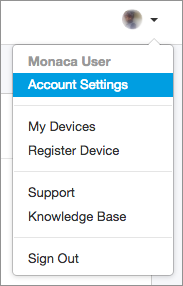
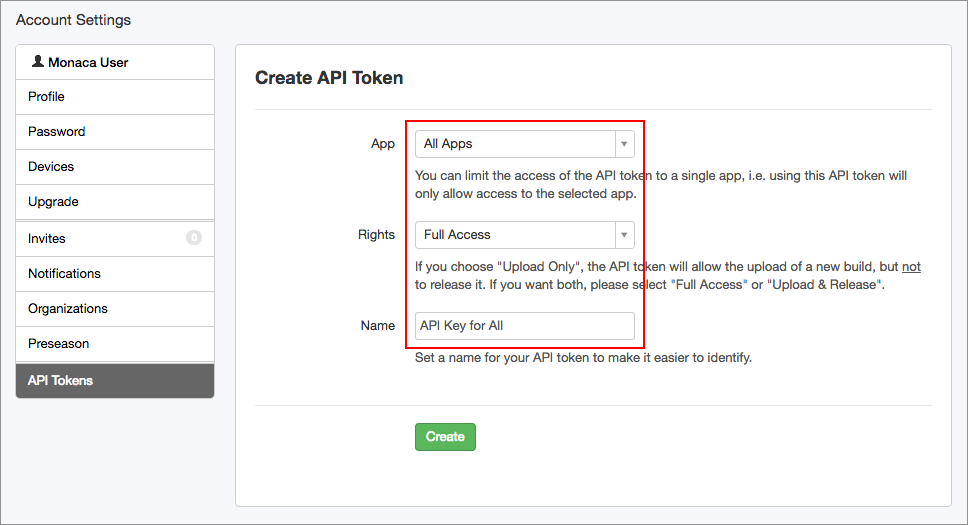
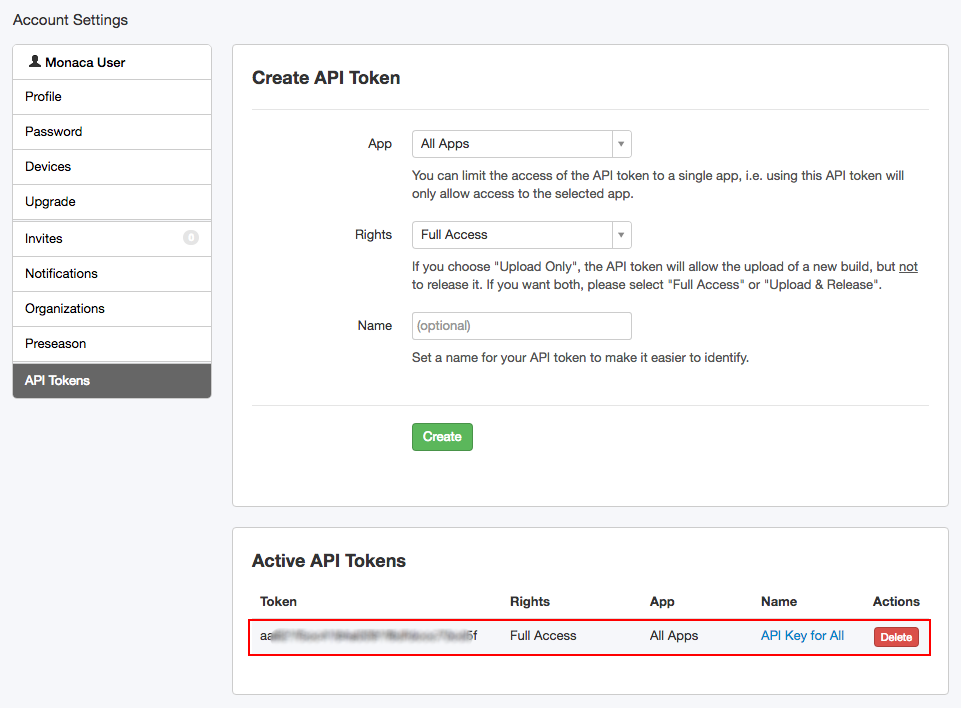

Deploy Services
===============

Currently Supported Deploy Services
-----------------------------------

### DeployGate

[DeployGate](https://deploygate.com/) makes it easy to share your
in-development iOS and Android apps, allowing developers to seamlessly
progress through the prototyping, development, testing, and marketing
stages of app distribution.

You may need to use the following parameters in the JSON recipe script
for Monaca CI. For more information, please refer to [DeployGate API
documentation](https://deploygate.com/docs/api).

  ---------------------------------------------------------------------------------------------------------------------------------------------------------------
  Param                      Description                                                                                   Remark
  -------------------------- --------------------------------------------------------------------------------------------- --------------------------------------
  `token`                    Your API key. If you are going to use the API for automated build in your organization, you   Stored in deploy service settings.
                             may want to use organization's API key which shown on the organization page to upload the app Automatically populated.
                             independent from member/role management.                                                      

  `file`                     App file binary                                                                               Automatically populated.

  `message`                  \[Optional\] Push message                                                                     

  `distribution_key`         \[Optional\] Target Distribution Key                                                          

  `release_note`             \[Optional\] Distribution message                                                             

  `disable_notify`           \[Optional\](`iOS only`) If you set yes as a value, disable notify via email.                 

  `visibility`               \[Optional\] Set a new application's privacy setting by specifying `private` (default) or     
                             `public`. If you are using Personal Free account, you have to specify `public` to upload a    
                             new app since it doesn't have a slot for private app. No effect when updating.                
  ---------------------------------------------------------------------------------------------------------------------------------------------------------------

#### How to Get API Key

1.  Log into [DeployGate](https://deploygate.com/).
2.  Go to Account Settings.

> {width="238px"}

3.  Then, a Profile page will be shown. You will be able to find the API
    key at the end of the page.

> {width="700px"}

### HockeyApp

[HockeyApp](https://hockeyapp.net/) brings mobile DevOps to your apps
with beta distribution, crash reporting, user metrics, feedback, and
powerful workflow integrations.

You may need to use the following parameters in the JSON recipe script
for Monaca CI. For more information, please refer to [HockeyApp API
documentation](https://support.hockeyapp.net/kb/api/api-apps).

+----------+-----------------------------------------+----------------+
| Param    | Description                             | Remark         |
+==========+=========================================+================+
| `ipa`    | file data of the `.ipa` for iOS,        | Automatically  |
|          | `.app.zip` for OS X, or `.apk` file for | populated.     |
|          | Android.                                |                |
+----------+-----------------------------------------+----------------+
| `dsym`   | \[Optional\] file data of the           |                |
|          | `.dSYM.zip` file (iOS and OS X) or      |                |
|          | `mapping.txt` (Android). Please note    |                |
|          | that the extension has to be            |                |
|          | `.dsym.zip` (case-insensitive) for iOS  |                |
|          | and OS X and the file name has to be    |                |
|          | `mapping.txt` for Android.              |                |
+----------+-----------------------------------------+----------------+
| `notes`  | \[Optional\] release notes as Textile   |                |
|          | or Markdown (after 5k characters note   |                |
|          | are truncated).                         |                |
+----------+-----------------------------------------+----------------+
| `notes_t | \[Optional\] type of release notes:     |                |
| ype`     |                                         |                |
|          | > -   `0` for Textile                   |                |
|          | > -   `1` for Markdown                  |                |
+----------+-----------------------------------------+----------------+
| `notify` | \[Optional\] notify testers (can only   |                |
|          | be set with full-access tokens):        |                |
|          |                                         |                |
|          | > -   `0` to not notify testers         |                |
|          | > -   `1` to notify all testers that    |                |
|          | >     can install this app              |                |
|          | > -   `2` to notify all testers         |                |
+----------+-----------------------------------------+----------------+
| `status` | \[Optional\] download status (can only  |                |
|          | be set with full-access tokens):        |                |
|          |                                         |                |
|          | > -   `1` to not allow users to         |                |
|          | >     download the version              |                |
|          | > -   `2` to make the version available |                |
|          | >     for download                      |                |
+----------+-----------------------------------------+----------------+
| `tags`   | \[Optional\] restrict download to       |                |
|          | comma-separated list of tags            |                |
+----------+-----------------------------------------+----------------+
| `teams`  | \[Optional\] restrict download to       |                |
|          | comma-separated list of team IDs. For   |                |
|          | example:                                |                |
|          |                                         |                |
|          | > -   `teams=12,23,42` with 12, 23, and |                |
|          | >     42 being the database IDs of your |                |
|          | >     teams                             |                |
+----------+-----------------------------------------+----------------+
| `users`  | \[Optional\] restrict download to       |                |
|          | comma-separated list of user IDs. For   |                |
|          | example:                                |                |
|          |                                         |                |
|          | > -   `users=1224,5678` with 1224 and   |                |
|          | >     5678 being the database IDs of    |                |
|          | >     your users                        |                |
+----------+-----------------------------------------+----------------+
| `mandato | \[Optional\] set version as mandatory:  |                |
| ry`      |                                         |                |
|          | > -   `0` for not mandatory             |                |
|          | > -   `1` for mandatory                 |                |
+----------+-----------------------------------------+----------------+
| `release | \[Optional\] set the release type of    |                |
| _type`   | the app:                                |                |
|          |                                         |                |
|          | > -   `2` for alpha                     |                |
|          | > -   `0` for beta \[default\]          |                |
|          | > -   `1` for store                     |                |
|          | > -   `3` for enterprise                |                |
+----------+-----------------------------------------+----------------+

#### How to Get API Key

1.  Log into [HockeyApp](https://hockeyapp.net/).
2.  Go to Account Settings.

> {width="183px"}

3.  In the Account Settings page, go to API Tokens tab. In this page,
    you can find all of your API tokens or create a new one. Assuming
    you haven't created an API token yet, let's create one as shown in
    the screenshot below:

> {width="700px"}

4.  Once the API token is successfully created, you will be able to see
    it at the bottom of the page.

> {width="700px"}

Upcoming Supported Deploy Services
----------------------------------

In addition to the above services, we are planning to add more
deployment services. Currently, we are working the following services:

-   [Test Flight](https://developer.apple.com/testflight/)
-   [Appetize.io](https://appetize.io/)

