Cloud IDE Overview
==================

Monaca Cloud IDE consists of 5 main parts such as:

1.  menu\_bar
2.  file\_tree
3.  debug\_panel
4.  preview\_team\_panel
5.  code\_editor

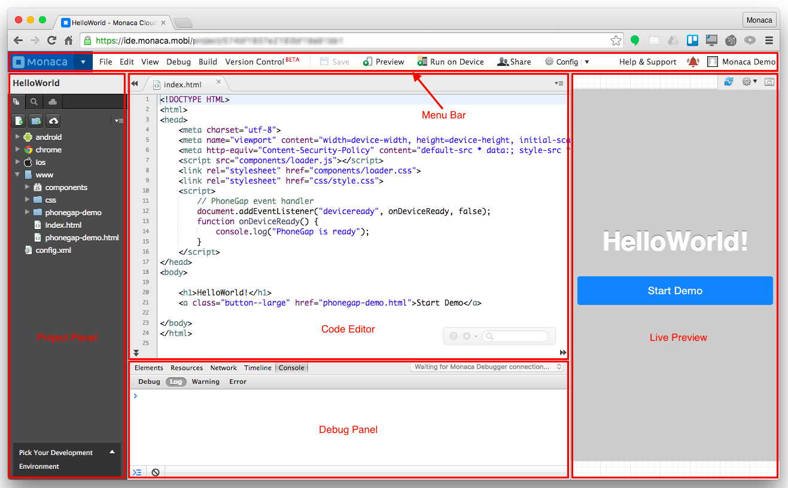{width="700px"}

Menu Bar
--------

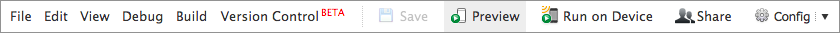{width="700px"}

In the menu bar, there are several main menus such as:

### File

### Edit

### View

### Debug

### Build

### Version Control

For more information to enable vision control on your project, please
refer to version\_control.

### Config

Publish Project
---------------

This feature allows you to make your project available to other users by
sharing the link generated after publishing your project. By accessing
the generated link, users can get a copy of their own in their account.
All changes made in the copies are not transferred to the original, so
there will be no fear of someone messing up the original.

Publishing your project is really easy and done by following the next
simple steps:

1.  From Monaca Cloud IDE menu, go to File --&gt; Publish Project.
2.  Click Publish button.

> 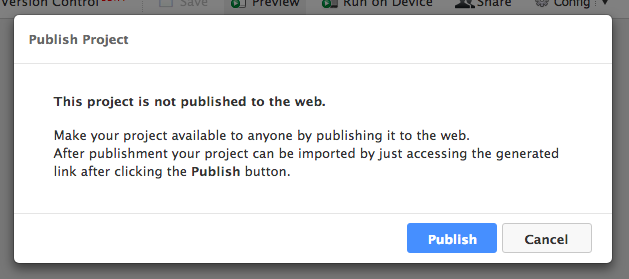{width="600px"}

3.  Copy the generated link and share it with the world

> 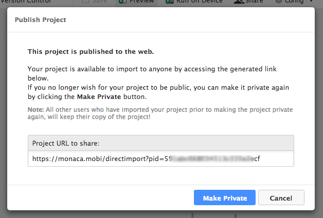{width="600px"}

If you no longer wish for your project to be available, you can make it
private again by clicking the Make Private button that appears after
publishing your project.

Direct Import
-------------

With this feature, we allow Monaca users to directly import published
Monaca projects or projects from a given URL directly by just accessing
a link. Upon accessing the link, the users will be forwarded to the
following screen (if signed in), whereby just clicking the import button
the project will be imported into their account.

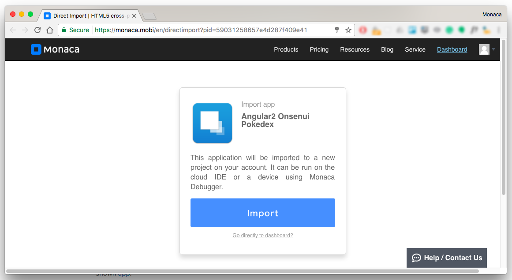{width="700px"}

Project Panel
-------------

In the Project panel, there are 3 main tabs:

-   *File Tree*: Displays a list of folders and files existed in the
    current project. Right-click on a folder or file to see additional
    functions such as New File, Copy, Rename, Delete, Upload File and so
    on. To edit a file, select it and then its content will be shown in
    Monaca IDE Editor&lt;code\_editor&gt;.
-   *Grep*: Searches for files by using Unix command.
-   *Monaca Backend*: Contains the backend settings of the project.

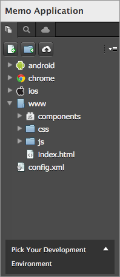{width="160px"}

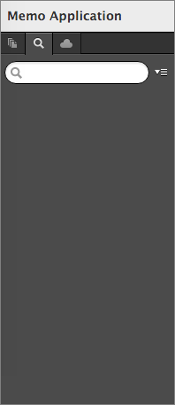{width="160px"}

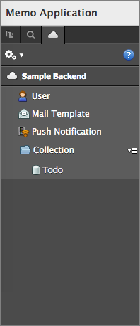{width="160px"}

Debug Panel
-----------

Once Monaca Debugger is connected with Monaca Cloud IDE, you can do
console debugging as well DOM inspection in this panel. For more
information, please refer to by\_debugger\_ide.

{width="700px"}

Live Preview
------------

The Live Preview provides an overview of your app in real-time. You can
also interact with this preview as if it is running on an actual device
with the limitation of executing the specific device’s functionality
(such as camera, contact and so on) and cross-origin network AJAX
request. Along with the Monaca Debugger, you will have effective and
efficient experiences during app development.

In this tab, you can:

-   refresh the Preview window.
-   change the display device's screen by clicking on the Configure icon
    in that tab. Then, you will see a drop-down list of different
    devices such as iPad, iPhone, and Nexus. You can change the
    orientation of the screen as well.
-   detach/attach the Preview window.

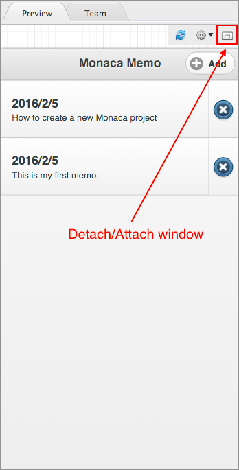{width="300px"}

*Live Preivew Limitations*

When using Live Preview, you should be aware of the the following
limitations:

-   Cordova Plugin APIs are not available.
-   Ajax requests will fail because of Cross-origin restriction.
    However, it can be done if server-side scripts return
    "Access-Control-Allow-Origin” Header (i.e., Cross-Origin Ajax
    Request is permitted).
-   Viewport appearance may differ from real devices.
-   Monaca Backend API and Push Notifications can not be initialized.

Share
-----

The usability of this function depends on your Monaca subscription plan.
For more information, please refer to [Monaca Subscription
Plan](https://monaca.mobi/en/pricing).

The *Share* function allows you to:

-   manage the team: add/remove members to the shared project.
-   share the source code with multiple people (members are assigned as
    Developers). There are 3 ways to do this such as:
    1.  The easiest way is to use Monaca Cloud's Team Management
        function. Then, two or more people can open the same project in
        different Monaca Cloud IDEs. However, if there is any conflict
        while updating the project, the previous version of the project
        will be overwritten (but it still remains in the file history).
    2.  Another way is to set up a version control system and do the
        local development using
        Monaca Localkit &lt;monaca\_localkit\_index&gt; or
        Monaca CLI &lt;monaca\_cli\_index&gt;. This requires a higher
        skill set, but more collaborative.
    3.  The last option is to use
        Monaca for Visual Studio &lt;monaca\_vs\_index&gt;. In this
        case, files can be managed by Visual Studio's built-in Team
        Explorer function. Git, TFS, Visual Studio Online and other
        supported version control system can be used in this case.
-   let multiple people to test the project (members are assigned as
    Testers).

If you want to join a team and edit the project files, you need to
subscribe to a valid plan. Otherwise, you can only join as a tester.
Please refer to [Pricing](https://monaca.io/pricing.html).

You can share your project with other Monaca users. You can also
add/remove other Monaca users to/from your project. In order to manage
the members of your project, please do as follows:

1.  Click on Share button in the Menu panel.
2.  Then, the Team Member Manage screen will appear. To add a member,
    input the email(s) of your team member(s). Please enter one email
    address per line. You can also assign the role of each member as
    Developer or Tester by choosing from the drop-down menu. Then, click
    Add Member button to send the invitation to them.

> 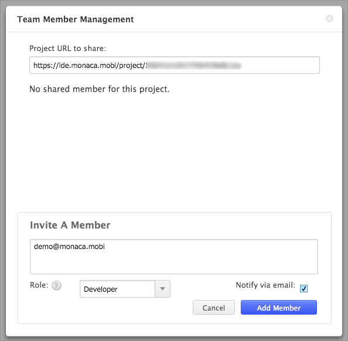{width="500px"}

3.  To remove a member from the project, you can just click on the
    delete icon at the end of the row of that member's info as shown
    below

> 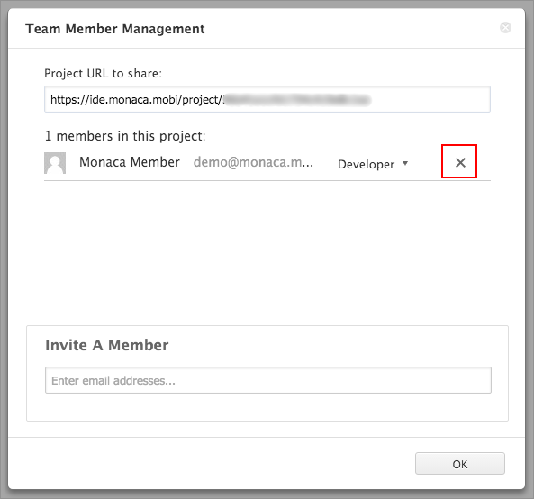{width="500px"}

Code Editor
-----------

Views and edits the selected file from the file tree. Various settings
such as Preferences is also shown and can be edited here. Once you open
a file, you can select it from the tab.

The editor supports the syntax highlight of JavaScript/HTML5/CSS3. The
editor also supports JavaScript and CSS autocomplete function,
Emmet (Zen Coding) &lt;emmet&gt; and typescript\_manual.

Please refer to editor\_shortcuts for the list of all shortcuts
available in Monaca code editor.

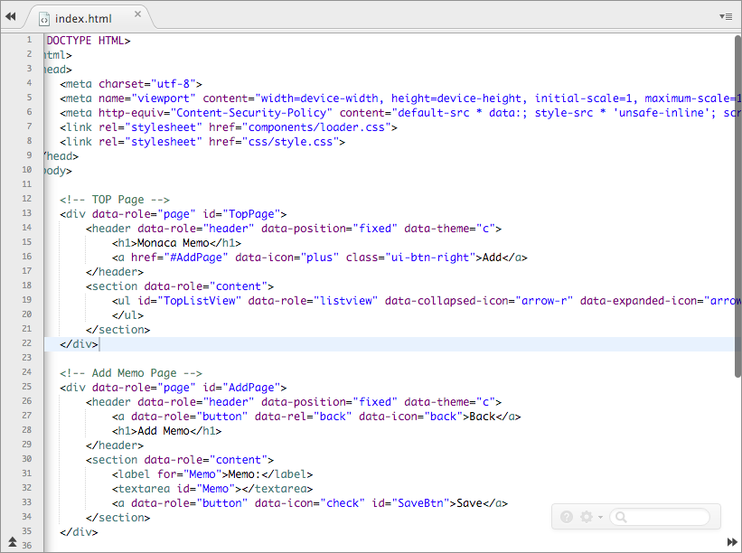{width="500px"}

Inside this editor, there is also a small and short menu bar as shown
below:

{width="200px"}

Within this short menu, you can:

-   go to Monaca documentation by clicking on Help icon.
-   config the code editor by clicking on Setting icon. You will see 3
    menu items such as:
    1.  View Older Versions: View older versions of the currently
        selected file.
    2.  Editor Configuration: Configure the appearance of the editor.
    3.  Editor Shortcuts: open the keyboard shortcut references.
-   search for a string inside the currently opened file.

