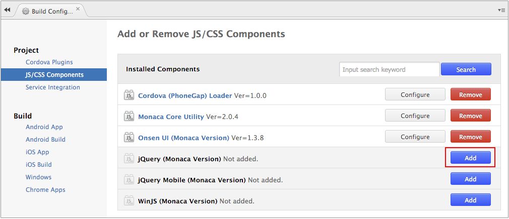
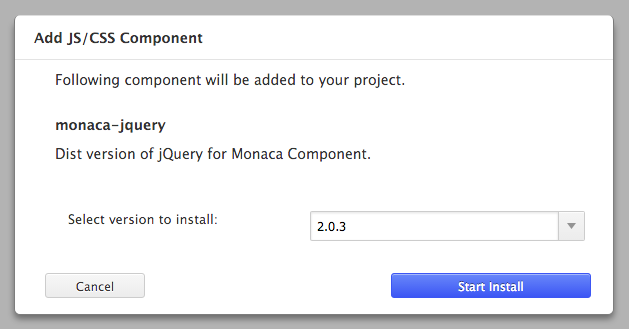
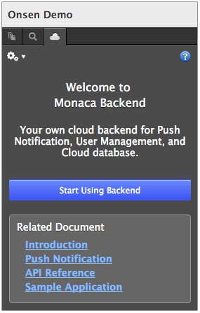
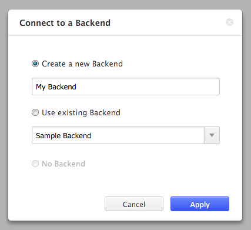
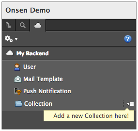
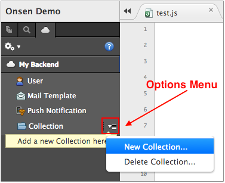

Part 3: Setting up Monaca Backend
=================================

Step 1: Enabling a Required Plugin for Monaca Backend
-----------------------------------------------------

In order to use Monaca Backend, you need to add [jQuery
library](https://jquery.com/) into your project. If you haven't added
jQuery into your project yet, please do as follows:

1.  From Monaca Cloud IDE menu, go to
    Config --&gt; Manage JS/CSS Components.
2.  Then, "Add or Remove JS/CSS Components" page will be shown. Select
    Add button of jQuery (Monaca Version) to add it to your project.

> {width="600px"}

3.  In this dialog, you can choose which version of jQuery library you
    want to install. Then, click Start Install button. Next, click OK
    button.

> {width="400px"}

Step 2: Attaching Backend to Your Project
-----------------------------------------

1.  From Monaca Cloud IDE, click on Cloud icon above the file tree menu
    to go to the Backend Control Panel. Then, click Start Using Backend
    button.

> {width="250px"}

2.  The following dialog will appear. You can create a new Backend, or
    select an existing one which is used in a different project. Then,
    click Apply to attach the Backend to your project.

> {width="400px"}

3.  After attaching the Backend, your Backend Control Panel will look
    similar to this:

> {width="250px"}

Step 3: Creating a New Collection
---------------------------------

Collection is a general purpose storage to keep data in the Backend.

1.  From Backend Control Panel, click on Options Menu icon. Then, choose
    New Collection....

> {width="350px"}

2.  Then, New Collection dialog will appear. Fill in the name for your
    Collection. Then, click Add button.

> {width="400px"}
>
> 

>
> Please remember to enable Allow JavaScript API to insert data if you
> want to insert data from your app. For more details about collection
> management, please refer to
> backend\_control\_panel\_collection\_management.
>
> 

After you follow the above steps, you can now start creating your own
applications with Backend support. backend\_database\_memo demonstrates
a step-by-step instruction on how to manipulate Monaca Backend in an
application. Please refer to it and start coding your app with Monaca
Backend.
