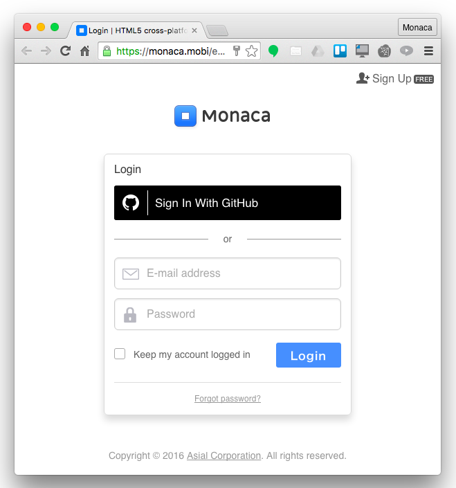
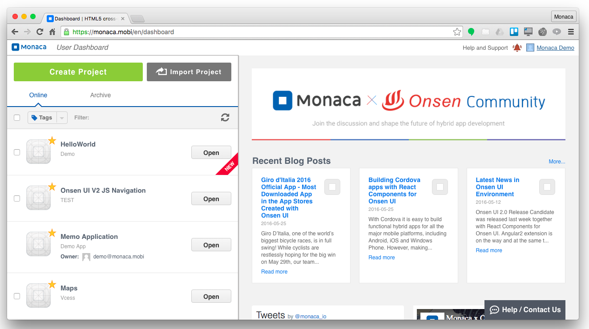
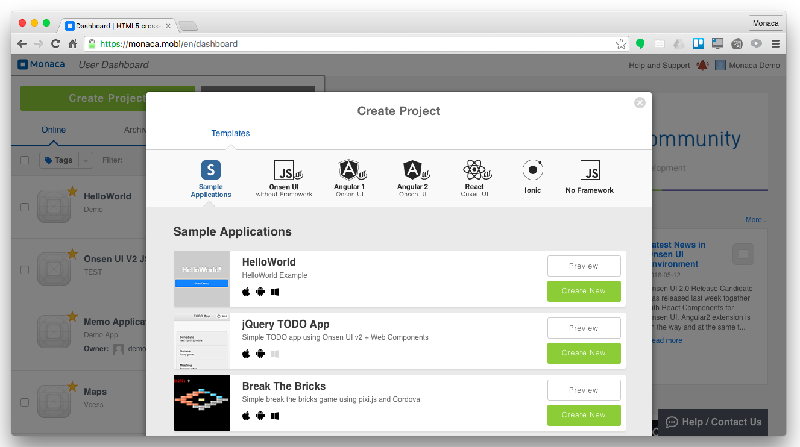
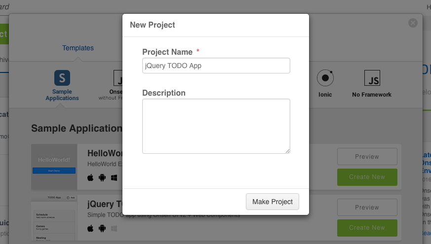
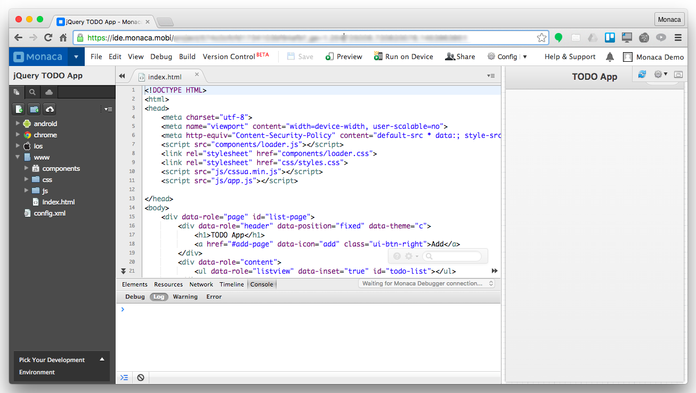
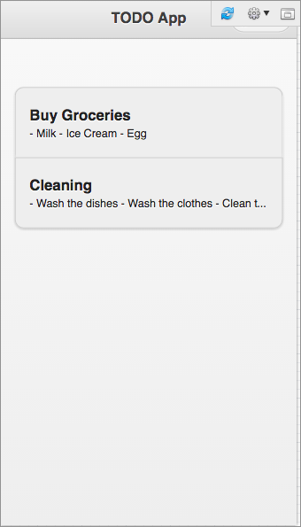

Part 1: Starting a Project
==========================

Step 1: Logging into Monaca
---------------------------

1.  Login to [Monaca](https://monaca.mobi/en/login).
2.  Input your Monaca account information.

> {width="400px"}

Step 2: Creating a New Project
------------------------------

After a successful sign-in, you will be directed to Monaca Dashboard.
You are now ready to create your first Monaca project. Please do as
follows:

1.  From Monaca Dashboard, click on Create Project or Import Project to
    create a new Monaca project.

> {width="650px"}

2.  If you choose Create Project, you will be able to create a new
    Monaca project based on various templates. On the other hand, if you
    choose Import Project, you will be able to create a new Monaca
    project by importing an existing project in 3 ways such as:

> -   filling in a project's URL
> -   uploading a project package
> -   or selecting your existing GitHub repository. Please refer to
>     version\_control on how to set up GitHub integration with Monaca.
>
> {width="650px"}
>
> {width="650px"}

3.  In this tutorial, we will choose the Create Project option. In the
    Create Project dialog, select Sample Applications and choose
    `jQuery TODO App` template by clicking on its Create New button.

> {width="650px"}

4.  Fill in the project's information and click on Make Project button.

> {width="500px"}

5.  Then, you will see your newly created project listed under the
    Online tab of the Dashboard.

Step 3: Previewing a Project
----------------------------

Monaca Cloud IDE allows you to preview your project through a Preview
window without any real devices.

Some functionalities of applications might not be properly previewed
because the Preview window has several limitations such as Ajax
requests, Cordova plugin APIs and so on. For more information, please
refer to usage and limitation of Live Preview &lt;preview\_tab&gt;.

1.  From the Monaca Dashboard, open a project. Then, Monaca Cloud IDE
    will be open. You can find the Preview window on the right panel of
    the IDE.

> {width="650px"}

2.  Try adding some TODO items in the Preview window.

> {width="300px"}

Step 4: Editing a Project
-------------------------

All editable files are listed under `www` folder.

1.  From the File Tree panel, choose a file to edit. Let's make some
    changes in index.html file in the code editor.
2.  Save the changes, then you will be able to see the updates instantly
    in the Preview window. Feel free to edit the project as you wish.
    For more detailed explanation about this template, please refer to
    Explanation about jQuery TODO App &lt;todo&gt;.

For more information regarding the code editor in Monaca Cloud IDE,
please refer to code\_editor.

