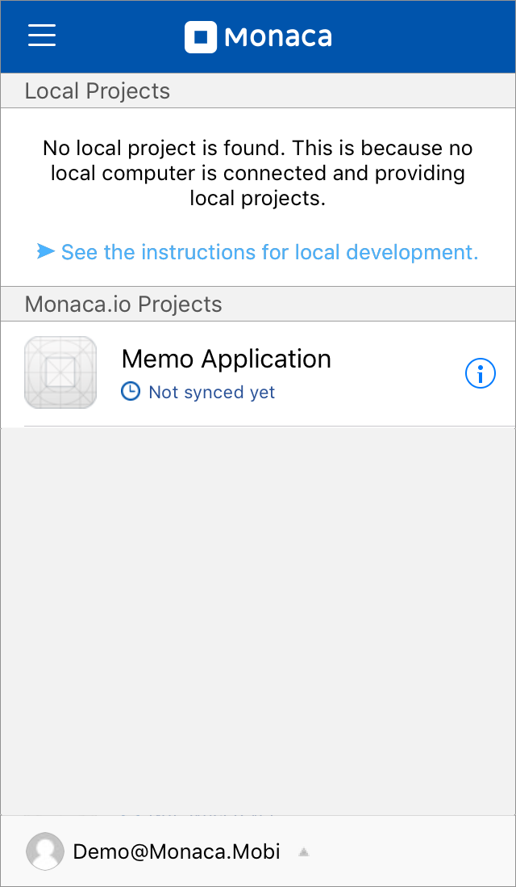
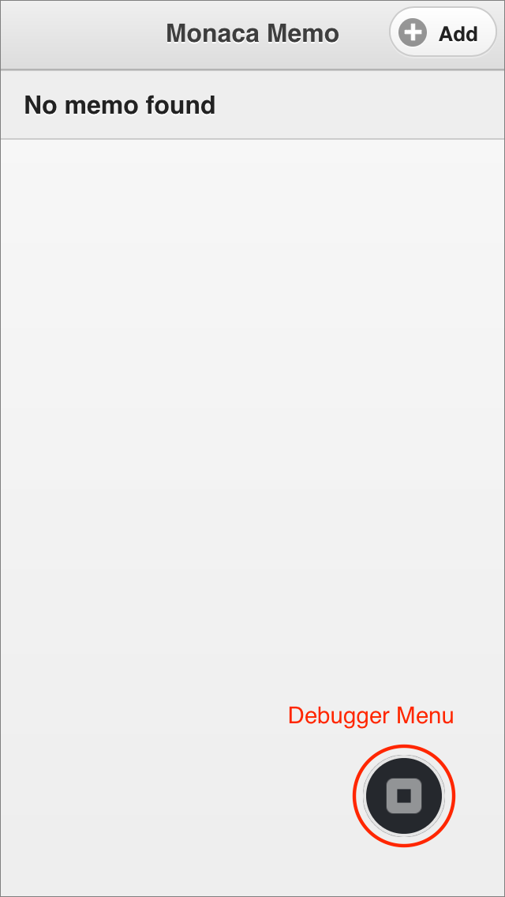
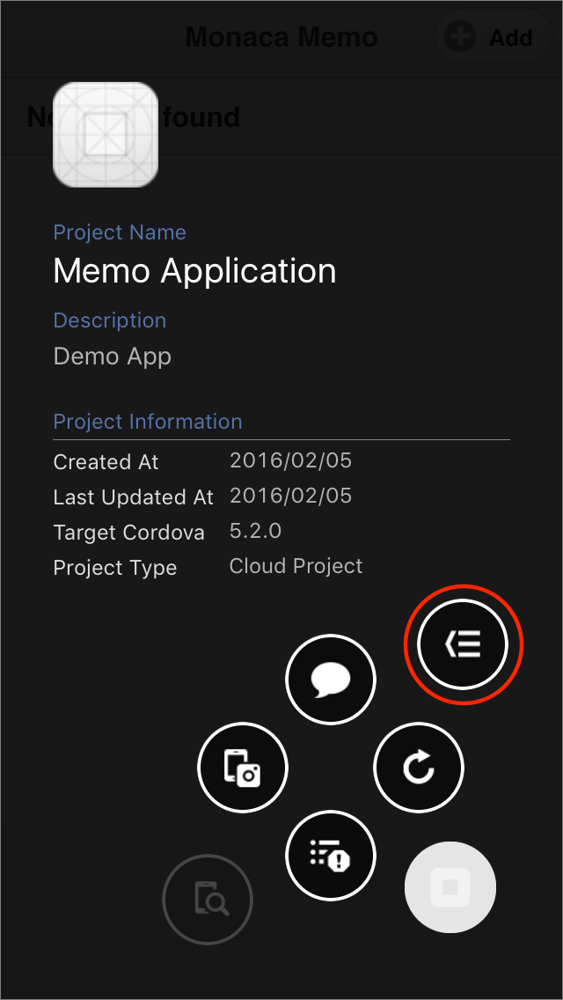
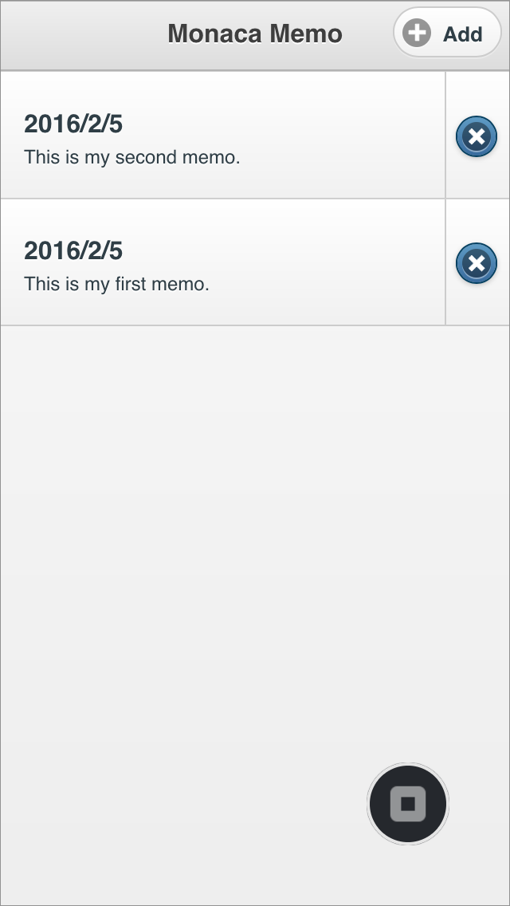
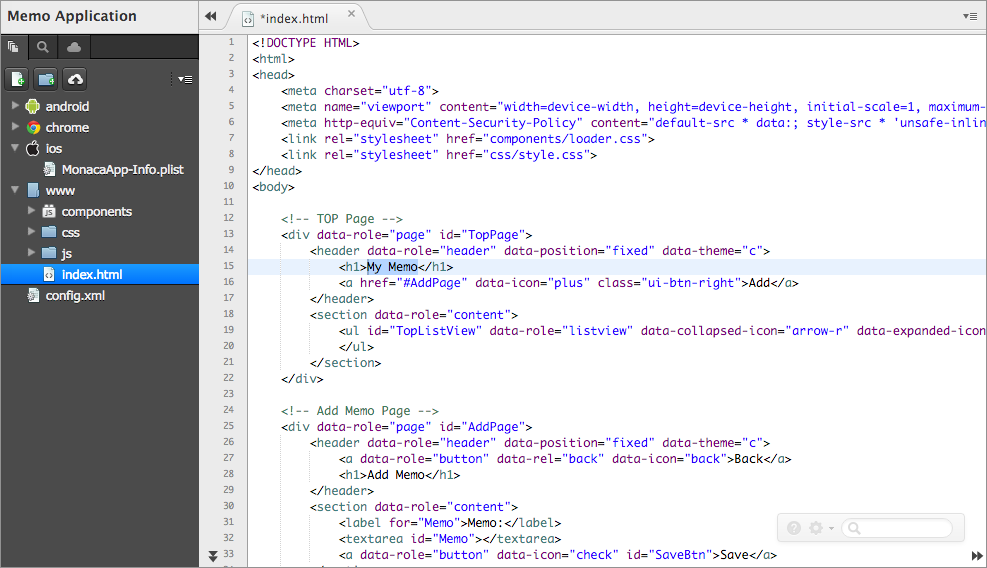
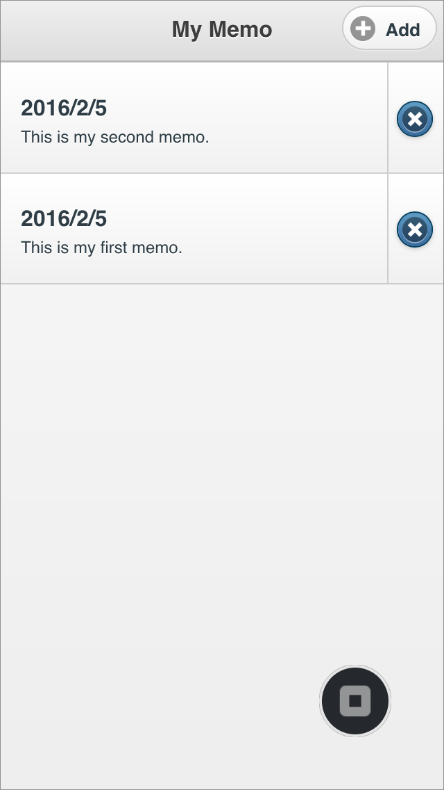
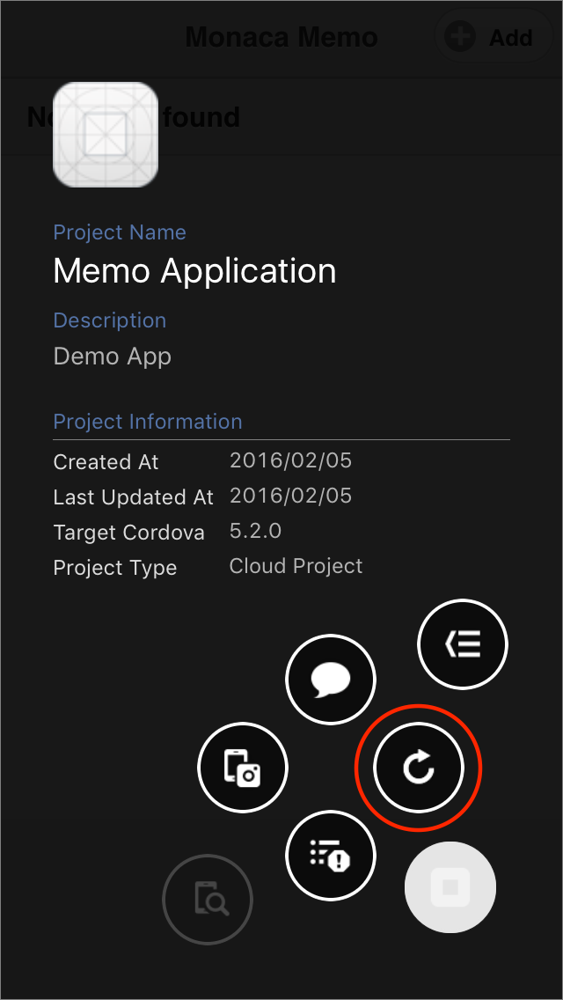

Part 2: Running Monaca Debugger with Monaca Cloud IDE
=====================================================

Monaca Debugger &lt;monaca\_debugger\_index&gt; is a powerful
application for testing and debugging your Monaca applications on real
devices in real time.

When developing Monaca apps in Monaca Cloud IDE, assuming that the
Internet connection is available, all changes made to your project files
will be pushed into your Monaca Debugger in real-time as soon as you
save those changes.

Before Getting Started
----------------------

Please install Monaca Debugger on your device.

> {width="100px"}
>
> {width="100px"}

Please refer to
Monaca Debugger Installation &lt;debugger\_installation\_index&gt; for
other platforms.

Step 1: Running a Project on Monaca Debugger
--------------------------------------------

1.  Launch Monaca Debugger app and sign in using your Monaca account
    information. Make sure you are using the same account information
    you use for Monaca Cloud IDE.

> 
>
> > width
> >
> > :   250px
> >
> > align
> >
> > :   left
> >
2.  Then, a project list will appear. All Monaca Cloud IDE projects are
    listed under `Monaca.io Projects`. To run a project, you can just
    click on the project name in Monaca Debugger or click Run on Device
    button in Monaca Cloud IDE menu.

> 
>
> > width
> >
> > :   250px
> >
> > align
> >
> > :   left
> >
3.  Then, your project should be running in the debugger. To go back to
    the Project List screen, go to Debugger Menu and click Back button.

> {width="250px"}
>
> {width="250px"}

4.  Try and test your project by adding/deleting a memo.

> {width="250px"}

Step 2: Real-time Updates between Monaca Cloud IDE and Debugger
---------------------------------------------------------------

By now, you are able to run your Monaca project on the debugger. Next,
let's try to edit this project and see how it is reflected on the
debugger.

1.  Run the project on the debugger.
2.  On Monaca Cloud IDE, make some changes in a project file and save
    them (please refer to
    Edit Project Files &lt;monaca\_cloud\_ide\_edit\_project&gt;). In
    this example, we edit index.html and change the title of page from
    "Monaca Memo" to "My Memo". Then, save the change.

> 
>
> > width
> >
> > :   700px
> >
> > align
> >
> > :   left
> >
3.  The saved changes will be sent to Monaca Debugger on your device.
    You can also click on Reload button to retrieve the latest updates
    of your app in case the changes are not reflected.

> {width="250px"}
>
> {width="250px"}

Please refer to monaca\_debugger\_features to explore the other
functions provided by Monaca Debugger.

That's it! That's how easy it is to use Monaca Debugger. Please try to
make more changes to your project and see how it runs on the debugger.

PRACTICE MAKES PERFECT! Enjoy developing with Monaca!
