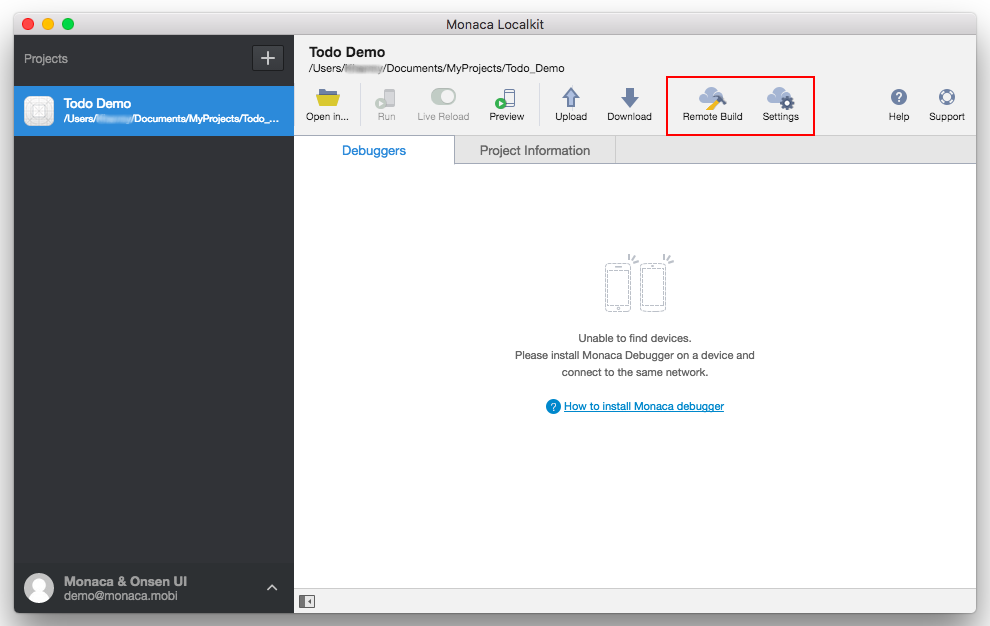

Remote Building and Publishing
==============================

> width
>
> :   700px
>
> align
>
> :   center
>
Inside Remote Build and Settings functions, there are several important
configurations such as:

-   App Settings: app's information configuration for each platform
    (iOS, Android & Windows).
-   Build & Build Settings: build configuration for each platform (iOS,
    Android & Windows).
-   Project: project dependencies configuration including
    Cordova plugins&lt;standard\_plugins&gt;, js\_css and Service
    Integration.

Please refer to the following documentation on how to build and
distribute your app according to each platform:

> maxdepth
>
> :   2
>
> ../../monaca\_ide/manual/build/index
> ../../monaca\_ide/manual/deploy/index
