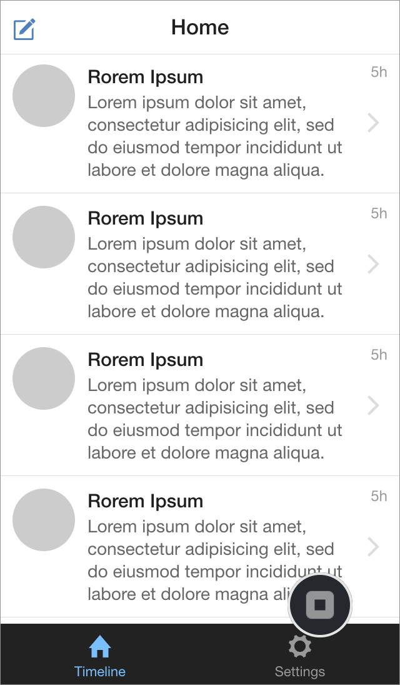
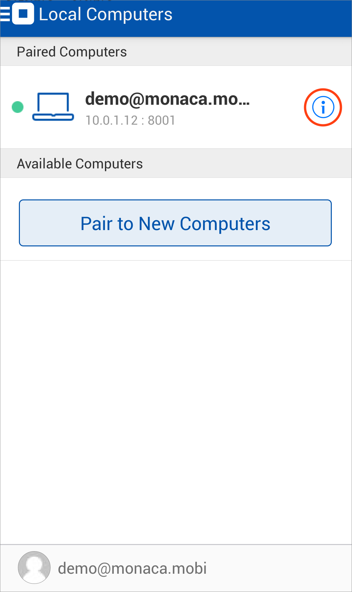

Pairing and Debugging
=====================

In order to debug Monaca app with Monaca for Visual Studio, you need to
pair your host PC (running Monaca for Visual Studio) with your device
(running Monaca Debugger) first.

Make sure your host PC and your mobile device are in the same network
connection (LAN or Wi-Fi). Some public networks do not allow connections
between clients; therefore, pairing cannot be done in this case.

Start Pairing
-------------

1.  Launch Monaca Debugger app and sign in using your Monaca account
    information. Make sure you are using the same account information
    you use for Monaca within Visual Studio IDE.

> 
>
> > width
> >
> > :   250px
> >
> > align
> >
> > :   left
> >
2.  Pair the Monaca Debugger with the PC hosting Monaca for Visual
    Studio. Once logged in, Monaca Debugger should be able to detect the
    host PC as shown below. Then, click Pair button to start the
    pairing.

> 
>
> > width
> >
> > :   250px
> >
> > align
> >
> > :   left
> >
3.  If your pairing is successful, a project list will appear in Monaca
    Debugger and the connected debugger will appear in the Monaca panel
    (see screenshots below as an example). However, if Monaca Debugger
    is unable to detect the host PC automatically, please refer to
    troubleshooting the Pairing&lt;troubleshoot\_pair&gt;.

> {width="250px"}
>
> {width="232px"}

4.  In order to run your project in Monaca Debugger, you can just click
    on the project name in the debugger or click Run in Device button in
    Monaca panel within Visual Studio. Then, your project should be
    running in the debugger as shown below:

> {width="250px"}

Stop Pairing
------------

1.  From Monaca Debugger, click on the toggle menu on the top-left
    corner and go to Local Computers button.
2.  Then, the connected PC will be shown. Click on the "Information"
    icon of the connected PC (see the screenshot below).

> 
>
> > width
> >
> > :   250px
> >
> > align
> >
> > :   left
> >
3.  The information of the connected PC will be shown here. Click
    Unpair this computer button to disconnect from the selected PC. Once
    you unpair, you can't debug your local Monaca projects with this
    debugger anymore unless you pair it again.

Debugging Monaca Apps with Monaca for Visual Studio
---------------------------------------------------

Please refer to debugger\_with\_local\_tools.
