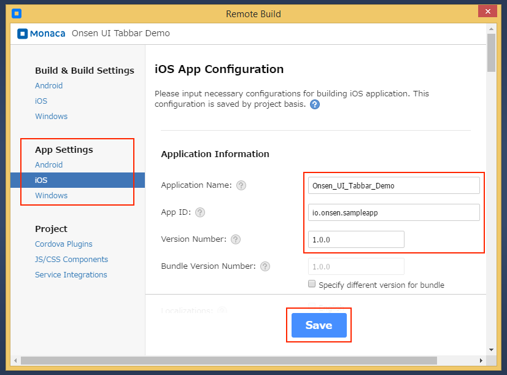
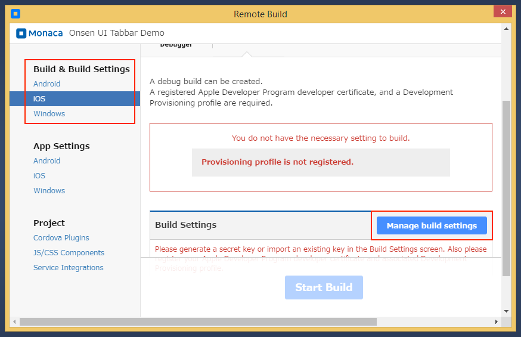
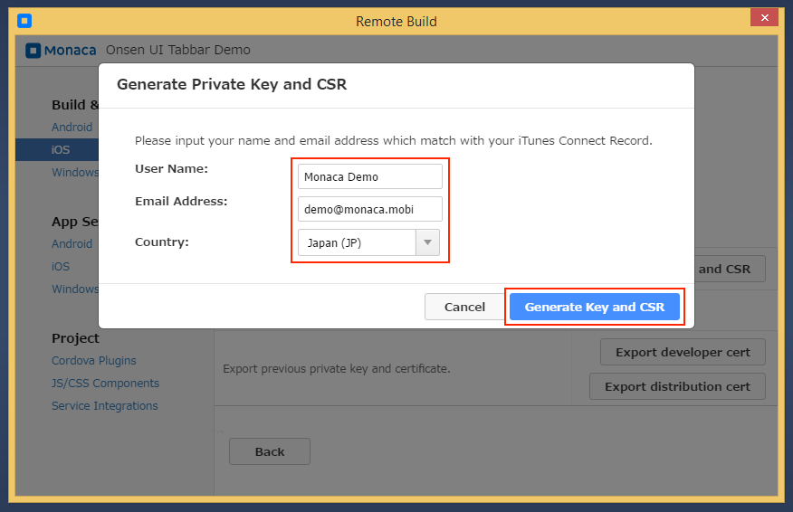
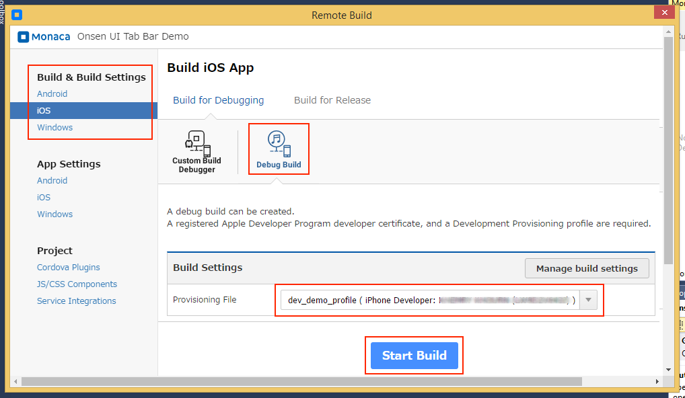
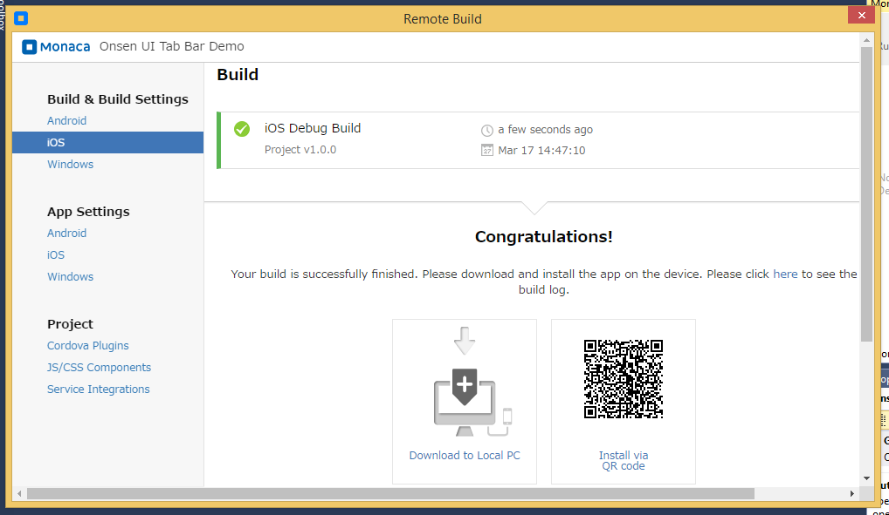
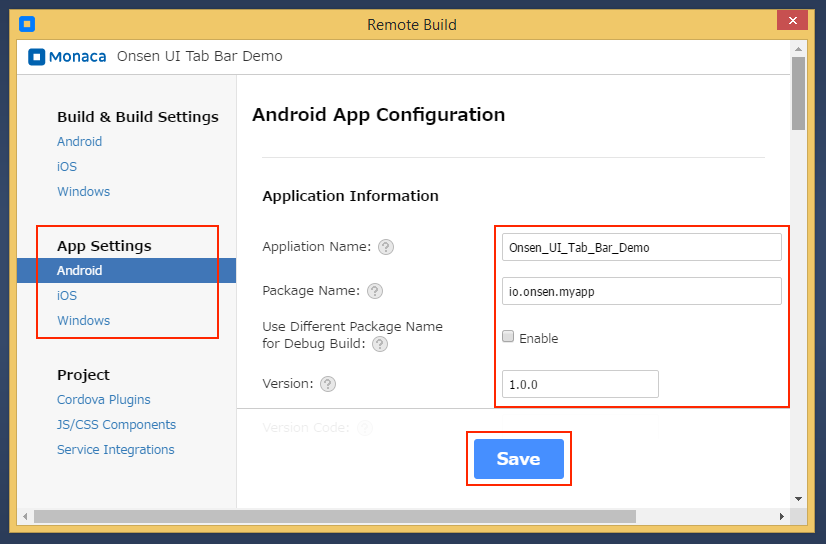
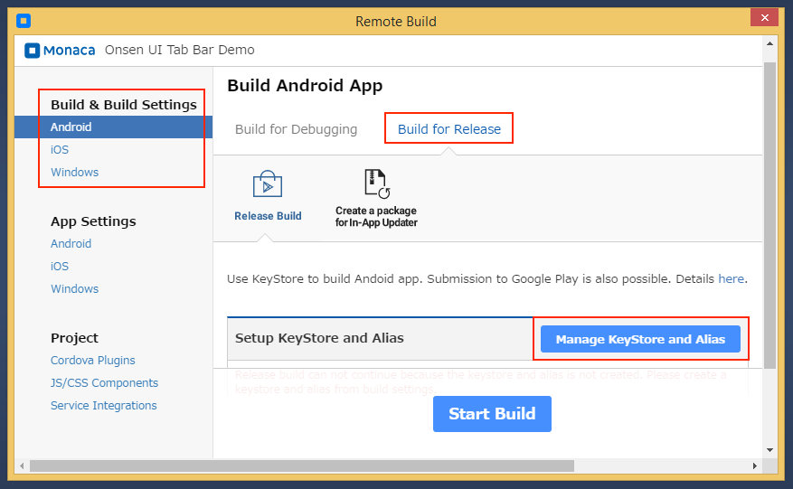
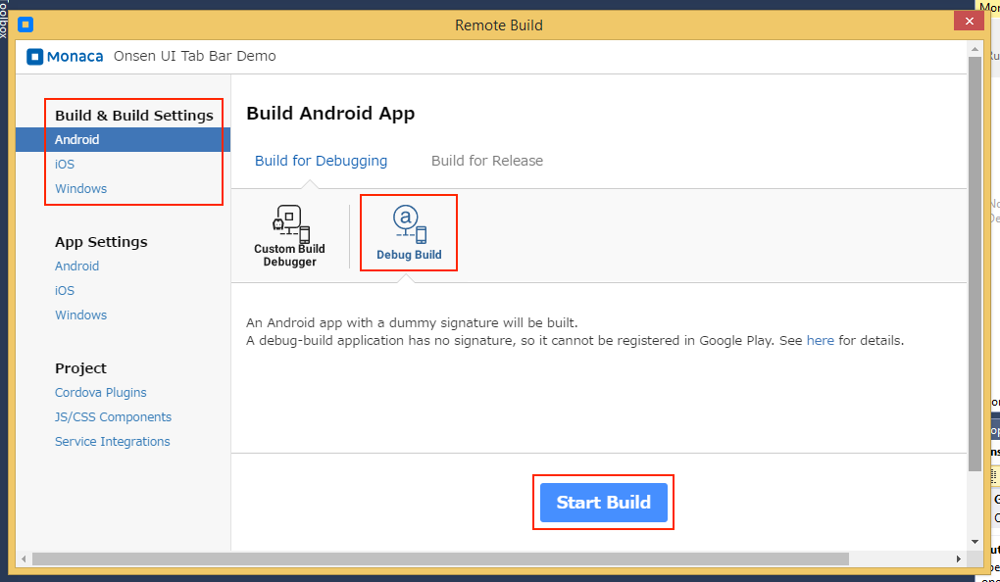
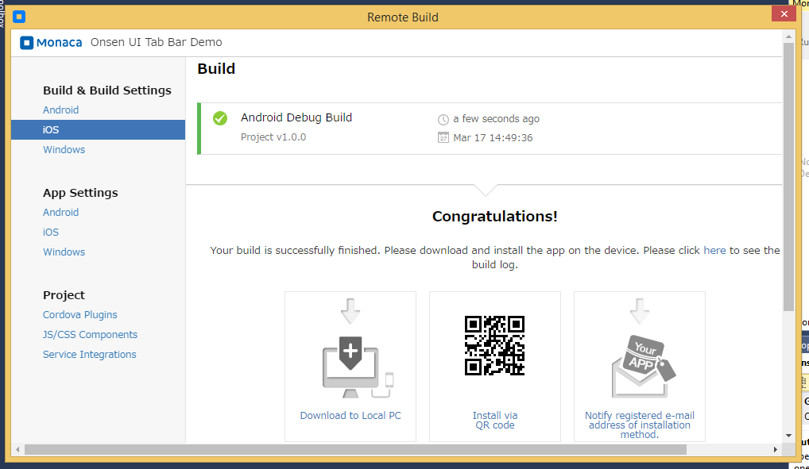

Part 3: Building Monaca App
===========================

In this page, we will cover the two following topics:

1.  monaca\_vs\_building\_for\_ios
2.  monaca\_vs\_building\_for\_android

For more information on how to build Monaca Apps for other platforms,
please refer to build\_index.

Building a Monaca App for iOS
-----------------------------

In this section, we will talk about how to create a Debug Build of your
Monaca app for iOS which will be installed on a development device. For
more information about other types of build, please refer to
types\_of\_build\_ios.

*Prerequisite*

1.  You must enroll in [Apple Developer
    Program](https://developer.apple.com/programs/).
2.  After enrolling in the program, you will be able to create the
    following items which are required to create a Debug build in
    Monaca:

-   `App ID` (see How to Register App ID &lt;register\_appID&gt;)
-   `Development Certificate` (see
    How to Generate Certificates &lt;create\_cer&gt;)
-   `Development Provisioning Profile` (see
    How to Create Provisioning Profiles&lt;register\_provisioning&gt;)

### Step 1: Configuring iOS App Settings

1.  From Monaca panel, select Build Settings.
2.  Under the App Settings on the left menu, select iOS.
3.  Fill in the necessary information of your app:

> -   Application Name: a public name representing your app.
> -   App ID: a unique ID representing your app. It is recommended to
>     use reverse-domain style (for example, mobi.monaca.appname) for
>     App ID. Only alphanumeric characters and periods (at least one
>     period must be used) are allowed. Each segment separated by a
>     period should begin with an alphabetic character.
> -   Version Number: a number representing the version of your app
>     which will be required when uploading (publishing process) your
>     application via iTune Connect later. It needs 3 numbers separated
>     by dots (for example, 1.10.2). Each number should be in \[0-99\].
> -   The remaining information is optional. In this page, you can also
>     configure icon, splash screen and other configurations.
>
> 
>
> > width
> >
> > :   600px
> >
> > align
> >
> > :   left
> >
> 

>
> The App ID in Monaca Build Settings must be the same as the App ID you
> have registered in iOS Provisioning Portal. This App ID (in Monaca
> Build Settings) cannot contain an asterisk (`*`); otherwise, the build
> will fail.
>
> 

4.  After finishing the configurations, click Save.

### Step 2: Configuring iOS Build Settings

1.  From Monaca panel, select Build.
2.  Under the Build & Build Settings on the left menu, select iOS. Then,
    select Manage build settings.

> 
>
> > width
> >
> > :   700px
> >
> > align
> >
> > :   left
> >
3.  Click on Generate Key and CSR button and fill in your Apple ID
    information (user name and email address) and country. Then, click
    Generate Key and CSR button. After that, you will be asked to
    download the CSR file. You can also
    import an existing Private Key &lt;import\_into\_monaca&gt; if you
    have one.

> 
>
> > width
> >
> > :   700px
> >
> > align
> >
> > :   left
> >

If you import an existing private key, you need to use the certificates
which are issued based on that imported private key. However, if you
create a new private key and CRS file, you will need to use the new CRS
file to issue new certificates.

### Step 3: Building the App

1.  From Monaca panel, select Build.
2.  Under the Build & Build Settings on the left menu, select iOS. Then,
    select the Debug Build option and the corresponding provisioning
    profile. Then, click Start Build button.

> 
>
> > width
> >
> > :   700px
> >
> > align
> >
> > :   left
> >
3.  It may take several minutes for the build to complete. Please wait.
    The following screen will appear after the build is complete.

> 
>
> > width
> >
> > :   700px
> >
> > align
> >
> > :   left
> >
### Step 4: Installing the App

There are 3 ways to install the debug built app:

> 1.  Download the built app and use iTunes to install the built app on
>     your iOS device.
> 2.  Install via QR code.
> 3.  Install via
>     cofigured deployment services &lt;supported\_services&gt;.

Building a Monaca App for Android
---------------------------------

In this section, we will talk about how to create a Debug Build of your
Monaca app for Android. For more information about other types of build,
please refer to types\_of\_build\_android.

### Step 1: Configuring Android App Settings

1.  From Monaca panel, select Build Settings.
2.  Under the App Settings on the left menu, select Android.
3.  Fill in the necessary information of your app:

> -   Application Name: a public name representing your app.
> -   Package Name: a unique ID representing your app. It is recommended
>     to use reverse-domain style (for example, mobi.monaca.appname) for
>     App ID. Only alphanumeric characters and periods (at least one
>     period must be used) are allowed. Each segment separated by a
>     period should begin with an alphabetic character.
> -   Version Number: a number representing the version of your app. It
>     needs 3 numbers separated by dots (for example, 1.10.2). Each
>     number should be in \[0-99\].
> -   Use Different Package Name for Debug Build: if checked, the
>     package name of the debug-built app and custom-built debugger are
>     different. In other words, the package name of debug-built app
>     will have `.debug` extension, and the one for custom-built
>     debugger will have `.debugger` extension. However, this option is
>     disable by default because it made some plugins impossible to be
>     debugged due to the fact that they are tied to exact package names
>     (for example, in-app purchase).
> -   The remaining information is optional. In this page, you can also
>     configure icon, splash screen and other configurations.
>
> 
>
> > width
> >
> > :   700px
> >
> > align
> >
> > :   left
> >
4.  After finishing the configurations, click Save.

### Step 2: Configuring Android KeyStore

Android KeyStore is used for storing the keys (Alias) needed to sign a
package. When a KeyStore is lost or it is overwritten by another
KeyStore, it is impossible to re-sign the signed package with the same
key. One KeyStore can contain multiple aliases, but only one alias is
used for code-sign an application.

Android KeyStore is required in order to create a Release build.
However, it's not necessary in order to create a Debug build.

In order to configure a new Android KeyStore in Monaca, please do as
follows:

1.  From Monaca panel, select Build.
2.  Under the Build & Build Settings on the left menu, select Android.
    Then, choose Build for Release and select Manage KeyStore and Alias.

> {width="700px"}

3.  The KeyStore can either be created or imported. In this tutorial, we
    assume that you need to create a new KeyStore. Therefore, click on
    Clear and Generate New button. Then, the following screen will
    appear:

> {width="700px"}

4.  Fill in the necessary information related to the KeyStore such as:

> -   Alias: key information stored in the KeyStore which is used to
>     sign an app package.
> -   Password: password for the Alias.
> -   KeyStore Password: password for the new KeyStore.

5.  Then, click Generate KeyStore and Alias button.

### Step 3: Building the App

1.  From Monaca panel, select Build.
2.  Under the Build & Build Settings on the left menu, select Android.
    Then, select the Debug Build option. Then, click Start Build button.

> {width="700px"}

3.  It may take several minutes for the build to complete. Please wait.
    The following screen will appear after the build is successfully
    completed.

> {width="700px"}

### Step 4: Installing the App

There are 5 ways you can install the built app:

1.  network\_and.
2.  Install via QR Barcode.
3.  download the built app directly to your computer and install it via
    USB cable.
4.  send the URL to download the built app to your registered email
    address.
5.  Install via
    cofigured deployment services &lt;supported\_services&gt;.

