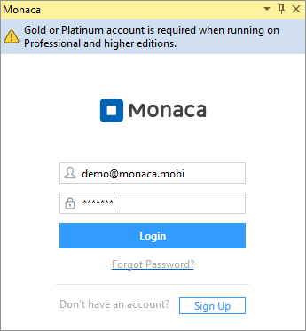
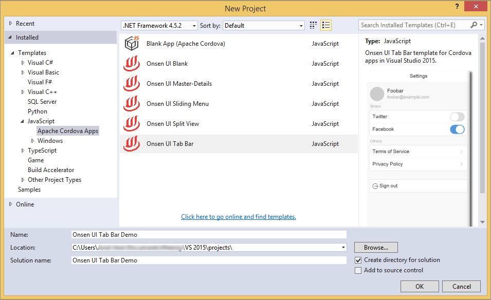
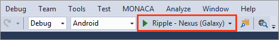
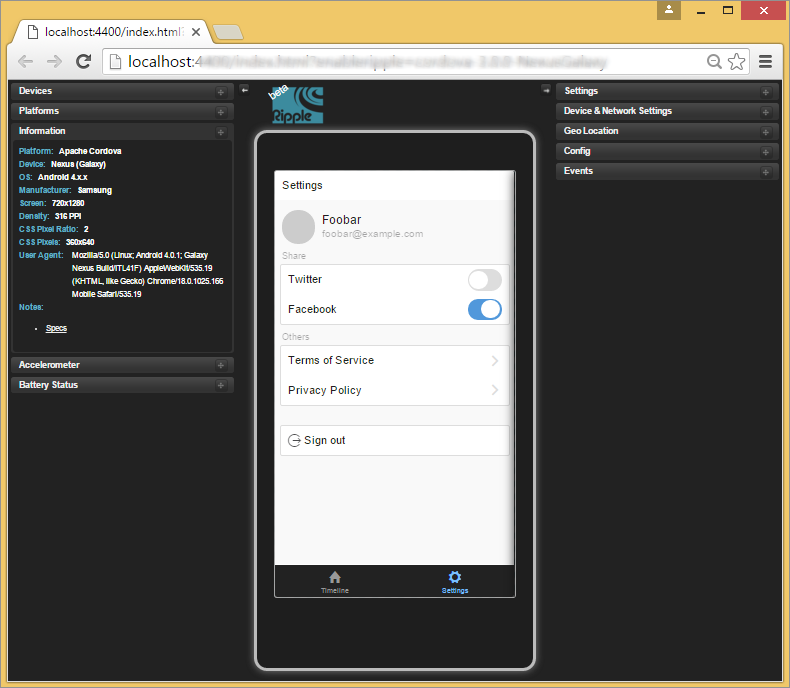
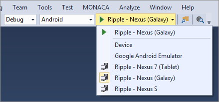
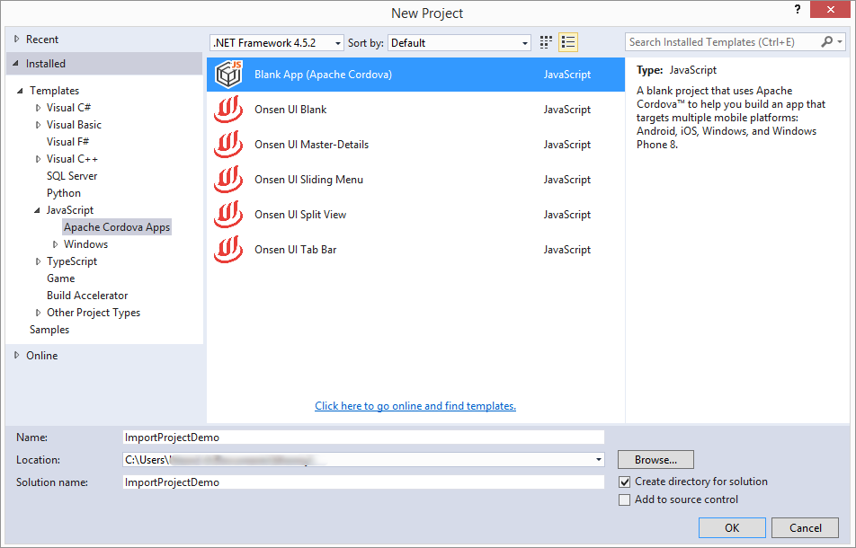
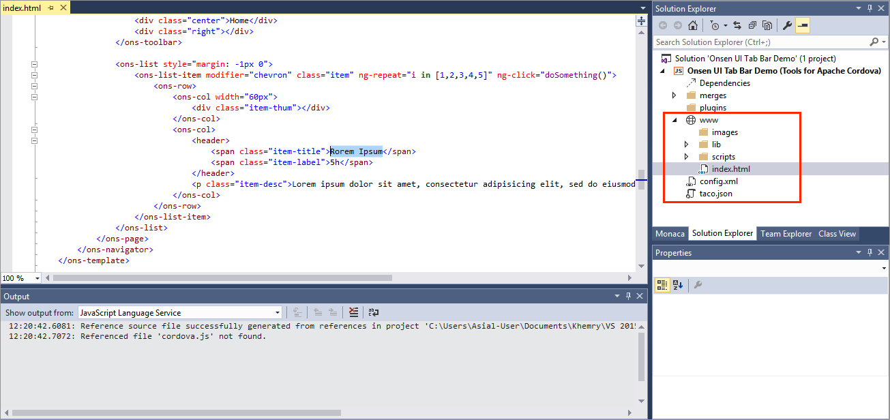

Part 1: Starting a Project
==========================

Step 1: Logging into Monaca
---------------------------

Before starting to develop Monaca app within Visual Studio IDE, please
log into Monaca first:

1.  From Microsoft Visual Studio IDE menu, go to MONACA --&gt; Sign In.
2.  Input your Monaca account information.

> 
>
> > width
> >
> > :   345px
> >
> > align
> >
> > :   left
> >
Step 2: Starting a Project
--------------------------

There are 3 ways to start a Monaca project in Visual Studio:

1.  creating a new project based on templates provided by Monaca&lt;monaca\_vs\_new\_project&gt;
2.  opening an existing Cordova project
3.  importing an existing Monaca project&lt;monaca\_vs\_import\_existing\_project&gt;.

### Creating a New Project

In order to create a new project, please follow the instruction below:

1.  From Monaca panel, choose Create a new project.
2.  In the New Project window, go to
    Templates --&gt; JavaScript --&gt; Apache Cordova Apps. Then, choose
    a project template. Fill in the project's information such as
    project name, project directory and solution name. Then, click OK.

> {width="700px"}

3.  Now, your new project is successfully created. Visual Studio allows
    you to preview your project through Ripple Emulator. From Visual
    Studio menu, go to Debug --&gt; Start Debugging or click the debug
    button as shown in the screenshot.

> 
>
> > width
> >
> > :   467px
> >
> > align
> >
> > :   left
> >
4.  Then, the emulator window will appear.

> 
>
> > width
> >
> > :   700px
> >
> > align
> >
> > :   left
> >
5.  You can change the debugging device within Ripple Emulator by
    clicking on the dropdown menu of the debug button as shown below:

> 
>
> > width
> >
> > :   439px
> >
> > align
> >
> > :   left
> >
### Importing a Existing Monaca Project

Currently, we don't have a direct importing feature for existing Monaca
projects into Visual Studio. However, you can open existing Monaca
projects as follows:

1.  Create a new blank Apache Cordova project. From New Project window,
    go to
    Installed --&gt; Templates --&gt; JavaScript --&gt; Apache Cordova Apps.
    Then, choose Blank App (Apache Cordova) and click OK.

> 
>
> > width
> >
> > :   700px
> >
> > align
> >
> > :   left
> >
2.  Copy `www` folder from the existing Monaca project and replace the
    `www` folder inside your newly created project. After that, you can
    run the existing Monaca project within Visual Studio.
3.  Start debugging the project to see if the existing project run as
    you expect. From Visual Studio menu, go to
    Debug --&gt; Start Debugging or click the debug button as shown in
    the screenshot. Then, the emulator window will appear.

> 
>
> > width
> >
> > :   467px
> >
> > align
> >
> > :   left
> >
Step 3: Editing the Project Files
---------------------------------

1.  Go to Solution Explorer panel in order to see all of the project
    files. All editable project files are listed under `www` folder.

> 
>
> > width
> >
> > :   700px
> >
> > align
> >
> > :   left
> >
2.  Choose a file to edit and make some changes.
3.  Save the changes. You will be able to see the changes reflected
    immediately on the emulator window or Monaca debugger (if it's
    connected).

