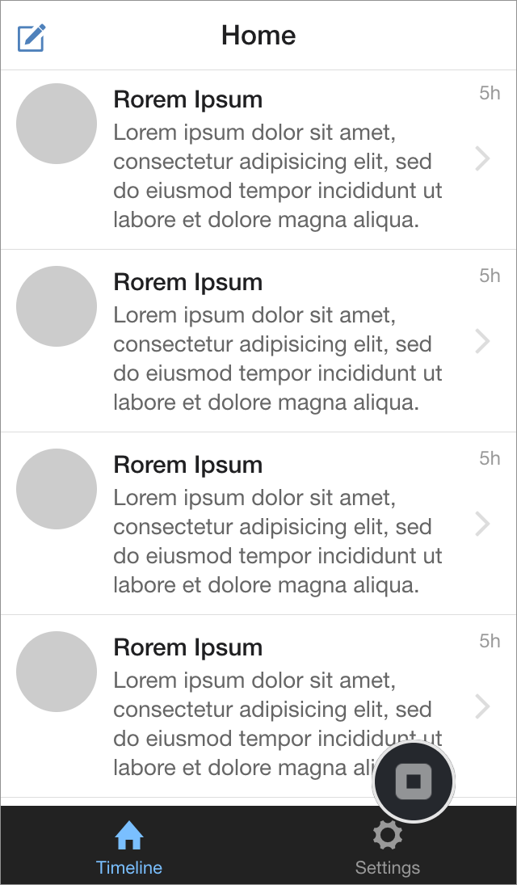

Part 2: Running Monaca Debugger with Monaca for Visual Studio
=============================================================

Monaca Debugger &lt;monaca\_debugger\_index&gt; is a powerful
application for testing and debugging your Monaca applications on real
devices in real time.

When developing Monaca apps on your local PC, assuming that your local
PC is successfully paired with Monaca Debugger, all changes made to your
project files will be pushed into your Monaca Debugger as soon as you
save those changes.

Before Getting Started
----------------------

Please install Monaca Debugger on your device.

> {width="100px"}
>
> {width="100px"}

Please refer to
Monaca Debugger Installation &lt;debugger\_installation\_index&gt; for
other platforms.

Step 1: Running the Project on Monaca Debugger
----------------------------------------------

1.  Launch Monaca Debugger app and sign in using your Monaca account
    information. Make sure you are using the same account information
    you use for Monaca within Visual Studio IDE.

> 
>
> > width
> >
> > :   250px
> >
> > align
> >
> > :   left
> >
2.  Pair the Monaca Debugger with the PC hosting Monaca for Visual
    Studio. Once logged in, Monaca Debugger should be able to detect the
    host PC as shown below. Then, click Pair button to start the
    pairing.

> 
>
> > width
> >
> > :   250px
> >
> > align
> >
> > :   left
> >
3.  If your pairing is successful, a project list will appear in Monaca
    Debugger and the connected debugger will appear in the Monaca panel
    (see screenshots below as an example). However, if Monaca Debugger
    is unable to detect the host PC automatically, please refer to
    troubleshooting the Pairing&lt;troubleshoot\_pair&gt;.

> {width="250px"}
>
> {width="232px"}

4.  In order to run your project in Monaca Debugger, you can just click
    on the project name in the debugger or click Run in Device button in
    Monaca panel within Visual Studio. Then, your project should be
    running in the debugger as shown below:

> {width="250px"}

Step 2: Real-time Updates between Your Project and Monaca Debugger
------------------------------------------------------------------

1.  Run the project on the debugger.
2.  Let's make some changes in a project file and save them (please
    refer to Edit Project Files &lt;monaca\_vs\_edit\_project&gt;). In
    this example, we edit index.html and change the title of each list
    item from "Rorem Ipsum" to "Monaca and OnsenUI". Then, save the
    change.

> 
>
> > width
> >
> > :   700px
> >
> > align
> >
> > :   left
> >
3.  The saved changes will be sent to Monaca Debugger on your device.
    You can also click on Reload button to retrieve the latest updates
    of your app in case the changes are not reflected.

> {width="250px"}
>
> {width="250px"}

That's it! That's how easy it is to use Monaca Debugger. Please try to
make more changes to your project and see how it runs on the debugger.

Please refer to monaca\_debugger\_features to explore the other
functions provided by Monaca Debugger.

