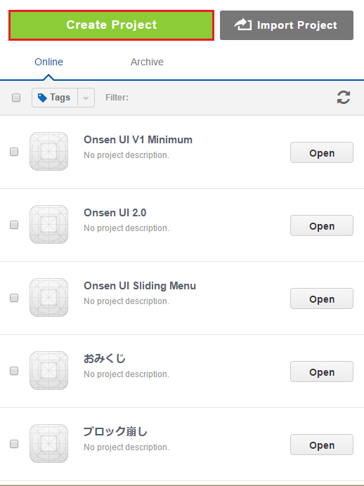
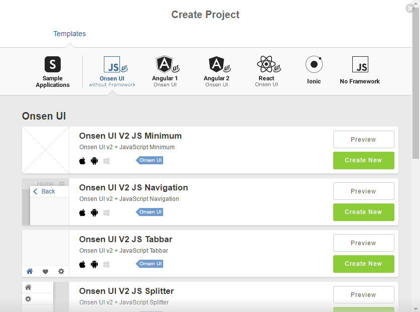

Onsen UI
========

HTML5 Framework for Building Mobile App Front End

For more information on **Onsen UI**, please go to [Onsen UI home
page](http://onsen.io).

Starting a new Onsen UI project in Monaca
-----------------------------------------

### Go to Dashboard

Go to Dashboard and click *Create Project*

> width
>
> :   350px
>
### Choose one Onsen UI template that best fit your project type

> width
>
> :   700px
>

Currently, Monaca Cloud IDE does not support Onsen UI with Angular 2
framework type since it requires to transpile the source code to
Javascript. Therefore, you need to setup the local environment with
Monaca CLI&lt;cli\_overview&gt;.

### Where to go from here

Now you have Onsen UI installed. See examples in [Onsen UI
Docs](http://onsen.io/guide/overview.html) for how to use Onsen UI
components.
