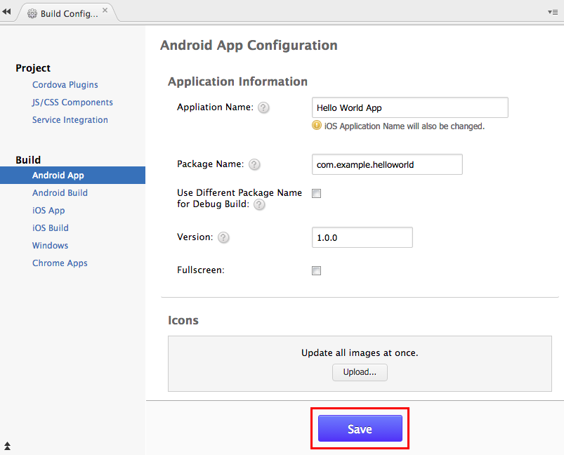
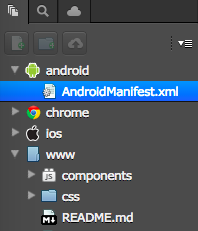

Android Configuration
=====================

There are 2 ways to configure your Android apps:

1.  Configure via Monaca Cloud IDE &lt;android\_config\_ide&gt;
2.  Configure via configuration files directly &lt;android\_config\_files&gt;.

Configuration via Monaca Cloud IDE
----------------------------------

### Android App Settings Page

The Android App Settings page allows to set several commonly used
parameter in Android app. Please follow the following instruction in
order to access the Android App Setting page in Monaca Cloud IDE:

1.  From Monaca Cloud IDE menu, go to
    Config --&gt; Android App Settings....
2.  *Android App Configuration* page will appear as shown below. You can
    then start your configuration.

> {width="600px"}

3.  After finishing the configuration, please click Save.

### Configurable Parameters

In the Android App Settings page, you can configure the parameters such
as application information, icons, splash files, permissions and
additional features. The following are the list of parameters can be
configured via the page:

-   *Allowed URL*: \[Set to `*` by default\] Specify URL(s) which can be
    accessed from your app. If set to `*`, you can access all domains
    from your app.
-   *Keep Running*: \[Enable by default\] Enable this if you want
    Cordova to keep running in the background.
-   *Disallow Overscroll*: \[Enable by default\] Enable this if you want
    to disable the glow when a user scrolls beyond the edge of the
    webview.
-   *WebView Engine*: Specify the WebView engine between the default one
    and Crosswalk.
-   *Display Time*: Specify the duration of showing splashscreen.
-   *Screen Orientation*: Specify the screen orientation of the app.

Configuration via Configuration Files
-------------------------------------

All the configuration parameters of an Android app are stored in the
files as follows:

> -   config\_xml\_android
> -   manifest\_xml

<div class="admonition note">

These configurations are critical to the Android app to run. Wrong
configuration can prevent the app from running properly, please edit the
file carefully.

</div>

### config.xml

The config.xml file is a settings file controlling various settings of
Cordova.

{width="198px"}

Below are available elements and preferences you may need to configure:

#### *&lt;widget&gt;* element

*version*

  ------------- --------------------------------------------
  Attribute     `version`
  Type          string
  Default       `1.0.0`
  Description   a version number which is visible to users
  ------------- --------------------------------------------

-   Example:

``` {.sourceCode .xml}
<widget id="com.example.helloworld" version="1.0.0">
  ...
</widget>
```

*android-versionCode*

  ------------- -----------------------------------------------------------------------------------------------------------------------------------
  Attribute     `android-versionCode`
  Type          string
  Default       automatically set. When `version` attribute is `"1.22.33"`, it will be 102233 (=1 \* 10000 + 22 \* 100 + 33). If the project uses
                Crosswalk, it will be `2xxxxxx` for ARM architecture and `7xxxxxx` for x86 architecture.
  Description   an internal version code. It is used only to determine whether one version is more recent than others. Higher number indicates a
                more recent version. This version number is not shown to users.
  ------------- -----------------------------------------------------------------------------------------------------------------------------------

-   Example:

``` {.sourceCode .xml}
<widget id="com.example.helloworld" version="0.0.1" android-versionCode="7">
  ...
</widget>
```

#### *&lt;content&gt; element*

  ------------- ---------------------------------------------------------------------------------------------------------------------------------
  Attribute     `src`
  Type          string
  Default       `indext.html`
  Description   the `<content>` element defines the app's starting page in the top-level web assets directory. You can change the starting page
                by changing the value of the `src` attribute to your preferred URL.
  ------------- ---------------------------------------------------------------------------------------------------------------------------------

-   Example:

``` {.sourceCode .xml}
<widget id="com.example.helloworld" version="1.0.0">
  ...
  <content src="https://monaca.io/" />
</widget>
```

#### *&lt;access&gt; element*

  ------------- --------------------------------------------------------------------------------------------------------------------
  Attribute     `origin`
  Type          string
  Default       `*`
  Description   it is used to declare access to specific network domains. If set to `*`, you can access all domains from your app.
  ------------- --------------------------------------------------------------------------------------------------------------------

-   Example:

``` {.sourceCode .xml}
...
<access origin="*" />
...
```

#### *&lt;preference&gt; element*

The `<preference>` tag sets various options as pairs of name/value
attributes. Each preference's name is case-insensitive. Many preferences
are unique to specific platforms, as listed at the top of this page. The
following sections detail preferences that apply to more than one
platform.

#### *KeepRunning*

  ------------- ------------------------------------------------------------------------
  Attribute     `value`
  Type          boolean
  Default       `true`
  Description   determines whether Cordova will keep running in the background or not.
  ------------- ------------------------------------------------------------------------

-   Example:

``` {.sourceCode .xml}
...
<preference name="KeepRunning" value="false" />
...
```

#### *DisallowOverscroll*

  ------------- --------------------------------------------------------------------------------------------------------------------------------
  Attribute     `value`
  Type          boolean
  Default       `false`
  Description   sets to `true` if you don't want the interface to display any feedback when users scroll past the beginning or end of content.
  ------------- --------------------------------------------------------------------------------------------------------------------------------

-   Example:

``` {.sourceCode .xml}
...
<preference name="DisallowOverscroll" value="true"/>
...
```

#### *Fullscreen*

  ------------- -------------------------------------------------------------
  Attribute     `value`
  Type          boolean
  Default       `false`
  Description   allows you to hide the status bar at the top of the screen.
  ------------- -------------------------------------------------------------

-   Example:

``` {.sourceCode .xml}
...
<preference name="Fullscreen" value="true" />
...
```

#### *SplashScreenDelay*

  ------------- ---------------------------------------------------------------------------------------------------------------------------------
  Attribute     `value`
  Type          number
  Default       `3000`
  Description   sets the default delay of how long the splashscreen appears in milliseconds. This should be the worst-case expected start time.
  ------------- ---------------------------------------------------------------------------------------------------------------------------------

-   Example:

``` {.sourceCode .xml}
...
<preference name="SplashScreenDelay" value="10000" />
...
```

#### *LogLevel*

  ------------- ---------------------------------------------------------------------------------------------------------------------------------
  Attribute     `value`
  Type          string
  Default       `ERROR`
  Description   sets the minimum log level through which log messages from your application will be filtered. There are 5 valid values such as:
                `ERROR`, `DEBUG`, `WARN`, `INFO` and `VERBOSE`.
  ------------- ---------------------------------------------------------------------------------------------------------------------------------

-   Example:

``` {.sourceCode .xml}
...
<preference name="loglevel" value="DEBUG" />
...
```

#### *AndroidPersistentFileLocation*

  ------------- --------------------------------------------------------------------------------------------------
  Attribute     `value`
  Type          string
  Default       `Internal`
  Description   sets where to store Android persistent files. There are 2 valid values such as:
                - `Internal`: will put persistent files under the user's application internal storage directory.
                - `Compatibility`: will put persistent files under storage root.
  ------------- --------------------------------------------------------------------------------------------------

<div class="admonition note">

If your application has previously been shipped to users, using an older
(pre- 3.0.0) version of this plugin, and has stored files in the
persistent filesystem, then you should set the preference to
Compatibility if your config.xml does not specify a location for the
persistent filesystem. Switching the location to "Internal" would mean
that existing users who upgrade their application may be unable to
access their previously-stored files, depending on their device.

</div>

-   Example:

``` {.sourceCode .xml}
...
<preference name="AndroidPersistentFileLocation" value="Internal" />
...
```

#### *ScreenOrientation* (Cordova 5.2 or Higher)

  ------------- ------------------------------------------------------------------------
  Attribute     `value`
  Type          string
  Default       `default`
  Description   sets screen orientation for devices. There are 3 valid values such as:
                - `default`: will use system default screen orientation.
                - `landscape`: set screen orientation to landscape mode.
                - `portrait`: set screen orientation to portrait mode.
  ------------- ------------------------------------------------------------------------

-   Global Settings:

``` {.sourceCode .xml}
<widget>
      ....
      <preference name="orientation" value="default"/>
      ....
</widget>
```

-   Platform Specific Settings:

``` {.sourceCode .xml}
<widget>
      ...
      <platform name="android">
        <preference name="orientation" value="default"/>
      </platform>
     ...
</widget>
```

### AndroidManifest.xml

Basic behaviour of Android applications can be configured by editing
AndroidManifest.xml file. It is located under `android` folder inside
your monaca project as shown below:

{width="198px"}

<div class="admonition note">

For Cordova 6.2 or higher, `AndroidManifest.xml` file is removed from
Monaca framework. Therefore, in order to config Android application
settings, use custom\_config\_plugin.

</div>

AndroidManifest.xml (Main elements)

``` {.sourceCode .xml}
<?xml version="1.0" encoding="utf-8"?>
<manifest>

  <uses-permission />
  <uses-sdk />
  <uses-feature />
  <supports-screens />

  <application>
    <activity>
        <intent-filter>
            <action />
            <category />
        </intent-filter>
    </activity>
  </application>

</manifest>
```

#### *&lt;manifest&gt;*

Is the root element of AndroidManifest.xml file. The child element of
`<manifest>` is `<application>` and it must contain xlmns:android and
`package` attributes.

``` {.sourceCode .xml}
<manifest xmlns:android="http://schemas.android.com/apk/res/android"
    android:versionCode="%%%VERSION_CODE%%%"
    android:versionName="%%%VERSION_NAME%%%" package="%%%PACKAGE_NAME%%%">
</manifest>
```

  Attribute             Description
  --------------------- ----------------------------------------------------------------------------------------------------------------------------------
  xmlns:android         an Android namespace attribute. This attribute must always have this value: `http://schemas.android.com/apk/res/android`.
  android:versionCode   an internal version number. It is used only to determine whether one version is more recent than others. Higher number indicates
                        a more recent version. This version number is not shown to users.
  android:versionName   a version number which is visible to users.

#### *&lt;uses-sdk&gt;*

Is API level settings of the application. This element is contained in
`<manifest>`.

``` {.sourceCode .xml}
<uses-sdk android:minSdkVersion="14" android:targetSdkVersion="22" />
```

  Attribute                  Description
  -------------------------- ---------------------------------------------------------------------------------------------------------------------------------------------------
  android:minSdkVersion      minimum API level required for the application to run. Android uses this value to determine whether the application can be installed in a device.
  android:targetSdkVersion   API level that the application targets.

#### *&lt;uses-permission&gt;*

Is permission settings. The permission is granted When the application
is installed. This element is contained in `<manifest>`

*Permissions for Camera*

``` {.sourceCode .xml}
<uses-permission android:name="android.permission.CAMERA"></uses-permission>
```

  Attribute      Description
  -------------- -------------------------------------------------------------------------------------------------------------------------------------
  android:name   name of the permissions to be granted for the Android system. The name of the permission can be defined as Camera, Network and etc.

#### *How to Define &lt;uses-permission&gt;*

`<components/loader.js>` needs `ACCESS_NETWORK_STATE` permission to run.
You may exclude this file from `<uses-permission>` if it's not necessary
for your application.

#### *&lt;uses-feature&gt;*

Declares hardware or software features used by the application. For
instance. If the application requires Camera feature, the user whose
device has no camera cannot install the application. This element is
contained in `<manifest>`.

The code below specifies that the application needs Camera feature.

``` {.sourceCode .xml}
<uses-feature android:name="android.hardware.camera" android:required="true" />
```

  Attribute          Description
  ------------------ ------------------------------------------------------------------------------------------------------------------------------
  android:name       feature name
  android:required   a boolean value that specifies whether the application requires the feature set in `android:name`. If you set the value to
                     `true`, you are indicating that the application cannot function without the feature. If you set it to `false`, it means that
                     the application prefers to use the feature, but can still function without the feature.

#### *&lt;application&gt;*

Is an Application tag. This element is contained in `<manifest>`.

``` {.sourceCode .xml}
<application android:icon="@drawable/icon"
             android:label="%%%APPLICATION_NAME%%%"
             android:name="mobi.monaca.framework.MonacaApplication">
</application>
```

  Attribute                   Description
  --------------------------- ----------------------------------------------------------------------------------------------------------------------
  android:name                defines a name of the application. It is a fully qualified name of the class that you extend from Application class.
  android:icon                an icon for the entire application as well as a default icon for each of the application's components
  android:label               a label for the entire application
  android:theme               an Application level theme
  android:screenOrientation   application level Orientation settings

#### *&lt;intent-filter&gt;*

Defines the process of intent filter. This element is contained in
`<activity>`. The child `<action>` element must be defined.

``` {.sourceCode .xml}
<intent-filter>
    <action android:name="android.intent.action.MAIN" />
    <category android:name="android.intent.category.LAUNCHER" />
</intent-filter>
```

#### *&lt;action&gt;*

Specifies an action for an intent filter. The element is contained in
`<intent-filter>`.

  Attribute      Description
  -------------- -------------
  android:name   action name

#### *&lt;category&gt;*

Specifies the category of the intent filter. The element is contained in
`<intent-filter>`.

  Attribute      Description
  -------------- ---------------
  android:name   category name


