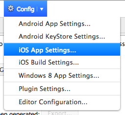
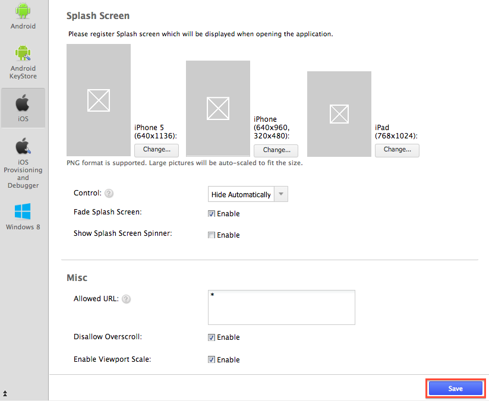
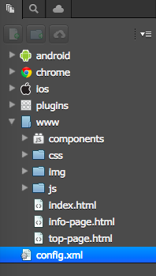

iOS Configuration
=================

There are 2 ways to configure your iOS apps:

1.  Configure via Monaca Cloud IDE &lt;ios\_config\_ide&gt;
2.  Configure via configuration files directly &lt;ios\_config\_files&gt;.

Configuration via Monaca Cloud IDE
----------------------------------

### iOS App Settings Page

The iOS App Settings page allows to set several commonly used parameter
in iOS app. Please follow the following instruction in order to access
the iOS App Setting page in Monaca Cloud IDE:

1.  From Monaca Cloud IDE menu, go to Config &gt; iOS App Settings....

> {width="250px"}

2.  *iOS App Configuration* page will appear as shown below. You can
    then start your configuration.

> {width="600px"}

3.  After finishing the configuration, please click Save button.

### Configurable Parameters

In the iOS App Settings page, you can configure the parameters such as
application information, icons, splash files, permissions and additional
features. The following are the list of parameters can be configured via
the page:

-   *Allowed URL*: Specify URL(s) which can be accessed from your app.
    If set to `*`, you can access all domains from your app. (Set to `*`
    by default)
-   *Disallow Overscroll*: \[Enable by default\] Enable this if you want
    to disable the glow when a user scrolls beyond the edge of the
    webview.
-   *Enable Viewport Scale*: \[Enable by default\] If you disable this
    feature, the viewport meta tag which is set inside your app will be
    ignored.
-   *Fade Splash Screen*: \[Enable by default\]
-   *Show Splash Screen*: Show splash screen at start of the app.

Configuration via Configuration Files
-------------------------------------

All the configuration parameters of an iOS app are stored in the files
as follows:

> -   info\_plist
> -   config\_xml\_ios

These configurations are critical to the iOS app to run. Wrong
configuration can prevent the app from running properly, please edit the
file carefully.

### MonacaApp-Info.plist

You can configure your iOS app in MonacaApp-Info.plist file. For
information on `plist` file, please refer to [Information Property List
Files
(Apple)](http://developer.apple.com/library/ios/documentation/general/Reference/InfoPlistKeyReference/Articles/AboutInformationPropertyListFiles.html).
This file is located under `ios` folder inside your monaca project as
shown below:

{width="250px"}

For Cordova 6.2 or higher, `MonacaApp-Info.plist` file is removed from
Monaca framework. Therefore, in order to config iOS application
settings, use custom\_config\_plugin.

MonacaApp-Info.plist (Excerpt)

    <?xml version="1.0" encoding="UTF-8"?>
    <!DOCTYPE plist PUBLIC "-//Apple//DTD PLIST 1.0//EN" "http://www.apple.com/DTDs/PropertyList-1.0.dtd">

    <plist>
      <dict>
        <key>key</key>
        <value-type>value</value-type>
          ...
        <key>key</key>
        <array>
          <value-type>value</value-type>
          <value-type>value</value-type>
        </array>
        ...
      </dict>
    </plist>

Inside MonacaApp-Info.plist file, there are 3 main types of elements:

-   *&lt;key&gt;*: Defines value (plistObject) and a combination of
    application configuration information.
-   *&lt;array&gt;*: You can have the array of values (plistObject).
-   *&lt;dict&gt;*: Key and combination of value (plistObject) are
    defined here.

For example:

    <plist>
      <dict>
        ...
        <key>XXX</key>
          <string>The value(plistObject) corresponding to key(XXX)</sting>
          ...
        <key>YYY</key>
          <array>
            <string>The 1st value(plistObject) corresponding to key(YYY)</string>
            <string>The 2nd value(plistObject) corresponding to key(YYY)</string>
            <string>The 3rd value(plistObject) corresponding to key(YYY)</string>
            <string>The 4th value(plistObject) corresponding to key(YYY)</string>
          </array>
        ...
      </dict>
    </plist>

*Type List of Values (plistObject)*

  Types     Description
  --------- ---------------------------------------------------
  string    String data type representing text.
  date      Date data type representing date and time.
  Integer   Integer number
  real      Floating data type representing a decimal number.
  data      Data type
  true      true boolean
  false     false boolean

*List of Keys*

Here are some keys and values you may need to configure in your iOS
apps:

#### *UISupportedInterfaceOrientations*

Is used to set the screen orientation of your app:

-   Settings for iPhone

<!-- -->

    ...
      <key>UISupportedInterfaceOrientations</key>
        <array>
          <string>UIInterfaceOrientationLandscapeLeft</string>
          <string>UIInterfaceOrientationLandscapeRight</string>
          <string>UIInterfaceOrientationPortraitUpsideDown</string>
          <string>UIInterfaceOrientationPortrait</string>
        </array>
    ...

-   Settings for iPad

<!-- -->

    ...
      <key>UISupportedInterfaceOrientations~ipad</key>
        <array>
          <string>UIInterfaceOrientationLandscapeLeft</string>
          <string>UIInterfaceOrientationLandscapeRight</string>
          <string>UIInterfaceOrientationPortraitUpsideDown</string>
          <string>UIInterfaceOrientationPortrait</string>
        </array>
    ...

*List of Orientation Values*

  Value                                      Description
  ------------------------------------------ ----------------------------------------------------------------------------------
  UIInterfaceOrientationLandscapeLeft        Landscape orientation aligned to the left side of the Home button.
  UIInterfaceOrientationLandscapeRight       Landscape orientation aligned to the right side of the Home button.
  UIInterfaceOrientationPortraitUpsideDown   Portrait orientation
  UIInterfaceOrientationPortrait             Portrait orientation in opposite direction from the normal portrait orientation.

You can download a sample screen orientation file below:

Screen Orientation File &lt;download/UISupportedInterfaceOrientations.zip&gt;

#### Statusbar Setting

###  config.xml

The config.xml file is a settings file controlling various settings of
Cordova.

{width="250px"}

Below are available preferences you may need to configure:

#### *Content*

  --------------- -----------------------------------------------------------------------------------------------------------------------------------------------------------------------------------------------------
  *Type*          string
  *Default*       `indext.html`
  *Description*   The `<content>` element defines the app's starting page in the top-level web assets directory. You can change the starting page by changing the value of the `src` attribute to your preferred URL.
  --------------- -----------------------------------------------------------------------------------------------------------------------------------------------------------------------------------------------------

    <?xml version="1.0" encoding="UTF-8"?>
    <widget xmlns="http://www.w3.org/ns/widgets" id="com.example.helloworld" version="1.0.0">
      ...
      <content src="https://monaca.io/" />
    </widget>

#### *DisallowOverScroll*

  --------------- -----------------------------------------------------------------------------
  *Type*          boolean
  *Default*       `false`
  *Description*   Set to `true` if you want to disable the rubber-band scrolling for WebView.
  --------------- -----------------------------------------------------------------------------

    ...
    <preference name="DisallowOverscroll" value="false" />
    ...

#### *EnableViewportScale*

  --------------- ---------------------------------------------------------------
  *Type*          boolean
  *Default*       `false`
  *Description*   Set to `true` to prevent viewport scaling through a meta tag.
  --------------- ---------------------------------------------------------------

    ...
    <preference name="EnableViewportScale" value="false" />
    ...

#### *AutoHideSplashScreen*

  --------------- ---------------------------------------------------------------------------------------
  *Type*          boolean
  *Default*       `true`
  *Description*   Set to `false` to control the splashscreen when it's hidden through a JavaScript API.
  --------------- ---------------------------------------------------------------------------------------

    ...
    <preference name="AutoHideSplashScreen" value="true" />
    ...

#### *BackupWebStorage*

  --------------- ------------------------------------------------------------------
  *Type*          string
  *Default*       `cloud`
  *Description*   There are 3 valid values:
                  - `none`: disable any backups of web storage.
                  - `cloud`: allow the web storage data to be backed up to iCloud.
                  - `local`: allow only local backups (iTunes sync).
  --------------- ------------------------------------------------------------------

    ...
    <preference name="BackupWebStorage" value="cloud" />
    ...

#### *UIWebViewDecelerationSpeed*

  --------------- ----------------------------------------------------------------------------------
  *Type*          string
  *Default*       `normal`
  *Description*   Controls the deceleration speed of momentum scrolling. There are 2 valid values:
                  - `normal`: is the default speed for most native apps
                  - `fast`: is the default speed for Mobile Safari.
  --------------- ----------------------------------------------------------------------------------

    ...
    <preference name="UIWebViewDecelerationSpeed" value="normal" />
    ...

#### *access origin*

  --------------- -------------------------------------------------------------------------------------------------------
  *Type*          string
  *Default*       `*`
  *Description*   Controls access to specific network domains. If set to `*`, you can access all domains from your app.
  --------------- -------------------------------------------------------------------------------------------------------

    ...
    <access origin="*" />
    ...

#### *ScreenOrientation* (Cordova 5.2 or Higher)

  --------------- --------------------------------------------------------------------------------------------------
  *Type*          string
  *Default*       `default`
  *Description*   There are 4 valid values:
                  - `all`: to specify both portrait & landscape mode you would use the platform specific value all
                  - `default`: screen orientation will be applied according to system default.
                  - `landscape`: set screen orientation to landscape mode.
                  - `portrait`: set screen orientation to portrait mode.
  --------------- --------------------------------------------------------------------------------------------------

    <widget>
          ...
          <platform name="ios">
            <preference name="Orientation" value="all"/>
          </platform>
         ...

> &lt;/widget&gt;

It is also possible to apply the setting for all devices at once;
however, you can only apply default, landscape and portrait in value.
"all" is not possible for Global Preferences.

    <widget>
          ...
    <preference name="Orientation" value="portrait" />
         ...

> &lt;/widget&gt;

> For android/windows, "default" means all direction, but in iOS only
> portrait will be applied.
