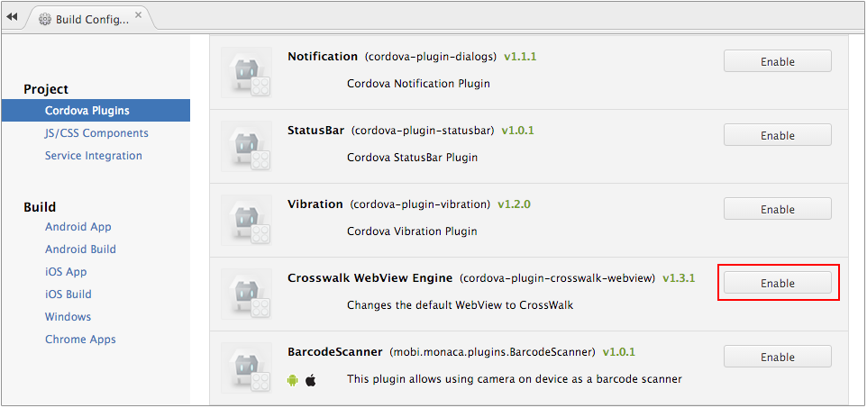
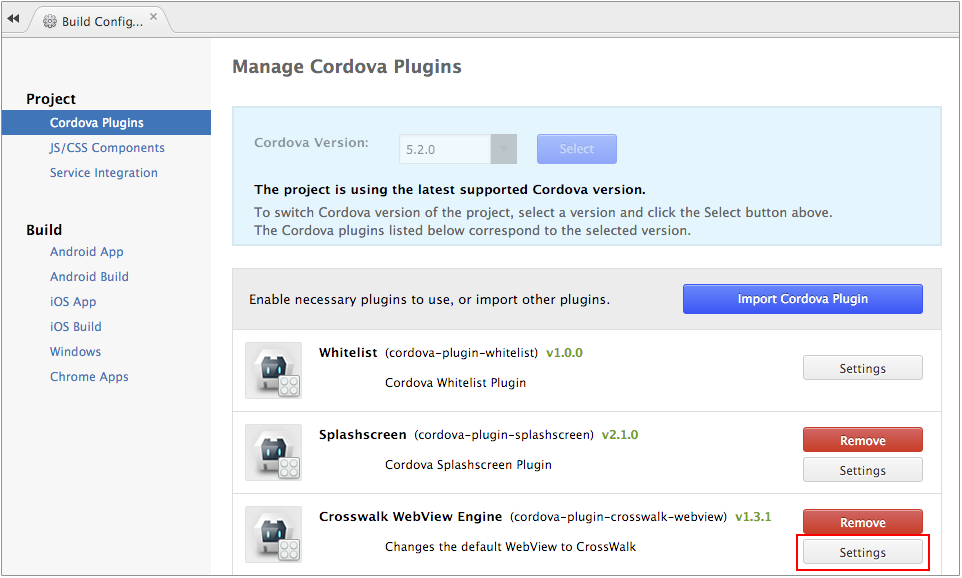
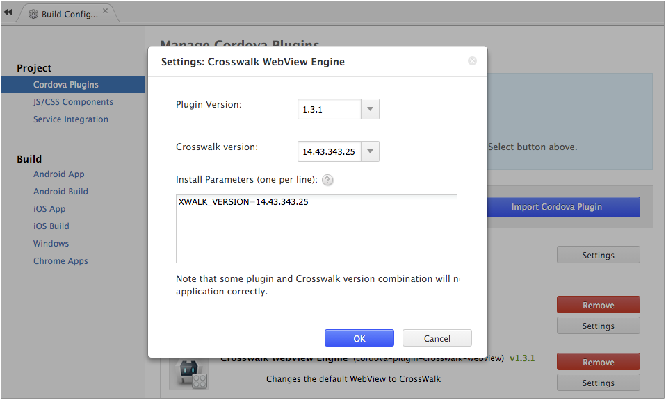

  Crosswalk Plugin (Android Only)
  ------------------------------------------------------------------------------------------------------------------------------------------------------------------------------------------------------------------------
  .. rst-class:: right-menu
  .. raw:: html
  &lt;div&gt;
  &lt;div style="float: left;" align="left"&gt;&lt;b&gt;Tested Version: &lt;/b&gt;&lt;a href="<https://github.com/crosswalk-project/cordova-plugin-crosswalk-webview#130-august-28-2015>"&gt;1.3.0&lt;/a&gt;&lt;/div&gt;
  &lt;div align="right" style="float: right;"&gt;&lt;b&gt;Last Edited:&lt;/b&gt; November 20th, 2015&lt;/div&gt;
  &lt;br/&gt;
  &lt;/div&gt;
  .. note::
  This document is based on the original Cordova docs available at [Cordova Docs](https://github.com/crosswalk-project/cordova-plugin-crosswalk-webview).
  This plugin makes your Cordova application uses the [Crosswalk WebView](https://crosswalk-project.org/) instead of the System WebView.
  What is Crosswalk?

There are many versions of Android from many manufacturers, this makes
it very difficult to develop a Cordova app that works consistently
across all versions of Android. WebView version affects display and some
operations on a device. Until Android 4.4, WebView upgrade can only be
done through OS upgrade. When most of these devices cannot be upgraded,
they are stuck using outdated Android WebViews. Crosswalk can solve this
problem.

Crosswalk is a web runtime based on Google Chromium and has better HTML5
feature support compared to the default WebView available in Android. By
upgrading the version of Crosswalk, Chromium version will also be
upgraded. This insures that your app works consistently, regardless of
the device manufacturer or Android version found in your customer's
Android 4.0+ device.

Plugin ID
=========

    cordova-plugin-crosswalk-webview

Supported Platforms
===================

-   Android 4.0.0 or higher
-   Cordova 5.2 or higher

Adding the Plugin in Monaca
===========================

In order to use this plugin, you need to enable `Crosswalk` plugin in
Monaca Cloud IDE first.

1.  From Monaca Cloud IDE, go to Config --&gt; Cordova Plugins.
2.  Enable the Crosswalk WebView Engine (see the screenshot below).

> {width="600px"}

3.  After enabling the Crosswalk WebView Engine, you can also change its
    version by clicking on Settings button.

> {width="600px"}

4.  Then, the following dialog will appear. After finishing your
    configuration, click OK.

> 

>
> You can change both plugin version or Crosswalk version. However, not
> all version combination between the two are applicable.
>
> 

>
> {width="600px"}

Pros and Cons of Crosswalk Plugin
=================================
