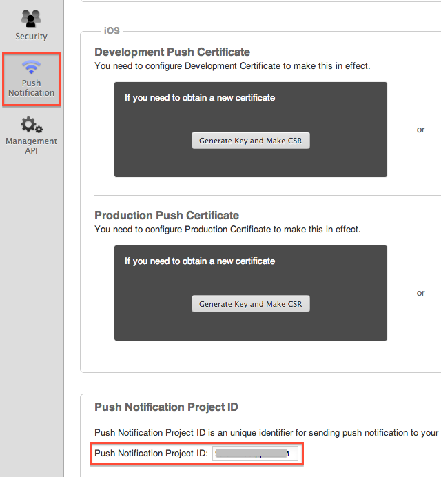

Push Notification
=================

For release and ad-hoc builds on Cordova 6.2 platform, please select the
release build option when sending push notifications.

Below are Monaca Backend Management APIs for Push Notifications.

  Method                          Description
  ------------------------------- ------------------------------
  Push.send()&lt;p.send&gt;       Send Push Notification
  Push.status()&lt;p.status&gt;   Get Push Notification Status

Push.send - Send Push Notification
----------------------------------

Send push notification to applications.

Push.send

Parameter

:   ----------------------- ----------------- --------------------------------------------------------------------------------------------------------------------------------------
      `pushProjectId`         string            push\_project\_id
      `platform`              string            User's platform which can be `"android"` or `"ios"`
      `target`                string            Type of end user which is `"app"`.
      `buildType`             string            Build type of the application which can be `"debug"` , `"release"` or `"adhoc"`.
      `title`                 string            Title (Android only)
      `message`               string            Message to send
      `badge`                                   Badge (iOS only)
      `json`                  json              JSON Data
      `userOidList`           array of string   Filter target users by their IDs. (Optional)
                                                \* In Javascript, these IDs are the values of monaca.cloud.User.oid&lt;u.\_oid&gt;.
                                                \* In ../cloud\_management/, there IDs are the values of `"_id"` property of each data from the User.list()&lt;u\_list&gt; function.
      `userQuery`             string            Filter target users by a MonaQL&lt;MonaQL&gt; query for user properties. (Optional)
                                                **e.g.** 'country == "US" && age &gt; 20'
      `userQueryBindParams`   array             Replace the placeholders in userQuery by its values. (Optional)
                                                **e.g.** \["US", 20\] when userQuery is 'country == ? && age &gt; ?'
      `deviceIdList`          array of string   Filter target devices by its IDs. (Optional)
                                                \* In Javascript, these IDs are the return values of monaca.getDeviceId()&lt;getDeviceId&gt;.
      ----------------------- ----------------- --------------------------------------------------------------------------------------------------------------------------------------

    

    Please note that `deviceIdList`, `userOidList` and `userQuery`
    cannot be used at the same time.

    

Return Value

:   --------------- -------------------------
      `queueIdList`   A list of push queue id
      --------------- -------------------------

Error Code

:   Errors are returned as ../cloud/error object.

      ---------- ----------------
      `-32602`   Invalid params
      ---------- ----------------

Push.status - Get Push Notification Status
------------------------------------------

Get push notification status.

Push.status

Parameter

:   ----------------- -------- ------------------------------------------------
      `pushProjectId`   string   push\_project\_id
      `queueId`         string   Push queue ID (get this id from `queueIdList`)
      ----------------- -------- ------------------------------------------------

Return Value

:   ------------------ --------------------------------------------------
      `status`           Status (`finish`, etc.)
      `numTarget`        Number of all recipients
      `numPushed`        Number of success recipients
      `numFailed`        Number of failed recipients
      `createdAt`        Created time
      `pushStartedAt`    Started time
      `pushFinishedAt`   Finished time (regardless of success or failure)
      ------------------ --------------------------------------------------

Error Code

:   Errors are returned as ../cloud/error object.

      ---------- ----------------
      `-32602`   Invalid params
      ---------- ----------------

Push Project ID
---------------

Push project ID is an unique identifier for sending push notification to
your app. You can easily find this ID with the following instruction:

1.  Go to *Monaca Backend* by clicking on a cloud icon in Monaca Cloud
    IDE.
2.  Then, click on setting icon and choose Backend Settings.... (See
    below screenshot)

> 
>
> > width
> >
> > :   200px
> >
3.  You will see a Backend Settings panel on the right side of the
    screen. Next, click on Push Notification. Scroll down to the bottom
    of this page to see Push project ID of the current application. (See
    below)

> 
>
> > width
> >
> > :   500px
> >

