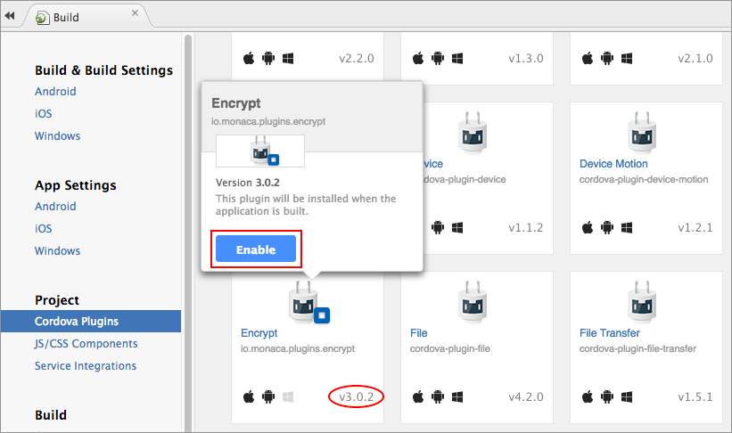
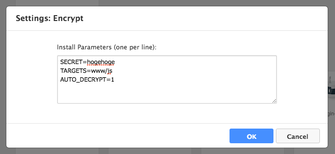
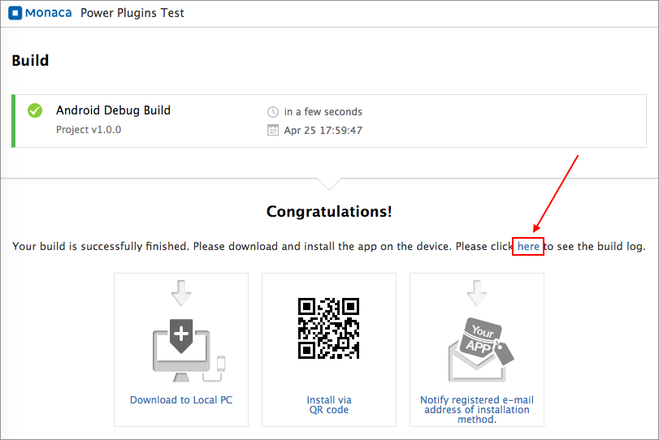
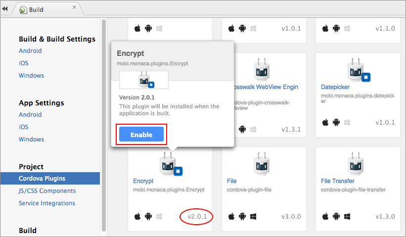
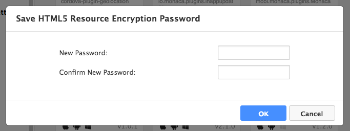

Monaca HTML5 Resource Encryption
================================

This plugin provides the encryption function for HTML5 assets bundled up
with the built app in Monaca and the decoding function for application
execution time.

<div class="admonition note">

In order to use this plugin, you are required to subscribe to a valid
plan. Please refer to [Pricing page](https://monaca.io/pricing.html).

</div>

This plugin is used differently depending on the Cordova version of your
project:

-   cordova\_6\_2\_projects
-   cordova\_5\_2\_and\_lower\_projects

For Cordova 6.2 Projects
------------------------

The plugin for Cordova 6.2 projects has two additional features:

1.  Developers can choose the encrypted directories other than www. For
    example, “www/data, www/js” etc.
2.  The decryption can now be done manually. In other words, the
    encrypted folder can't be read unless the decrypt function is
    called.

### Supported Platforms

-   Cordova 6.2
-   iOS 7 or higher
-   Android 4.0 or higher

### Encryption Scheme

  ------------------- --------
  Encryption Method   AES
  Key Length          256bit
  ------------------- --------

### Adding the Plugin in Monaca Cloud IDE

1.  From Monaca Cloud IDE menu, go to File --&gt; Manage Cordova Plugins
    or Config --&gt; Manage Cordova Plugins.
2.  Click Enable button of the `Encrypt` plugin.

> {width="700px"}

3.  Find the newly added plugin under the *Enabled Plugins* section.
    Then, hover the plugin and click Configure button.

> {width="700px"}

4.  Enter parameter(s) for this plugin. Then, click OK button. Available
    parameters are as follows:

> +---------+------------------------------------------------------------+
> | Paramet | Description                                                |
> | er      |                                                            |
> +=========+============================================================+
> | SECRET  | \[Required\] (String) Password/secret for the encryption.  |
> +---------+------------------------------------------------------------+
> | TARGETS | \[Optional\] (String) Target folder of the project files   |
> |         | to be encrypted. Default folder is `www`.                  |
> +---------+------------------------------------------------------------+
> | AUTO\_D | \[Optional\] (Boolean) Auto decryption options:            |
> | ECRYPT  |                                                            |
> |         | > -   `1`: (default) for enabling auto decryption          |
> |         | > -   `0`: for disabling auto decryption                   |
> +---------+------------------------------------------------------------+
>
> {width="600px"}

### Manual Decryption

You can also manually decrypt the configured target folder. The target
folder is encrypted and can't be read until the
`monaca.Encrypt.setDecryptHash()` function is executed. In other words,
it can not be read with the script tag in index.html file.

Please follow the steps below on how to use manual decryption:

#### Step 1: Enabling the Manual Decryption Option

In order to enable manual decryption, please set `AUTO_DECRYPT` to `0`
in the plugin configuration (Step 4 in the previous section).

#### Step 2: Getting the Hash Code for Decryption

A hash code is required when calling `monaca.Encrypt.setDecryptHash()`
function to decrypt the target folder(s). The hash code can be found in
the build log as follows:

1.  Build your project (either iOS or Android).
2.  Once the build is successfully completed, click on here (as shown in
    the screenshot below) button to see the build log.

> {width="700px"}

5.  Copy the build log and paste it in any text editor and find the hash
    code which looks like this:

> ``` {.sourceCode .javascript}
> ...
> Hash : [4c716d***************************************************ae9f720d]
> ...
> ```

#### Step 3: Calling the Decryption Function

Once you have the hash code, you can start using the decryption
function. The function needs to be called inside the `deviceready`
event. For example:

``` {.sourceCode .javascript}
document.addEventListener("deviceready", onDeviceReady, false);
function onDeviceReady() {
    monaca.Encrypt.setDecryptHash(
        function() {alert('SUCESS');},
        function() {alert('FAIL');},
    "4c716d***************************************************ae9f720d"); // Hash code for decryption
}
```

<div class="admonition note">

In the above example, the hash code is embedded directly in the
function. For security concern, you can also hide it by loading the
value from the server and use it under a parameter.

</div>

### App Store Submission

In this plugin, we use the encryption library of iOS SDK. Therefore, in
order to release the built app embedded this plugin to the AppStore, you
need to set 2 options when you submit your app for a review. Under the
Export Compliance section, please choose "Yes" for both questions as
shown in the screenshot below:


> width
>
> :   630px
>
> align
>
> :   center
>
For Cordova 5.2 or Lower Projects
---------------------------------

### Supported Platforms

-   Cordova 5.2 or lower
-   iOS 7 or higher
-   Android 4.0 or higher

### Encryption Scheme

  ------------------- --------
  Encryption Method   AES
  Key Length          256bit
  ------------------- --------

### Enabling the Plugin in Monaca Cloud IDE

1.  From Monaca Cloud IDE menu, go to File --&gt; Manage Cordova Plugins
    or Config --&gt; Manage Cordova Plugins.
2.  Click Enable button of the `Encrypt` plugin.

> {width="700px"}

3.  Next, you need to setup the encryption password. Find the newly
    added plugin under the *Enabled Plugins* section. Then, hover the
    plugin and click Configure button.

> {width="700px"}

4.  Enter the password for this encryption. Then, click OK button.

> {width="400px"}

### App Store Submission

In this plugin, we use the encryption library of iOS SDK. Therefore, in
order to release the built app embedded this plugin to the AppStore, you
need to set 2 options when you submit your app for a review. Under the
Export Compliance section, please choose "Yes" for both questions as
shown in the screenshot below:


> width
>
> :   630px
>
> align
>
> :   center
>

