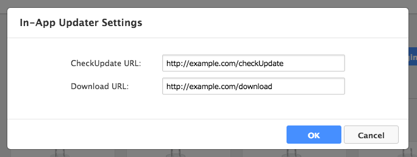
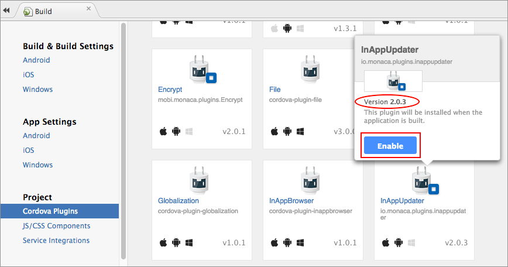
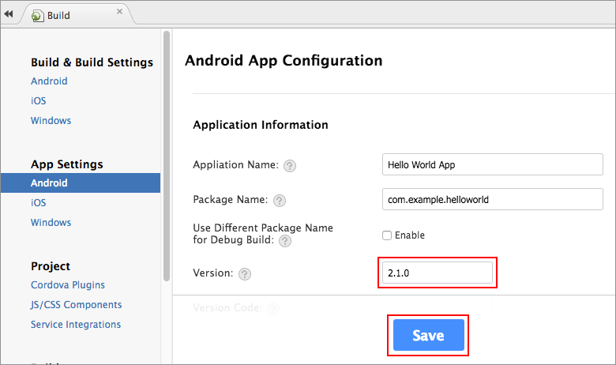
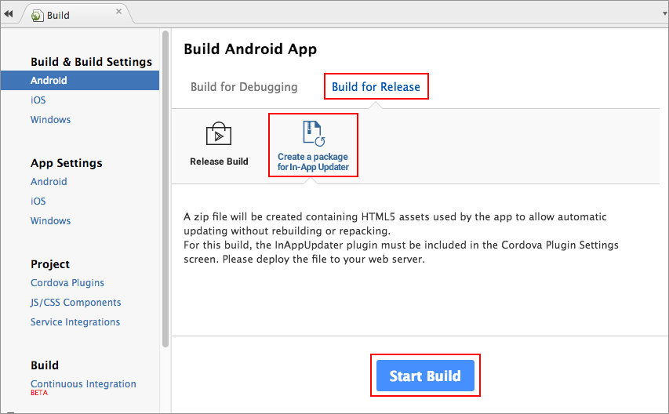
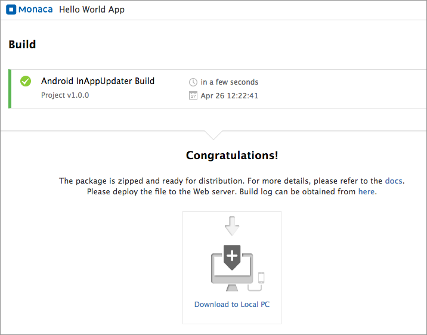

Monaca In-App Updater
=====================

This plugin updates HTML5 assets contained in the app without rebuilding
and packaging the app. You need a Web server to host the update files
which will be accessed from the app.

<div class="admonition note">

In order to use this plugin, you are required to subscribe to a valid
plan. Please refer to [Pricing page](https://monaca.io/pricing.html).

</div>

This plugin is used differently depending on the Cordova version of your
project:

-   inapp\_update\_6\_2
-   inapp\_update\_5\_2\_and\_lower

For Cordova 6.2 Projects
------------------------

### Supported Platforms

-   iOS 8 or later
-   Android 4 or later

### Adding the Plugin in Monaca Cloud IDE

1.  From Monaca Cloud IDE menu, go to File --&gt; Manage Cordova Plugins
    or Config --&gt; Manage Cordova Plugins.
2.  Click Enable button of the `Monaca In-App Updater (Version 4.0.0)`
    to add it into your project.

> {width="700px"}

3.  Next, you need to configure necessary information for this plugin.
    Find your newly added plugin under the *Enable Plugins* section.
    Then, hover the plugin and click Configure button.

> {width="700px"}

4.  Input the CheckUpdate URL &lt;checkUpdate\_api&gt; and
    Download URL &lt;download\_api&gt; appropriately. Then, click OK
    button.

> {width="600px"}

### Plugin Configuration

In this section, we will talk about how to create the two web API you
will need to use this plugin: checkUpdate\_api and download\_api.

#### /checkUpdate

Check the update version on the server side.

*Request Parameters*

> widths
>
> :   10 10 30
>
> header-rows
>
> :   1
>
> -   -   Parameter
>     -   Data Type
>
>     - Description
> -   -   `project_id`
>     -   String
>
>     - Unique project ID
> -   -   `my_update_number`
>     -   String
>
>     - \[optional\] The current update number of the app
> -   -   `os`
>     -   String
>
>     - \[optional\] The type of OS to receive the update
> -   -   `build_type`
>     -   String
>
>     - \[optional\] The type of build
> -   -   `app_version`
>     -   String
>
>     - \[optional\] The version of the app
> -   -   `plugin_version`
>     -   String
>     -   \[optional\] The version of the In-App-Updater plugin
>
*Response Parameters*

Here is an example of a successful response:

``` {.sourceCode .javascript}
{
  "ios": {
    "2.1.0": {　// app version
      "1": { // update number
        "date": 20170113,
        "url": "https://hogehoge.com/app/ios-v2.1.0.zip" // This parameter is optional.
      }
    }
  }
}
```

If you use static files, then the information of all update versions
will be included in the response as follows:

``` {.sourceCode .javascript}
{
  "ios": {
    "2.1.0": {　// app version
      "1": { // update number
        "date": 20170113,
        "url": "https://hogehoge.com/app/1/ios-v2.1.0.zip" //  This parameter is optional.
      },
      "2": { // update number
        "date": 20170113,
        "url": "https://hogehoge.com/app/2/ios-v2.1.0.zip" //  This parameter is optional.
      }
    },
    "2.2.0": {　// app version
      "1": { // update number
        "date": 20170210,
        "url": "https://hogehoge.com/app/1/ios-v2.2.0.zip" //  This parameter is optional.
      }
    }
  }
}
```

As shown in the above example, the value of the update number is an JSON
object consists of the update information such as `date`, `url` and so
on. It can be obtained by the `updateInfo` parameter of a JSON object
returned by the Promise of getserverversion method.

#### /download

Download the zip file (update package file).

<div class="admonition note">

You can omit this preference if you set a download URL with download.

</div>

*Request Parameters*

> widths
>
> :   10 10 30
>
> header-rows
>
> :   1
>
> -   -   Parameter
>     -   Data Type
>
>     - Description
> -   -   `update_number`
>     -   String
>
>     - The update version number to be downloaded
> -   -   `project_id`
>     -   String
>
>     - Unique project ID
> -   -   `my_update_number`
>     -   String
>
>     - \[optional\] The current update number of the app
> -   -   `os`
>     -   String
>
>     - \[optional\] The type of OS to receive the update
> -   -   `build_type`
>     -   String
>
>     - \[optional\] The type of build
> -   -   `app_version`
>     -   String
>
>     - \[optional\] The version of the app
> -   -   `plugin_version`
>     -   String
>     -   \[optional\] The version of the In-App-Updater plugin
>
*Response Parameters*

A successful response contains a ZIP file of InAppUpdater resource.

### Methods

The easiest way to use this plugin is to only use autoUpdate which will
download the update files (as configure in updater\_configuration) and
update the app automatically.

On the other hand, if you want to customize the update process, you can
use various available methods such as getServerVersion, download,
updateAndRestart and so on.

Here is the list of all available methods for this plugin:

  Methods                     Description
  --------------------------- ----------------------------------------------------------------------------------------------
  getServerVersion            Get the information of files to be updated from the server.
  forceStopGetServerVersion   Force getServerVersion to stop.
  getLocalVersion             Get the currect version of the app.
  download                    Download the update files.
  forceStopDownload           Force download to stop.
  updateAndRestart            Deploy and mount the downloaded update files, and then restart the app.
  status                      Get the current status of the plugin.
  showAlertDialog             Show a dialog with a title and a message. Only one dialog is shown at a time.
  dismissAlertDialog          Close the Alert dialog.
  showProgressDialog          Show a Progress dialog indicating the update progress.
  changeProgressDialog        Change the Progress dialog.
  dismissProgressDialog       Close a Progress dialog.
  networkStatus               Check the network status (Wifi, 3G/LTE, or disconnected).
  terminateApp                Terminate/Shut down the app.
  autoUpdate                  Update automatically if necessary, by using methods such as getServerVersion, download, etc.

#### getServerVersion()

Get the information of files to be updated from the server.

monaca.InAppUpdater.getServerVersion(\[args: JSON object\]): Promise

Parameter: JSON Object

:   +--------------+------+------------------------------------------------+
    | Name         | Data | Description                                    |
    |              | Type |                                                |
    +==============+======+================================================+
    | `connectDela | Inte | A delay time in milliseconds before starting   |
    | y`           | ger  | to connect to the server                       |
    +--------------+------+------------------------------------------------+
    | `connectTime | Inte | (Android only) A time-out duration in          |
    | out`         | ger  | milliseconds for connecting to the server      |
    +--------------+------+------------------------------------------------+
    | `readTimeout | Inte | (Android only) A time-out duration in          |
    | `            | ger  | milliseconds for receiving all responses from  |
    |              |      | the server                                     |
    +--------------+------+------------------------------------------------+
    | `timeoutForR | Inte | (iOS only) A time-out duration in milliseconds |
    | equest`      | ger  | for sending a request to the server. When the  |
    |              |      | time-out happens, the request will be resent   |
    |              |      | automatically without any errors.              |
    +--------------+------+------------------------------------------------+
    | `timeoutForR | > In | (iOS only) A time-out duration in milliseconds |
    | esponse`     | tege | for receiving all responses from the server    |
    |              | r    |                                                |
    +--------------+------+------------------------------------------------+

Return Value: Promise

:   -   Success callback receives a JSON object as shown below:

        > widths
        >
        > :   15 5 25
        >
        > header-rows
        >
        > :   1
        >
        > -   -   Name
        >     -   Data Type
        >
        >     - Description
        > -   -   `needsUpdate`
        >     -   Boolean
        >
        >     - It indicates whether or not the version of the app
        >     should be updated.
        > -   -   `updatable`
        >     -   Boolean
        >
        >     - It indicates whether or not there are new files for
        >     update on the server.
        > -   -   `latestVersion`
        >     -   String
        >
        >     - The latest version of the app
        > -   -   `myVersion`
        >     -   String
        >
        >     - The current version of the app
        > -   -   `latestUpdateNumber`
        >     -   String
        >
        >     - The latest update number for the current version of the
        >     app
        > -   -   `myUpdateNumber`
        >     -   String
        >
        >     - The current update number for the current version of the
        >     app
        > -   -   `updateInfo`
        >     -   JSON Object
        >     -   The update information returned by the server after
        >         the update number. For example, if the server side
        >         response is as follows:
        >
        >         > ``` {.sourceCode .javascript}
        >         > {
        >         >   "ios": {
        >         >     "2.1.0": {　// app version
        >         >       "1": { // update number
        >         >         "date": 20170113,
        >         >         "url": "https://hogehoge.com/app/ios-v2.1.0.zip" // This parameter is optional.
        >         >       }
        >         >     }
        >         >   }
        >         > }
        >         > ```
        >
        >         Then, the value of `updateInfo` will be:
        >
        >         > ``` {.sourceCode .javascript}
        >         > updateInfo = {
        >         >   "date": 20170113,
        >         >   "url": "https://hogehoge.com/app/ios-v2.1.0.zip"
        >         > }
        >         > ```
        >
    -   Fail callback receives a JSON object indicating the error(s).

Example

:   ``` {.sourceCode .javascript}
    monaca.InAppUpdater.getServerVersion().then(
        function(json) {
            alert( JSON.stringify(json) );
            targetVersion = json.myVersion;
            targetUpdateNumber = json.latestUpdateNumber;
            url = json.updateInfo.url;
            alert( targetVersion );
            alert( targetUpdateNumber );
            alert( url );
        } ,
        function(fail) { alert( JSON.stringify(fail) ); }
    );
    ```

#### forceStopGetServerVersion()

Force `getServerVersion()` to stop.

monaca.InAppUpdater.forceStopGetServerVersion(): Promise

Parameter

:   There is no argument for this method.

Return Value: Promise

:   -   Success callback receives a JSON object indicating the result.
    -   Fail callback receives a JSON object indicating the error(s).

Example

:   ``` {.sourceCode .javascript}
    monaca.InAppUpdater.forceStopGetServerVersion().then(
        function(str) { alert("stop success"); } ,
        function(fail) { alert( JSON.stringify(fail) ); }
    );
    ```

#### getLocalVersion()

Get the currect version of the app.

monaca.InAppUpdater.getLocalVersion(): Promise

Parameter

:   There is no argument for this method.

Return Value: Promise

:   -   Success callback receives a JSON object indicating the result.
    -   Fail callback receives a JSON object indicating the error(s).

Example

:   ``` {.sourceCode .javascript}
    monaca.InAppUpdater.getLocalVersion().then(
        function(json) { alert( JSON.stringify(json) ); } ,
        function(fail) { alert( JSON.stringify(fail) ); }
    );
    ```

#### download()

Download the update files.

monaca.InAppUpdater.download(args: JSON object): Promise

Parameter: JSON Object

:   +--------------+------+------------------------------------------------+
    | Name         | Data | Description                                    |
    |              | Type |                                                |
    +==============+======+================================================+
    | `updateNumbe | Inte | The update number                              |
    | r`           | ger  |                                                |
    +--------------+------+------------------------------------------------+
    | `bufferSize` | Inte | (Android only) Buffer size in bytes. The       |
    |              | ger  | default value is `8192`.                       |
    +--------------+------+------------------------------------------------+
    | `url`        | Stri | The URL where you download the ZIP file from.  |
    |              | ng   | If this value is not existed, the value of     |
    |              |      | `monaca:updater_DownloadUrl` in `config.xml`   |
    |              |      | is used instead.                               |
    +--------------+------+------------------------------------------------+
    | `connectDela | Inte | A delay time in milliseconds before starting   |
    | y`           | ger  | to connect to the server                       |
    +--------------+------+------------------------------------------------+
    | `connectTime | > In | (Android only) A time-out duration in          |
    | out`         | tege | milliseconds for connecting to the server      |
    |              | r    |                                                |
    +--------------+------+------------------------------------------------+
    | `readTimeout | Inte | (Android only) A time-out duration in          |
    | `            | ger  | milliseconds for receiving all responses from  |
    |              |      | the server                                     |
    +--------------+------+------------------------------------------------+
    | `timeoutForR | Inte | (iOS only) A time-out duration in milliseconds |
    | equest`      | ger  | for sending a request to the server. When the  |
    |              |      | time-out happens, the request will be resent   |
    |              |      | automatically without any errors.              |
    +--------------+------+------------------------------------------------+
    | `timeoutForR | > In | (iOS only) A time-out duration in milliseconds |
    | esponse`     | tege | for receiving all responses from the server    |
    |              | r    |                                                |
    +--------------+------+------------------------------------------------+

Return Value: Promise

:   -   Success callback receives a JSON object indicating the result.
    -   Fail callback receives a JSON object indicating the error(s).
    -   Progress callback receives a JSON object indicating the progress
        of download as shown below:

      Name                        Data Type     Description
      --------------------------- ------------- ---------------------------------------------------------------------------------------
      `count`                     Integer       The total size of the files that have been downloaded so far
      `total`                     Integer       The total size of the all expected download files

Example

:   ``` {.sourceCode .javascript}
    monaca.InAppUpdater.download( { version : targetVersion, buildNumber : targetBuildNumber, url : url } ).then(
        function(json) { alert( JSON.stringify(json) ); } ,
        function(fail) { alert( JSON.stringify(fail) ); } ,
        function(json) { console.log( json.count + "/" + json.total + " are done." ); }
    );
    ```

#### forceStopDownload()

Force `download()` to stop.

monaca.InAppUpdater.forceStopDownload(): Promise

Parameter

:   There is no argument for this method.

Return Value: Promise

:   -   Success callback receives a JSON object indicating the result.
    -   Fail callback receives a JSON object indicating the error(s).

Example

:   ``` {.sourceCode .javascript}
    monaca.InAppUpdater.forceStopDownload().then(
        function(str) { alert("stop success"); } ,
        function(fail) { alert( JSON.stringify(fail) ); }
    );
    ```

#### updateAndRestart()

Deploy and mount the downloaded update files, and then restart the app.

monaca.InAppUpdater.updateAndRestart(): Promise

Parameter

:   There is no argument for this method.

Return Value: Promise

:   -   Success callback receives a JSON object indicating the result.
    -   Fail callback receives a JSON object indicating the error(s).
    -   Progress callback receives a JSON object indicating the progress
        of the deployment as shown below:

      Name                        Data Type     Description
      --------------------------- ------------- ---------------------------------------------------------------------------------------
      `count`                     Integer       The total size of the files that have been deployed so far
      `total`                     Integer       The total size of the all update files to be deployed

Example

:   ``` {.sourceCode .javascript}
    monaca.InAppUpdater.updateAndRestart().then(
        function() { },
        function(fail) { alert( JSON.stringify(fail) ); },
        function(json) { console.log( json.count + "/" + json.total + " are done." ); }
    );
    ```

#### status()

Get the current status of the plugin.

monaca.InAppUpdater.status(): Promise

Parameter

:   There is no argument for this method.

Return Value: Promise

:   -   Success callback receives a JSON object as shown below:

      Name                        Data Type     Description
      --------------------------- ------------- ---------------------------------------------------------------------------------------
      `running`                   Boolean       Returns `true` if the plugin is in use.
      `status`                    String        The information on what kind of task the plugin is working on right now.

    -   Fail callback receives a JSON object indicating the error(s).

Example

:   ``` {.sourceCode .javascript}
    monaca.InAppUpdater.status().then(
        function(json) { alert( JSON.stringify(json) ); },
        function(fail) { alert( JSON.stringify(fail) ); }
    );
    ```

#### showAlertDialog()

Show a dialog with a title and a message. Only one dialog is shown at a
time.

monaca.InAppUpdater.showAlertDialog(args: JSON object): Promise

Parameter: JSON Object

:   +-------------+-------+------------------------------------------------+
    | Name        | Data  | Description                                    |
    |             | Type  |                                                |
    +=============+=======+================================================+
    | `title`     | Strin | Title of the dialog                            |
    |             | g     |                                                |
    +-------------+-------+------------------------------------------------+
    | `message`   | Strin | Message content                                |
    |             | g     |                                                |
    +-------------+-------+------------------------------------------------+
    | `button`    | JSON  | A button in the dialog consists of 2 elements  |
    |             | Objec | such as :                                      |
    |             | t     |                                                |
    |             |       | -   `label`: \[String\] The label of the       |
    |             |       |     button                                     |
    |             |       | -   `handler`: A function to be called when    |
    |             |       |     the button is clicked.                     |
    |             |       |                                                |
    |             |       | Example:                                       |
    |             |       |                                                |
    |             |       | ``` {.sourceCode .javascript}                  |
    |             |       | {                                              |
    |             |       |     label : "OK",                              |
    |             |       |     handler : function() { alert("OK is clicke |
    |             |       | d"); }                                         |
    |             |       | }                                              |
    |             |       | ```                                            |
    +-------------+-------+------------------------------------------------+
    | `cancel`    | JSON  | A cancel button in the dialog consists of 2    |
    |             | Objec | elements such as :                             |
    |             | t     |                                                |
    |             |       | -   `label`: \[String\] The label of the       |
    |             |       |     cancel button                              |
    |             |       | -   `handler`: A function to be called when    |
    |             |       |     the cancel button is clicked.              |
    |             |       |                                                |
    |             |       | Example:                                       |
    |             |       |                                                |
    |             |       | ``` {.sourceCode .javascript}                  |
    |             |       | {                                              |
    |             |       |     label : "Close",                           |
    |             |       |     handler : function() { alert("Close is cli |
    |             |       | cked"); }                                      |
    |             |       | }                                              |
    |             |       | ```                                            |
    +-------------+-------+------------------------------------------------+

Return Value: Promise

:   -   Success callback receives a JSON object indicating the result.
    -   Fail callback receives a JSON object indicating the error(s).

Example

:   ``` {.sourceCode .javascript}
    monaca.InAppUpdater.showAlertDialog({
      title : "Title" ,
      message : "Message" ,
      button : { label : "OK" , handler : function() { alert( "OK is clicked"); } },
      cancel : { label : "Cancel" , handler : function() { alert( "Cancel is clicked"); } },
      dismiss : function() { alert("Dismissed!"); }
    } ).then(
        function(btnLabel) { alert( "open" ); },
        function(fail) { alert( JSON.stringify(fail) ); }
    );
    ```

#### dismissAlertDialog()

Close the Alert dialog.

monaca.InAppUpdater.dismissAlertDialog(): Promise

Parameter

:   There is no argument for this method.

Return Value: Promise

:   -   Success callback receives a JSON object indicating the result.
    -   Fail callback receives a JSON object indicating the error(s).

Example

:   ``` {.sourceCode .javascript}
    setTimeout( function() {
      monaca.InAppUpdater.dismissAlertDialog().then(
          function(json) { alert( "OK auto close" ); },
          function(fail) { alert( JSON.stringify(fail) ); }
      );
    } , 1000 );
    ```

#### showProgressDialog()

Show a Progress dialog indicating the update progress.

monaca.InAppUpdater.showProgressDialog(args: JSON object): Promise

Parameter: JSON Object

:   +-------------+-------+------------------------------------------------+
    | Name        | Data  | Description                                    |
    |             | Type  |                                                |
    +=============+=======+================================================+
    | `title`     | Strin | Title of the dialog                            |
    |             | g     |                                                |
    +-------------+-------+------------------------------------------------+
    | `message`   | Strin | Message content                                |
    |             | g     |                                                |
    +-------------+-------+------------------------------------------------+
    | `max`       | Integ | The maximum value of a counter. When           |
    |             | er    | downloading files, it will be a total number   |
    |             |       | of files.                                      |
    +-------------+-------+------------------------------------------------+
    | `progress`  | Integ | A value that indicates the progress. When      |
    |             | er    | downloading files, it will be a total number   |
    |             |       | of files downloaded.                           |
    +-------------+-------+------------------------------------------------+
    | `cancel`    | JSON  | A cancel button in the dialog consists of 2    |
    |             | Objec | elements such as :                             |
    |             | t     |                                                |
    |             |       | -   `label`: \[String\] The label of the       |
    |             |       |     cancel button                              |
    |             |       | -   `handler`: A function to be called when    |
    |             |       |     the cancel button is clicked.              |
    |             |       |                                                |
    |             |       | Example:                                       |
    |             |       |                                                |
    |             |       | ``` {.sourceCode .javascript}                  |
    |             |       | {                                              |
    |             |       |     label : "Close",                           |
    |             |       |     handler : function() { alert("Close is cli |
    |             |       | cked"); }                                      |
    |             |       | }                                              |
    |             |       | ```                                            |
    +-------------+-------+------------------------------------------------+
    | `dismiss`   | Callb | A function to be called when a dialog is       |
    |             | ack   | closed.                                        |
    +-------------+-------+------------------------------------------------+

Return Value: Promise

:   -   Success callback receives a JSON object indicating the result.
    -   Fail callback receives a JSON object indicating the error(s).

Example

:   ``` {.sourceCode .javascript}
    monaca.InAppUpdater.showProgressDialog(
      { title : "Title" ,
        message : "Message" ,
        max : 100 ,
        progress : 50 ,
        cancel : { label : "Cancel" , handler : function() { log("cancel handler"); } } ,
        dismiss : function() { log("dismissed."); }
      } ).then(
      function(json) {
        alert(JSON.stringify(json));
      },
      function(fail) {
        alert( JSON.stringify(fail));
      }
    );
    ```

#### changeProgressDialog()

Change the Progress dialog.

monaca.InAppUpdater.changeProgressDialog(args: JSON object): Promise

Parameter: JSON Object

:   
      Name                          Data Type          Description
      ----------------------------- ------------------ --------------------------------------------------------------------------------------------------------
      `progress`                    Integer            A value of the progress to be changed/updated.

Return Value: Promise

:   -   Success callback has no argument.
    -   There is no fail callback.

Example

:   ``` {.sourceCode .javascript}
    monaca.InAppUpdater.changeProgressDialog( { progress: progress } ).then(
      function() {
        if (progress < 100) {
          setTimeout( function() { changeProgressDialog(progress+10); } , 500 );
        } else {
          monaca.InAppUpdater.dismissProgressDialog().then(
            function(json) { log("complete"); } ,
            function(error) { alert( JSON.stringify(error) ); }
          );
        }
      }
    )
    ```

#### dismissProgressDialog()

Close a Progress dialog.

monaca.InAppUpdater.dismissProgressDialog(): Promise

Parameter

:   There is no argument for this method.

Return Value: Promise

:   -   Success callback receives a JSON object indicating the result.
    -   Fail callback receives a JSON object indicating the error(s).

Example

:   ``` {.sourceCode .javascript}
    setTimeout( function() {
      monaca.InAppUpdater.dismissProgressDialog().then(
        function(json) { alert(JSON.stringify(json)); } ,
        function(error) { alert( JSON.stringify(error) ); }
      );
    } , 1000 );
    ```

#### networkStatus()

Check the network status (Wifi, 3G/LTE, or disconnected).

monaca.InAppUpdater.dismissAlertDialog(): Promise

Parameter

:   There is no argument for this method.

Return Value: Promise

:   -   Success callback receives a JSON object as shown below:

      Name                                                                                                Data Type                                        Description
      --------------------------------------------------------------------------------------------------- ------------------------------------------------ -----------------------------------------------------------------------------------------------------------------------------------------------------------------------------------------------------------------------------------------------------------------------------------------------------------------------------------
      `network`                                                                                           Boolean                                          Return `true` if carrier network (i.e. Docomo, KDDI, …) is available.
      `wifi`                                                                                              Boolean                                          Return `true` if Wifi is available.
      `mobile`                                                                                            Boolean                                          Return `true` if a network connection (Wifi or carrier network) is available. Otherwise, return `false when there is no connection available.`

    -   Fail callback receives a JSON object indicating the error(s).

Example

:   ``` {.sourceCode .javascript}
    monaca.InAppUpdater.networkStatus().then(
        function(json) { alert( JSON.stringify(json) ); },
        function(fail) { alert( JSON.stringify(fail) ); }
    );
    ```

#### terminateApp()

Terminate/Shut down the app.

<div class="admonition note">

This method is added for compatibility with the old `InAppUpdater`
plugin ( v2.0.4 ) for Cordova 5.

</div>

<div class="admonition warning">

For iOS, this is equivalent to shutdown/crash so we do not recommend to
use. Apple might reject your app because of this.

</div>

monaca.InAppUpdater.terminateApp()

Parameter

:   There is no argument for this method.

Return Value:

:   There is no return value.

Example

:   ``` {.sourceCode .javascript}
    monaca.InAppUpdater.terminateApp();
    ```

#### autoUpdate()

Download the update files and update the app automatically.

monaca.InAppUpdater.autoUpdate(options: JSON object): Promise

Parameter: JSON Object

:   
    >
    > widths
    >
    > :   15 10 30
    >
    > header-rows
    >
    > :   1
    >
    > -   -   Name
    >     -   Data Type
    >
    >     - Description
    > -   -   `connectDelay`
    >     -   Integer
    >
    >     - A delay time in milliseconds before starting to connect to
    >     the server
    > -   -   `dialogMessages`
    >     -   JSON Object
    >     -   A dialog to be displayed while updating the app. It has 3
    >         variables such as :
    >
    >         -   `confirm3G`: \[String\] A text to be shown when the
    >             user is using carrier network instead of Wifi
    >             connection while downloading the update.
    >         -   `prepare`: \[JSON Object\] An object with 2 string
    >             variables such as `title` and `message` which will
    >             displayed while preparing to download the updates.
    >         -   `download`: \[JSON Object\] An object with 2 string
    >             variables such as `title` and `message` which will
    >             displayed while downloading the updates.
    >
    >         Example:
    >
    >         :   ``` {.sourceCode .javascript}
    >             {
    >                 confirm3G : 'These updates will be downloaded with your mobile data.',
    >                 prepare : {
    >                     title : 'Preparing to Dowload the Updates',
    >                     message : 'Now checking the server version ...'},
    >                 download : {
    >                     title : 'Dowloading the Updates',
    >                     message : 'Now downloading ...'}
    >             }
    >             ```
    >
    > -   -   `nextTask`
    >     -   Callback
    >
    >     - A function to be called when the update is done
    >     successfully.
    > -   -   `failTask`
    >     -   Callback
    >     -   A function to be called when the update is failed.
    >
Return Value:

:   There is no return value.

Example

:   ``` {.sourceCode .javascript}
    monaca.InAppUpdater.autoUpdate( {
      connectDelay : 0000,
      connectTimeout : 30000,
      readTimeout: 300000,
      nextTask : function(res) {
        if (res.requireRestart) {
          monaca.InAppUpdater.updateAndRestart().then(
            function() { },
            function(fail) { alert( JSON.stringify(fail) ); }
          );
        } else {
          alert("App is started!");
        }
      },
      failTask : function(res) {
        monaca.InAppUpdater.showAlertDialog(
          { title : "Error Code "+res.error.code ,
            message : res.error.message ,
            button : { label : "OK" , handler : function() { } }
          } ).then(
          function(json) {  },
          function(fail) { }
        );
      }
    });
    ```

For Cordova 5.2 or Lower Projects
---------------------------------

### Supported Platforms

-   iOS 7 or later
-   Android 4.0 or later

### Adding the Plugin in Monaca Cloud IDE

1.  From Monaca Cloud IDE menu, go to File --&gt; Manage Cordova Plugins
    or Config --&gt; Manage Cordova Plugins.
2.  Click Enable button of the `Monaca In-App Updater (Version 2.x.x)`
    to add it into your project.

> {width="700px"}

3.  Next, you need to configure necessary information for this plugin.
    Find your newly added plugin under the *Enable Plugins* section.
    Then, hover the plugin and click Configure button.

> {width="700px"}

4.  Choose an appropriate update\_mode and enter the
    Deploy URL &lt;files\_placement&gt; storing the package update files
    (see config\_in\_app\_updater). Then, click OK button.

> {width="600px"}

### Plugin Configuration

#### Update Mode

When there are available updates, the application will try to update the
app according to the predefined update mode.

  Mode      Description
  --------- ---------------------------------------------------------------------------------------------------------------------------------------------------
  Default   The application can run even the update process cannot be done.
  Severe    The application cannot run if the update process cannot be done. For instance, if the application has no network connectivity, the app will exit.

These settings are stored in config.xml file as shown below:

``` {.sourceCode .javascript}
<preference name="monaca:UpdateMode" value="default"/>
<preference name="monaca:UpdateUrl" value="DEPLOY_URL"/>
```

### Creating Update Package Files

The update package files are:

-   update.json: an update configuration file storing version of update
    file for each platform
-   android-vX.X.X.zip: an Android update file generated by Monaca
-   ios-vX.X.X.zip: an iOS update file generated by Monaca

<div class="admonition note">

It's possible to just update the app for iOS or Android depending on the
update file(s) you have.

</div>

#### 1. Creating update.json File

As mention above, the update.json file is an update configuration file
to store the version information of the update files. Please create this
file with the following format as an example:

``` {.sourceCode .javascript}
{
  "ios": { "version": "2.0.0" },
  "android": { "version": "2.1.0" }
}
```

In this example, `"ios": { "version": "2.0.0" }` means that the
`ios-v2.0.0.zip` file will be used to download as an in-app update for
iOS.

#### 2. Creating Android or iOS Update File

Each update file has a version number in its filename. This version
number is based on the Android or iOS app's version number when the
update file is created.

You can update the version of the update file by the following steps:

1.  From Monaca Cloud IDE, go to Config --&gt; iOS App Settings for iOS
    or go to Config --&gt; Android App Settings for Android.
2.  Enter the version number and click Save button.

{width="700px"}

{width="700px"}

<div class="admonition note">

The Android and iOS version do not have be the same.

</div>

After you are done configuring the app's information, you can start
building the package file for each platform. Please do as follows:

1.  Go to iOS or Android Build screen.
2.  Select Build for Release --&gt; Create a package for In-App Updater.

> {width="700px"}

3.  Click Start Build. It may takes sometimes to create the package. So
    please wait.
4.  When the build is successfully completed, you can download the
    update package file.

> {width="700px"}

### Placing the Update Package Files

After you have created the package files (update.json,
android-vX.X.X.zip and/or ios-vX.X.X.zip), you can start uploading them
to your server. Please make sure to place all files at the same level.
For example, if your Deploy URL is `http://example.com/HelloWorld/`,
then your update files should be placed as follows:

``` {.sourceCode .javascript}
http://example.com/HelloWorld/update.json
http://example.com/HelloWorld/ios-v2.0.0.zip
http://example.com/HelloWorld/android-v2.1.0.zip
```

<div class="admonition note">

Using this plugin might cause your app to be rejected by the App Store.
However, so far we haven't had any known rejection yet.

</div>
