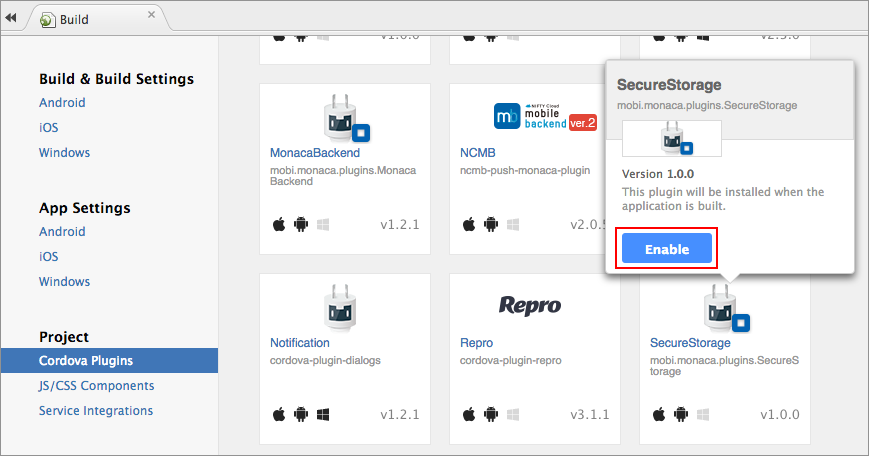
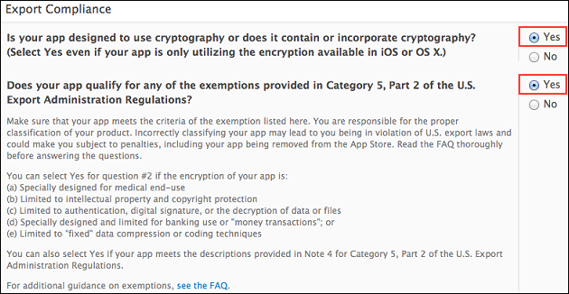

Monaca Secure Storage
=====================

This plugin provides an encrypted data storage function. If the
application is uninstalled, saved data will also be deleted.

In order to use this plugin, you are required to subscribe to a valid
plan. Please refer to [Pricing](https://monaca.io/pricing.html).

Supported Platforms
-------------------

-   Cordova 4.1 or later
-   iOS
-   Android

Encryption Scheme
-----------------

  ------------------- --------
  Encryption Method   AES
  Key Length          256bit
  ------------------- --------

Adding the Plugin in Monaca Cloud IDE
-------------------------------------

1.  From Monaca Cloud IDE menu, go to File --&gt; Manage Cordova Plugins
    or Config --&gt; Manage Cordova Plugins.
2.  Click Enable button of the `Monaca Secure Storage` to add it into
    your project.

> {width="700px"}

Methods
-------

  ----------------- -------------------------------------------------------------------------------------------------------------------------------------------------------------------------------
  Set Data          Save data into the storage by specifying the `key` and `value`. The boolean callback will notify whether the data is successfully saved (`True`) or failed to save (`false`).
                    .. code-block:: javascript
                    plugins.secureStorage.setItem(key, value, function(result) {
                    // result: true=success, false=error
                    });
                    
  Get Data          Retrieve data associated with the specified key. The callback will return the intended data if the key is found; otherwise, a null value will be return.
                    .. code-block:: javascript
                    plugins.secureStorage.getItem(key, function(value) {
                    // value: null = no such a value
                    });
                    
  Delete Data       Delete the data associated with a specified key. The boolean callback will notify whether the data deletion is successful (`True`) or failed (`false`).
                    .. code-block:: javascript
                    plugins.secureStorage.removeItem(key, function(result) {
                    // result: true=success, false=error
                    });
                    
  Delete All Data   Delete all data in the storage. The boolean callback will notify whether the data deletion is successful (`True`) or failed (`false`).
                    .. code-block:: javascript
                    plugins.secureStorage.clear(function(result) {
                    // result: true=success, false=error
                    });
  ----------------- -------------------------------------------------------------------------------------------------------------------------------------------------------------------------------

App Store Submission
--------------------

In this plugin, we use the encryption library of iOS SDK. Therefore, in
order to release the built app embedded this plugin to the App Store,
you need to set 2 options when you submit your app for a review. Under
the Export Compliance section, please choose "Yes" for both questions as
shown in the screenshot below:

> width
>
> :   600px
>
> align
>
> :   center
>

