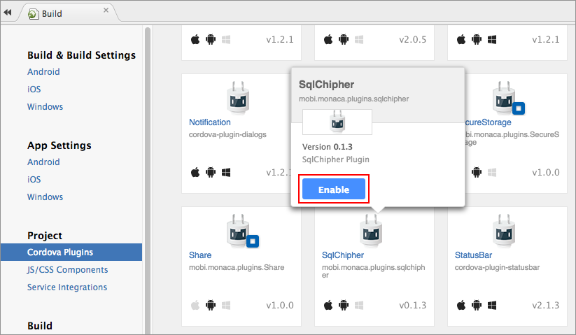

SQLCipher Adapter
=================

SQLCipher Adapter is a Cordova plugin to create and access encrypted
databases on Android, iOS, and Windows Universal (8.1) with API similar
to HTML5/Web SQL API.

<div class="admonition note">

In order to use this plugin, you are required to subscribe to a valid
plan. Please refer to [Pricing](https://monaca.io/pricing.html).

</div>

Supported Platforms
-------------------

-   Cordova 5.2
-   iOS 8 or later
-   Android 4.0 or later

Adding the Plugin in Monaca Cloud IDE
-------------------------------------

1.  From Monaca Cloud IDE menu, go to
    Config --&gt; Manage Cordova Plugins.
2.  Click Enable button of the `SQLCipher Adapter` to add it into your
    project.

> {width="700px"}

Usage
-----

### Opening a Database

If you try to open a database that doesn’t exist, the API will create
it.

var db = window.sqlitePlugin.openDatabase({name: "myDatabase.db", \[key: "your-password-here"\], \[location: 1\]});

Parameter

:   +--------+-------------------------------------------------------------+
    | `name` | Your database's name. The database file name should include |
    |        | the extension, if desired.                                  |
    +--------+-------------------------------------------------------------+
    | `key`  | Your database's password.                                   |
    +--------+-------------------------------------------------------------+
    | `locat | It used to select the database subdirectory location (iOS   |
    | ion`   | only) with the following choices:                           |
    |        |                                                             |
    |        | > -   `0` (default): *Documents* - visible to iTunes and    |
    |        | >     backed up by iCloud.                                  |
    |        | > -   `1`: *Library* - backed up by iCloud, NOT visible to  |
    |        | >     iTunes.                                               |
    |        | > -   `2`: *Library/LocalDatabase* - NOT visible to iTunes  |
    |        | >     and NOT backed up by iCloud.                          |
    +--------+-------------------------------------------------------------+

Example

:   The following code illustrates an example with PRAGMA feature.
    First, a table is created and a single entry is added. Then, a query
    to count the inserted item to see if it's added as expected.

    ``` {.sourceCode .javascript}
    // Wait for Cordova to load
    document.addEventListener("deviceready", onDeviceReady, false);

    // Cordova is ready
    function onDeviceReady() {
      var db = window.sqlitePlugin.openDatabase({name: "my.db"});

      db.transaction(function(tx) {
        tx.executeSql('DROP TABLE IF EXISTS test_table');
        tx.executeSql('CREATE TABLE IF NOT EXISTS test_table (id integer primary key, data text, data_num integer)');

        // demonstrate PRAGMA:
        db.executeSql("pragma table_info (test_table);", [], function(res) {
          console.log("PRAGMA res: " + JSON.stringify(res));
        });

        tx.executeSql("INSERT INTO test_table (data, data_num) VALUES (?,?)", ["test", 100], function(tx, res) {
          console.log("insertId: " + res.insertId + " -- probably 1");
          console.log("rowsAffected: " + res.rowsAffected + " -- should be 1");

          db.transaction(function(tx) {
            tx.executeSql("select count(id) as cnt from test_table;", [], function(tx, res) {
              console.log("res.rows.length: " + res.rows.length + " -- should be 1");
              console.log("res.rows.item(0).cnt: " + res.rows.item(0).cnt + " -- should be 1");
            });
          });

        }, function(e) {
          console.log("ERROR: " + e.message);
        });
      });
    }
    ```

<div class="admonition note">

PRAGMA statements must be executed in executeSql() on the database
object (i.e. db.executeSql()) and NOT within a transaction.

</div>

### Deleting a Database

window.sqlitePlugin.deleteDatabase({name: "myDatabase.db", location: 1}, successCb, errorCb);

Parameter

:   +--------+-------------------------------------------------------------+
    | `name` | Your database's name. The database file name should include |
    |        | the extension, if desired.                                  |
    +--------+-------------------------------------------------------------+
    | `locat | It used to select the database subdirectory location (iOS   |
    | ion`   | only) with the following choices:                           |
    |        |                                                             |
    |        | > -   `0` (default): *Documents* - visible to iTunes and    |
    |        | >     backed up by iCloud.                                  |
    |        | > -   `1`: *Library* - backed up by iCloud, NOT visible to  |
    |        | >     iTunes.                                               |
    |        | > -   `2`: *Library/LocalDatabase* - NOT visible to iTunes  |
    |        | >     and NOT backed up by iCloud.                          |
    +--------+-------------------------------------------------------------+
    | `succe | A callback when the database is deleted successfully.       |
    | ssCb`  |                                                             |
    +--------+-------------------------------------------------------------+
    | `error | A callback when the database is failed to be deleted.       |
    | Cb`    |                                                             |
    +--------+-------------------------------------------------------------+

<div class="admonition note">

This API is not implemented for Windows 8.1 or higher and Windows Phone
8.1 or higher.

</div>
