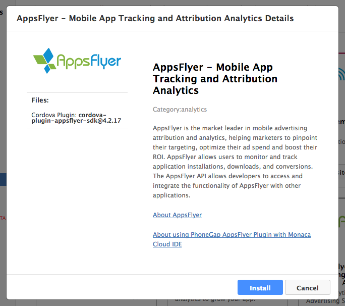
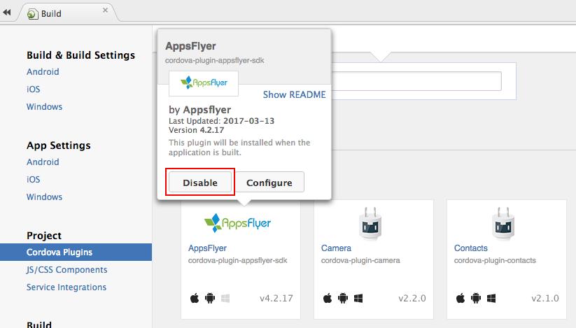

AppsFlyer
=========

<div class="admonition note">

Please note that the AppsFlyer is used differently depending on the
Cordova version of your project. Please refer to the document carefully.

</div>

[AppsFlyer](https://www.appsflyer.com/overview/) is the market leader in
mobile advertising attribution and analytics, helping marketers to
pinpoint their targeting, optimize their ad spend and boost their ROI
(Return on Investment).

AppsFlyer allows users to monitor and track application installations,
downloads, and conversions. The AppsFlyer API allows developers to
access and integrate the functionality of AppsFlyer with other
applications.

In this page, we cover the following topics:

-   pre\_appsflyer
-   add\_appsflyer
-   appsflyer\_cordova\_6\_higher
-   appsflyer\_cordova\_lower\_than\_6
-   remove\_appsflyer

Prerequisite
------------

In order to enable AppsFlyer to start tracking your app, you are
required to have the following two information such as:

1.  `devKey`: Your application devKey provided by AppsFlyer.
2.  `appId`: (For iOS only) Your iOS app ID in the App Store.

Adding AppsFlyer to Monaca Project
----------------------------------

1.  For Monaca Cloud IDE, go to Config --&gt; Service Integration or go
    to Build Settings --&gt; Service Integration for Monaca Localkit.
2.  Click Details button of AppsFlyer service.
3.  Then, click Install button to add it into your project.

> {width="600px"}

4.  You will be asked to confirm the setup. Click OK to start the
    installation.

Using AppsFlyer with Cordova Version 6 or Higher
------------------------------------------------

### Usage

Add the following lines to your code to initialize the tracking with
your own AppsFlyer devKey and appId:

> ``` {.sourceCode .javascript}
> document.addEventListener("deviceready", function(){
>
>     var options = {
>         devKey:  'xxXXXXXxXxXXXXxXXxxxx8'  // your AppsFlyer devKey
>     };
>
>     var userAgent = window.navigator.userAgent.toLowerCase();
>
>     if (/iphone|ipad|ipod/.test(userAgent)) {
>         options.appId = "123456789";       // your ios app id in app store
>     }
>
>     window.plugins.appsFlyer.initSdk(options);
>
> }, false);
> ```

### API Methods

#### initSdk()

Initialize the SDK.

initSdk(options, onSuccess, onError): void

Parameter

:   
      Name              Type                          Description
      ----------------- ----------------------------- ---------------------------------------------------------------------------------------------------
      `options`         Object                        SDK configuration (please refer to the `options` table below)
      `onSuccess`       (message: string) =&gt; void  Success callback: called after a successfull SDK initialization. (optional)
      `onError`         (message: string) =&gt; void  Error callback: called when error occurs during initialization. (optional)

Options

:   +------------------+----+----+----------------------------------------+
    | Name             | Ty | De | Description                            |
    |                  | pe | fa |                                        |
    |                  |    | ul |                                        |
    |                  |    | t  |                                        |
    +==================+====+====+========================================+
    | `devKey`         | St |    | [Appsflyer Dev                         |
    |                  | ri |    | key](https://support.appsflyer.com/hc/ |
    |                  | ng |    | en-us/articles/207032126-AppsFlyer-SDK |
    |                  |    |    | -Integration-Android#SDK_Initializatio |
    |                  |    |    | n_and_Installation_Event_(Minimum_Requ |
    |                  |    |    | irement_for_Tracking))                 |
    +------------------+----+----+----------------------------------------+
    | `appId`          | St |    | (For iOS only) [Your iOS app ID in the |
    |                  | ri |    | App                                    |
    |                  | ng |    | Store](https://support.appsflyer.com/h |
    |                  |    |    | c/en-us/articles/207032066-AppsFlyer-S |
    |                  |    |    | DK-Integration-iOS#SDK_Initialization_ |
    |                  |    |    | &_Installation_Event_(Minimum_Requirem |
    |                  |    |    | ent_for_Tracking))                     |
    +------------------+----+----+----------------------------------------+
    | `isDebug`        | Bo | fa | Debug mode (optional)                  |
    |                  | ol | ls |                                        |
    |                  | ea | e  |                                        |
    |                  | n  |    |                                        |
    +------------------+----+----+----------------------------------------+
    | `onInstallConver | Bo | fa | Accessing AppsFlyer                    |
    | sionDataListener | ol | ls | Attribution/Conversion Data from the   |
    | `                | ea | e  | SDK (Deferred Deeplinking). AppsFlyer  |
    |                  | n  |    | plugin will return attribution data in |
    |                  |    |    | onSuccess callback. For more           |
    |                  |    |    | information, please refer to:          |
    |                  |    |    |                                        |
    |                  |    |    | > -   [Deferred Deeplinking for        |
    |                  |    |    | >     Android](https://support.appsfly |
    |                  |    |    | er.com/hc/en-us/articles/207032176-Acc |
    |                  |    |    | essing-AppsFlyer-Attribution-Conversio |
    |                  |    |    | n-Data-from-the-SDK-Android-Deferred-D |
    |                  |    |    | eeplinking-)                           |
    |                  |    |    | > -   [Deferred Deeplinking for        |
    |                  |    |    | >     iOS](https://support.appsflyer.c |
    |                  |    |    | om/hc/en-us/articles/207032096-Accessi |
    |                  |    |    | ng-AppsFlyer-Attribution-Conversion-Da |
    |                  |    |    | ta-from-the-SDK-Deferred-Deeplinking-) |
    +------------------+----+----+----------------------------------------+

Example

:   The following snippet shows how to use `initSdk()` function:

    ``` {.sourceCode .javascript}
    var onSuccess = function(result) {
        //handle result
    };

    function onError(err) {
        // handle error
    }

    var options = {
       devKey:  'd3Ac9qPardVYZxfWmCspwL',
       appId: '123456789',
       isDebug: false,
       onInstallConversionDataListener: true
    };

    window.plugins.appsFlyer.initSdk(options, onSuccess, onError);
    ```

#### trackEvent()

Allow you to send in-app events to AppsFlyer analytics. This method
allows you to add events dynamically by adding them directly to the
application code. These in-app events help you track how loyal users
discover your app, and attribute them to specific
campaigns/media-sources. Please take the time to define the event(s) you
want to measure to allow you to track ROI (Return on Investment) and LTV
(Lifetime Value).

trackEvent(eventName, eventValues): void (optional)

Parameter

:   
      Name           Type                  Description
      -------------- --------------------- -------------------------------------------------------------------------------
      `eventName`    String                Custom event name, is presented in your dashboard.
      `eventValue`   Object                Event details

Example

:   The following snippet shows how to use `trackEvent()` function:

    ``` {.sourceCode .javascript}
    var eventName = "af_add_to_cart";

    var eventValues = {
        "af_content_id": "id123",
        "af_currency":"USD",
        "af_revenue": "2"
    };

    window.plugins.appsFlyer.trackEvent(eventName, eventValues);
    ```

#### setCurrencyCode()

Change the currency code.

setCurrencyCode(currencyId): void

Parameter

:   
      Name                                                                                                                                                 Type                                    Default                                 Description
      ---------------------------------------------------------------------------------------------------------------------------------------------------- --------------------------------------- --------------------------------------- ------------------------------------------------------------------------------------------------------------------------------------------------------------------------------------------------------------------------------------------------------------------------------------------------------------------------
      `currencyId`                                                                                                                                         String                                  `USD`                                   [ISO 4217 Currency Codes](http://www.xe.com/iso4217.php)

Example

:   The following snippet shows how to use `setCurrencyCode()` function:

    ``` {.sourceCode .javascript}
    window.plugins.appsFlyer.setCurrencyCode("USD");
    window.plugins.appsFlyer.setCurrencyCode("GBP"); // British Pound
    ```

#### setAppUserId()

Set your own custom ID. This enables you to cross-reference your own
unique ID with AppsFlyer’s user ID and the other devices’ IDs. This ID
is available in AppsFlyer CSV reports along with postbacks APIs for
cross-referencing with you internal IDs.

<div class="admonition note">

The ID must be set during the first launch of the app at the SDK
initialization. The best practice is to call this API during the
deviceready event, where possible.

</div>

setAppUserId(customerUserId): void

Parameter

:   
      Name               Type               Description
      ------------------ ------------------ ----------------------------------------------------------------------------------
      `customerUserId`   String             Your custom ID

Example

:   The following snippet shows how to use `setAppUserId()` function:

    ``` {.sourceCode .javascript}
    window.plugins.appsFlyer.setAppUserId(userId);
    ```

#### setGCMProjectID()

Set a GCM Project Number in order to enable app uninstall tracking for
Android platform.

setGCMProjectID(GCMProjectNumber): void

Parameter

:   
      Name                                                                                                                Type                                                                                            Description
      ------------------------------------------------------------------------------------------------------------------- ----------------------------------------------------------------------------------------------- ----------------------------------------------------------------------------------------------------------------------------------------------------------------------------------------------------------------------------------------------------------------------------------------------------------------------------------------------------------------------------------------------------------------------------------------------------------------------------------------------------------
      `GCMProjectNumber`                                                                                                  String                                                                                          GCM Project number. It is obtained through your google developer console. For more information, please refer to [Android Uninstall Tracking Guide](https://support.appsflyer.com/hc/en-us/articles/208004986-Android-Uninstall-Tracking).

#### registerUninstall()

Set your iOS device token in order to enable app uninstall tracking for
iOS platform.

registerUninstall(token): void

Parameter

:   
      Name                                                                                                Type                                                                                        Description
      --------------------------------------------------------------------------------------------------- ------------------------------------------------------------------------------------------- --------------------------------------------------------------------------------------------------------------------------------------------------------------------------------------------------------------------------------------------------------------------------------------------------------------------------------------------------------------------------------------------------------------------------------
      `token`                                                                                             String                                                                                      Your iOS device token. You can get your device token from `UnityEngine.iOS.NotificationServices.deviceToken`. For more information, please refer to [Unity](https://support.appsflyer.com/hc/en-us/articles/213766183-Unity) and [iOS Uninstall Tracking Guide](https://support.appsflyer.com/hc/en-us/articles/211211963-iOS-Uninstall-Tracking).

#### getAppsFlyerUID()

Get AppsFlyer’s proprietary Device ID. The AppsFlyer Device ID is the
main ID used by AppsFlyer in Reports and APIs.

getAppsFlyerUID(getUserIdCallbackFn): void

Parameter

:   
      Name                                Type                    Description
      ----------------------------------- ----------------------- ---------------------------------------------------------------------------------------------------------------------------------
      `getUserIdCallbackFn`               () =&gt; void           Success callback

Example

:   The following snippet shows how to use `getAppsFlyerUID()` function:

    ``` {.sourceCode .javascript}
    var getUserIdCallbackFn = function(id) {
        alert('received id is: ' + id);
    }
    window.plugins.appsFlyer.getAppsFlyerUID(getUserIdCallbackFn);
    ```

#### handleOpenUrl()

Track deeplinks with AppsFlyer attribution data (for iOS only).

<div class="admonition note">

For Android version 4.2.5 and higher, the deeplinking metadata
(scheme/host) is sent automatically.

</div>

handleOpenUrl(url): void

Parameter

:   
      Name                Type          Description
      ------------------- ------------- -------------------------------------------------------------------------
      `url`               String        Url

Example

:   The following snippet shows how to use `handleOpenUrl()` function:

    ``` {.sourceCode .javascript}
    var handleOpenURL = function(url) {
        window.plugins.appsFlyer.handleOpenUrl(url);
    }
    ```

Using AppsFlyer with Cordova Version Lower than 6
-------------------------------------------------

### Configure AppsFlyer in Monaca

After adding AppsFlyer to your Monaca project, you need to make some
configurations before starting to use the plugin. Please follow the
configuration below:

1.  Add the following xml to your config.xml in the root directory of
    your `www` folder:

> ``` {.sourceCode .xml}
> <!-- for iOS -->
> <feature name="AppsFlyerPlugin">
>     <param name="ios-package" value="AppsFlyerPlugin" />
> </feature>
> ```
>
> ``` {.sourceCode .xml}
> <!-- for Android -->
> <feature name="AppsFlyerPlugin">
>     <param name="android-package" value="com.appsflyer.cordova.plugin.AppsFlyerPlugin" />
> </feature>
> ```

2.  For Android, add the following xml to your AndroidManifest.xml:

> ``` {.sourceCode .xml}
> <uses-permission android:name="android.permission.INTERNET" />
> <uses-permission android:name="android.permission.ACCESS_NETWORK_STATE" />
> <uses-permission android:name="android.permission.READ_PHONE_STATE" />
> ```

3.  Add new app on AppsFlyer dashboard. Make sure that the value in the
    manifest and the value entered in the dashboard are identical. If
    you want to track installations for Android-Out-Of-Store
    Applications, please take a look
    [here](https://support.appsflyer.com/hc/en-us/articles/207447023-Tracking-Installs-for-Out-Of-Store-Applications).
4.  Add following lines to your code to initialize the tracking with
    your own AppsFlyer dev key:

> ``` {.sourceCode .javascript}
> document.addEventListener("deviceready", function(){
>     var args = [];
>     var devKey = "xxXXXXXxXxXXXXxXXxxxx8";   // your AppsFlyer devKey
>     args.push(devKey);
>     var userAgent = window.navigator.userAgent.toLowerCase();
>
>     if (/iphone|ipad|ipod/.test( userAgent )) {
>         var appId = "123456789";            // your ios app id in app store
>         args.push(appId);
>     }
>     window.plugins.appsFlyer.initSdk(args);
> }, false);
> ```

5.  Test your app for
    [Android](https://support.appsflyer.com/hc/en-us/articles/207032136-Testing-AppsFlyer-Android-SDK-Integration-Before-Submitting-to-Google-Play)/[iOS](https://support.appsflyer.com/hc/en-us/articles/207032046-Testing-AppsFlyer-iOS-SDK-Integration-Before-Submitting-to-the-App-Store-)
    before submitting to the Google Play/App Store.

<div class="admonition note">

For more information on how to use AppsFlyer, please refer to [AppsFlyer
Documentation](https://support.appsflyer.com/hc/en-us).

</div>

### Usage

Once, you have successfully configured AppsFlyer, the plugin is now
ready to be used. In this section, we will briefly describe some AppsFly
APIs.

#### Set Customer User ID (Advanced)

Setting your own custom ID will enable you to cross-reference your own
unique ID with AppsFlyer’s user ID and the other devices’ IDs. This ID
will be available at AppsFlyer CSV reports along with postbacks APIs for
cross-referencing with you internal IDs.

``` {.sourceCode .javascript}
window.plugins.appsFlyer.setAppUserId(userId);
```

<div class="admonition note">

The ID must be set during the first launch of the app at the SDK
initialization. The best practice is to call to this API during
deviceready event if possible.

</div>

#### Set Currency Code (Optional)

By default, the currency code is set to be `USD`. You can change it by
using the following API:

``` {.sourceCode .javascript}
//For example, you want to change to British Pound
window.plugins.appsFlyer.setCurrencyCode("GBP");
```

<div class="admonition note">

For all acceptable currency codes, please refer to [ISO 4217 Currency
Codes](http://www.xe.com/iso4217.php).

</div>

#### In-App Events Tracking API (optional)

In-app events help you track how loyal users discover your app, and
attribute them to specific campaigns/media-sources. Please take time to
define the event(s) you would like to measure to allow you to track ROI
(Return on Investment) and LTV (Lifetime Value).

The `trackEvent` method allows you to send in-app events to AppsFlyer
analytics. This method allows you to add events dynamically by adding
them directly to the application code.

``` {.sourceCode .javascript}
// eventName - any string to define the event name. For example: “registration” or “purchase”
// eventValue - the sales value. For example: 0.99 or 0.79
window.plugins.appsFlyer.sendTrackingWithEvent(eventName, eventValue);
// window.plugins.appsFlyer.sendTrackingWithEvent(eventName, "");
```

#### Rich In-App Events Tracking API (optional)

AppsFlyer’s rich in­-app events provide advertisers with the ability to
track any post­-install events and attribute them to a media source and
campaign. An in­-app event is comprised of an event name and event
parameters.

``` {.sourceCode .javascript}
var eventName = "af_add_to_cart";
var eventValues = {"af_content_id": "id123", "af_currency":"USD", "af_revenue": "2"};
window.plugins.appsFlyer.trackEvent(eventName, eventValues);
```

#### Get AppsFlyer’s Unique Device UID (Advanced)

This API is used to get AppsFlyer’s proprietary device ID. AppsFlyer
device ID is the main ID used by AppsFlyer in the Reports and APIs.

``` {.sourceCode .javascript}
// getUserIdCallbackFn - callback function
window.plugins.appsFlyer.getAppsFlyerUID(getUserIdCallbackFn);
```

Here is an example of how to use this API:

``` {.sourceCode .javascript}
var getUserIdCallbackFn = function(id) {
    alert('received id is: ' + id);
}
window.plugins.appsFlyer.getAppsFlyerUID(getUserIdCallbackFn);
```

#### Accessing AppsFlyer Attribution/Conversion Data from the SDK (Deferred Deep-linking)

AppsFlyer allows you to access the user attribution data in real time
directly at the SDK level. It enables you to customize the landing page
a user sees on the very first app open after a fresh app install. This
is commonly referred to as “deferred” deeplinking. This is very common
on the web, however there is a big challenge doing this in the mobile
app ecosystem. Luckily, AppsFlyer provides support for all cases and
platforms.

Read more on [Accessing AppsFlyer Attribution or Conversion Data from
the SDK for iOS and
Android](https://support.appsflyer.com/hc/en-us/articles/207032096-Accessing-AppsFlyer-Attribution-Conversion-Data-from-the-SDK-Deferred-Deeplinking-).

<div class="admonition note">

AppsFlyer plugin will fire `onInstallConversionDataLoaded` event with
attribution data. You must implement an event listener to receive the
data.

</div>

``` {.sourceCode .javascript}
document.addEventListener('onInstallConversionDataLoaded', function(e){
    var attributionData = (JSON.stringify(e.detail));
    alert(attributionData);
}, false);
```

Removing AppsFlyer from Monaca
------------------------------

1.  For Monaca Cloud IDE, go to Config --&gt; Manage Cordova Plugins or
    go to Build Settings --&gt; Cordova Plugins for Monaca Localkit.
2.  Under Enabled Plugins section, hover over AppsFlyer plugin and click
    Disable button.

> {width="700px"}
