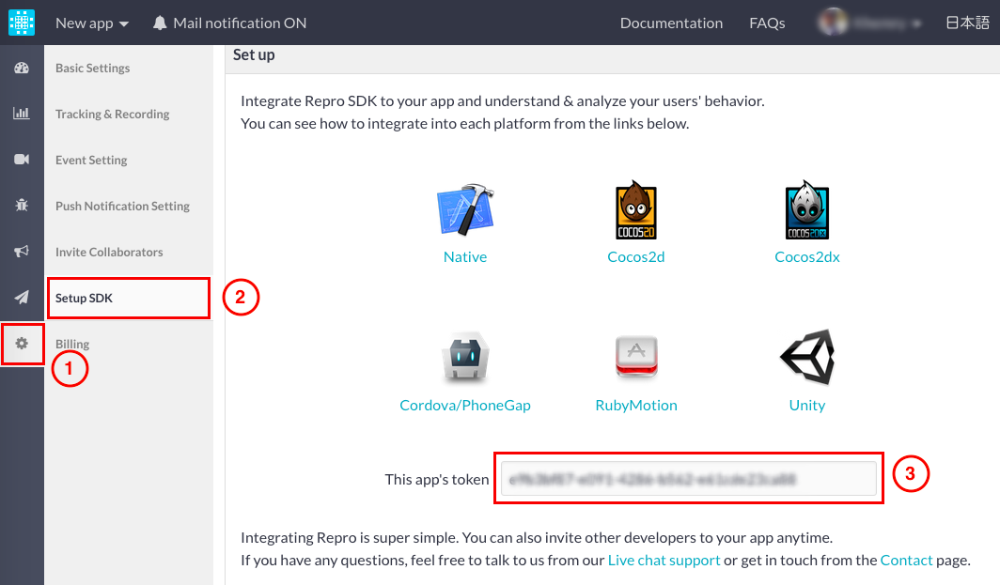

Repro (iOS only)
================

[Repro](https://repro.io/) is a service which provides the confirmation
of how a user handles an application by recording the user's actions.
Currently, it supports iOS only.

<div class="admonition note">

This Repro service integration is available for all Monaca users.
However, if you want to use the latest Repro plugin via
[Github](https://github.com/reproio/repro-ios-sdk), you can
import &lt;import\_cordova\_plugin&gt; it. In order to import this
plugin, you need to subscribe to a valid plan. Please refer to
[Pricing](https://monaca.io/pricing.html).

</div>

Adding Repro Service to Monaca
------------------------------

1.  For Monaca Cloud IDE, go to Config --&gt; Service Integration or go
    to Build Settings --&gt; Service Integration for Monaca Localkit.
2.  Click Details button of Repro service.
3.  Then, click Install button to add it into your project.

> {width="600px"}

4.  You will be asked to confirm the setup. Click OK to start the
    installation.

Configuring Repro Service in Monaca
-----------------------------------

You are required to have the app's token in order to use Repro. In order
to get the token, please do as follows:

1.  Register your app with Repro.
2.  Find the app's token by going to Settings --&gt; Setup SDK.

> {width="700px"}

3.  After you get the app's token, replace it in the following snippet
    of `onDeviceReady` function. Then, add this snippet to your project.

``` {.sourceCode .javascript}
document.addEventListener("deviceready",onDeviceReady,false);
function onDeviceReady() {
    Repro.setup("YOUR_APP_TOKEN");
    Repro.startRecording();
}
```

<div class="admonition note">

For more information on how to use Repro, please refer to [Repro
Documentation](http://docs.repro.io/en/).

</div>

Usage
-----

<div class="admonition note">

You need to run your application on a real device for Repro to record
your action.

</div>

1.  Build your Monaca app. Please refer to building\_monaca\_for\_ios.
2.  Install the built app on a real device.
3.  Start using your app for a few seconds, then press Home button.
    Then, the recorded video will be uploaded to Repro server after your
    app go to the background.

> {width="250px"}

4.  Repro will send you an email with a link to the recorded video.

Removing Repro Service from Monaca
----------------------------------

1.  For Monaca Cloud IDE, go to Config --&gt; Manage Cordova Plugins or
    go to Build Settings --&gt; Cordova Plugins for Monaca Localkit.
2.  Look for Repro plugin and click Disable button.

> {width="600px"}
