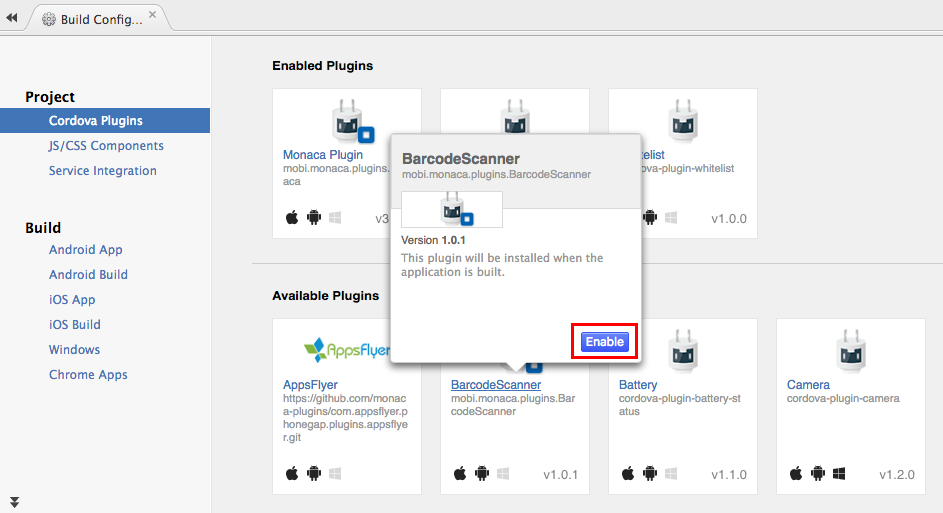

BarcodeScanner Plugin
=====================

<div class="admonition note">

BarcodeScanner Plugin (the built-in plugin on Monaca Cloud IDE) can't be
used with Android version 6 or higher and it may also not work with
Cordova 6.5 projects for iOS platform. In this case, please use [the
external PhoneGap Plugin
BarcodeScanner](https://github.com/phonegap/phonegap-plugin-barcodescanner).
In order to import this plugin, you need to subscribe to a valid plan.
Please refer to [Pricing page](https://monaca.io/pricing.html).

</div>

Enable Plugin in Monaca
-----------------------

1.  From the IDE menu, go to File --&gt; Manage Cordova Plugins or
    Config --&gt; Manage Cordova Plugins.
2.  Click Enable button of the BarcodeScanner to add it into your
    project.

> {width="700px"}

BarcodeScanner Demo
-------------------

Here is a simple example demonstrating how to use the BarcodeScanner
plugin with Monaca:

``` {.sourceCode .html}
<!DOCTYPE HTML>
<html>
<head>
    <title>Barcode Scanner DEMO</title>

    <meta charset="utf-8">
    <meta name="viewport" content="width=device-width, user-scalable=no">
    <script src="components/loader.js"></script>
    <link rel="stylesheet" href="components/loader.css">

    <script type="text/javascript">

    function scanBarcode() {
        window.plugins.barcodeScanner.scan( function(result) {
                alert("We got a barcode\n" +
                          "Result: " + result.text + "\n" +
                          "Format: " + result.format + "\n" +
                          "Cancelled: " + result.cancelled);
            }, function(error) {
                alert("Scanning failed: " + error);
            }
        );

    }
    </script>
</head>

<body>
    <hr> BarcodeReader DEMO <hr><br>
    <input type="button" onClick ="scanBarcode()" value ="Scan" />
</body>
</html>
```
