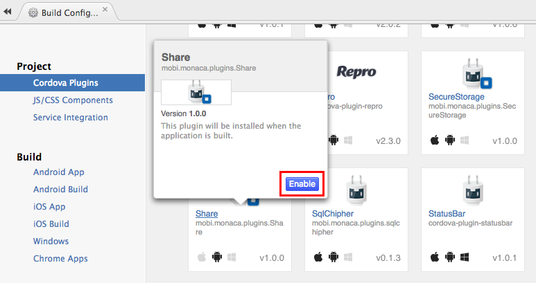

Share Plugin (Android)
======================

Share plugin lets an app to share data with other apps like Gmail,
DropBox, etc.

<div class="admonition note">

This plugin is available only to Android platform.

</div>

Enable Plugin in Monaca
-----------------------

1.  From the IDE menu, go to File --&gt; Manage Cordova Plugins or
    Config --&gt; Manage Cordova Plugins.
2.  Click Enable button of the Share to add it into your project.

> {width="700px"}

Methods
-------

  ------------------------------------------------------------------------
  Function Name Description
  ------------- ----------------------------------------------------------
  show(func)    Show a list of apps for user to choose and share the data
                when an app is selected.
  ------------------------------------------------------------------------

Share Plugin Demo
-----------------

``` {.sourceCode .html}
<!DOCTYPE HTML>
<html>

<head>
  <title>Cordova - Share Plugin Demo</title>

  <meta charset="utf-8">
  <meta name="viewport" content="width=device-width, user-scalable=no">
  <script src="components/loader.js"></script>
  <link rel="stylesheet" href="components/loader.css">

  <script type="text/javascript">

    function shareDemo() {
      window.plugins.share.show(
          {
              subject: 'Subject test',
              text: 'text http://phonegap-fan.com/'
          },
          function() {}, // Success function
          function() {alert('Share failed')} // Failure function
      );
    }
  </script>
</head>

<body bgcolor="#ffffff">
  <hr> Share Plugin Demo<hr><br>
  <input type="button" onClick ="shareDemo()" value ="shareDemo" />
</body>
</html>
```
