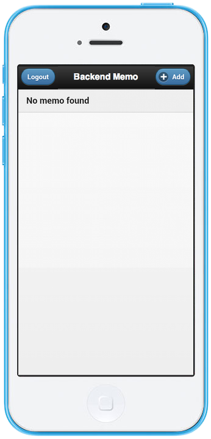

Backend Memo
============

This sample app allows user to create a memo app using Monaca Backend
API.

  *Tested Environment*                                       Android 7.0                       iOS 10.1.1
  ---------------------------------------------------------- --------------------------------- -------------------------------------------------------------------------------------------------------------------------------------------------------------------------------------------------------------------------------
                                                                                               
  .. raw:: html                                                                                
  &lt;div class="iframe-sample                               s"&gt;                            
  &lt;iframe src="<https://mon>                              aca.github.io/project-templa      tes/16-backend-memo/www/index.html" style="max-width: 150%;"&gt;&lt;/iframe&gt;
  &lt;/div&gt;                                                                                 
                                                                                               
  :download:\`Click here to dow                              nload the project &lt;download/   backend\_memo.zip&gt;\`
  Prerequisite                                                                                 
  \^\^\^\^\^\^\^\^\^\^\^\^\^\^\^\^\^\^\^\^\^\^\^\^\^\^\^\^                                     
  You need to set-up a new ba                                ckend and attach it to the p      roject. After creating a new project, please follow cloud\_ide\_adding\_backend for detailed instruction.
  After you have created a ne                                w backend, please create a n      ew `Memo` collection as follows:
  .. image:: images/backend\_m                               emo/memo\_collection.png          
  :width: 320px                                                                                
  .. note:: Please check :gui                                label:\`Allow JavaScript API      to insert data\`. Read and Write options must not be selected.
                                                                                               
  For more details on how to c                               reate Backend, please read :      ref:backend\_control\_panel.
                                                                                               
  .. note:: In order to access                               Backend API, you need to re       gister `cloud.monaca.mobi` in the whitelist by editing each OSs configuration file. For more details, please refer to Access Origin (Android) &lt;access\_origin\_android&gt; and Access Origin (iOS) &lt;access\_origin&gt;.
                                                                                               
  File Components                                                                              
  \^\^\^\^\^\^\^\^\^\^\^\^\^\^\^\^\^\^\^\^\^\^\^\^\^\^\^\^                                     
  .. image:: images/backend\_m                               emo/1.png                         
  :width: 210px                                                                                
  :align: center                                                                               
  ================== ========                                ============================      ======================================================================================================
  `index.html` The Sta                                       rtup page                         
  `js/app.js` JavaScr                                        ipt file handling the intera      ction of the application

Required JS/CSS Components
--------------------------

  `jQuerymobile`                                               
  ------------------------------------------------------------ ----------------------------------------------------------------------------------------------------------------------------------------------------------------------------------------------------------------------------------------------------------------------------------------------------------------------------------------------------------------------------------------------------------------------------------------------------------------------------------------------------------------------------------------------------------------------------------------------------------------------------
                                                               
  HTML Explanation                                             
  \^\^\^\^\^\^\^\^\^\^\^\^\^\^\^\^\^\^\^\^\^\^                 
  For the User Interface of th                                 is sample app, we use jQuery Mobile. In jQuery Mobile, multiple pages can be integrated to a single HTML file. In this app, for example, both login screen and register screen are defined within index.html. Specifically, pages are expressed by `div` tags in which the `data-role` attribute is set to `page`. The role of the tags is expressed by the `data-role` attribute in this manner. For example, `data-role` can also specify as `header`, `content` , or `listview`. For more information on jQuery Mobile tags and components, please refer to [jQuery Mobile Demo](http://jquerymobile.com/demos/1.2.0/).
  The following contents of th                                 e HTML body:
  ::                                                           
  &lt;body&gt;                                                 
  &lt;!-- Login Page --&gt;                                    
  &lt;div data-role="page" id=                                 "LoginPage"&gt;
  &lt;header data-role="head                                   er" data-position="fixed"&gt;
  &lt;h1&gt;Monaca Memo&lt;/h1&gt;                             
  &lt;/header&gt;                                              
  &lt;section data-role="c                                     ontent"&gt;
  &lt;h1&gt;Sign in&lt;/h1&gt;                                 
  Email:                                                       
  &lt;input type="text"                                        id="login\_email"&gt;
  Password:                                                    
  &lt;input type="passwo                                       rd" id="login\_password"&gt;
  New to Monaca Memo?                                          
  &lt;a href="\#RegisterP                                      age" data-role="button" data-mini="true" data-inline="true" data-theme="b"&gt;Register&lt;/a&gt;
  &lt;a href="\#" id="Log                                      inBtn" data-role="button" data-inline="false" data-theme="b"&gt;Login&lt;/a&gt;
  &lt;/section&gt;                                             
  &lt;/div&gt;                                                 
  ...                                                          
  &lt;/body&gt;                                                
  is corresponding to this scr                                 eenshot which allows a user to login to Monaca Memo app if the user has already registered with the app:
  .. figure:: images/backend\_m                                emo/login.png
  :width: 250px                                                
  :align: center                                               
                                                               
  The following contents of th                                 e HTML body:
  ::                                                           
  ...                                                          
  &lt;!-- Register Page --&gt;                                 
  &lt;div data-role="page" id="R                               egisterPage"&gt;
  &lt;header data-role="header                                 " data-position="fixed"&gt;
  &lt;h1&gt;Monaca Memo&lt;/h1&gt;                             
  &lt;/header&gt;                                              
  &lt;section data-role="con                                   tent"&gt;
  &lt;h1&gt;Sign up&lt;/h1&gt;                                 
  Email:                                                       
  &lt;input type="text" id                                     ="reg\_email"&gt;
  Password:                                                    
  &lt;input type="password                                     " id="reg\_password"&gt;
  &lt;a href="\#" id="Regis                                    terBtn" data-role="button" data-inline="false" data-theme="b"&gt;Register&lt;/a&gt;
  &lt;/section&gt;                                             
  &lt;/div&gt;                                                 
  ...                                                          
  is corresponding to this scr                                 eenshot which allows a new user to register with the Monaca Memo app:
  .. figure:: images/backend\_m                                emo/signup.png
  :width: 250px                                                
  :align: center                                               
  Likewise, there are several                                  other pages defined in this HTML. Here are the screenshots of those pages.
  .. figure:: images/backend                                   \_memo/list\_memo.png
  :width: 180px                                                
  :align: left                                                 
  List Page                                                    
  .. figure:: images/backend                                   \_memo/confirm\_logout.png
  :width: 180px                                                
  :align: left                                                 
  Confirm Logout Message                                       
  .. figure:: images/backend                                   \_memo/confirm\_delete.png
  :width: 180px                                                
  :align: left                                                 
  Confirm Delete Message                                       
  .. rst-class:: clear                                         
  .. figure:: images/backend                                   \_memo/add\_memo.png
  :width: 180px                                                
  :align: left                                                 
  Add Page                                                     
  .. figure:: images/backend                                   \_memo/add\_success.png
  :width: 180px                                                
  :align: left                                                 
  Successful Adding Messa                                      ge
                                                               
  .. figure:: images/backend                                   \_memo/view\_memo.png
  :width: 180px                                                
  :align: left                                                 
  View Memo                                                    
                                                               
  .. figure:: images/backend                                   \_memo/edit\_memo.png
  :width: 180px                                                
  :align: left                                                 
  Edit Page                                                    
  .. figure:: images/backend                                   \_memo/update\_success.png
  :width: 180px                                                
  :align: left                                                 
  Successful Updating Mes                                      sage
  .. rst-class:: clear                                         
                                                               
  JavaScript Explanation                                       
  \^\^\^\^\^\^\^\^\^\^\^\^\^\^\^\^\^\^\^\^\^\^\^\^\^\^\^\^\^   \^\^\^\^\^\^\^\^\^\^\^\^\^\^\^\^\^\^\^\^\^\^\^\^\^\^\^\^\^\^\^\^\^\^\^\^\^\^\^\^\^\^\^\^\^\^\^\^\^\^
  There are 7 main functionali                                 ties in the JavaScript code of this app which are *Login*, *Logout*, *Register*, *Adding Memo*, *Editing Memo*, *Deleting Memo* and *Viewing Memo* functions.
  Register a New User                                          

`onRegisterBtn()` is called when a user clicks on Register button in the
*Register Page*. Then, both `email` and `password` from the input boxes
are captured and used to call `monaca.cloud.User.register()` function.
This function is used to register a new user to Monaca Backend. If the
registration is successful, the user will be automatically logged-in.
Below is the JavaScript code to register a user:

``` {.sourceCode .javascript}
function onRegisterBtn()
{
  var email = $("#reg_email").val();
  var password = $("#reg_password").val();

  MC.User.register(email, password)
    .done(function()
    {
      console.log('Registration is success!');
    })
    .fail(function(err)
    {
      console.log(err.text);
      console.log('Registration failed!');
    });
}
```

### Login a User and Get Collection Data

`onLoginBtn()` is called when a user clicks on Login button. In this
function, a Monaca Backend API called `monaca.cloud.User.login()` is
used to login an existing user. If the user is found in the Monaca
Backend, the user is redirected to the list page which displays a list
of memo of the currently logged-in user by calling `getMemoList()`
function. Inside `getMemoList()` function, a list of memo of currently
logged-in users is retrieved by using
`monaca.cloud.Collection().findMine()` function. In this example, we
assume that you have already created a collection named `Memo`. The memo
is then dynamically added into the `TopListView` in the list page. Below
is the JavaScript code of the these functions:

``` {.sourceCode .javascript}
function onLoginBtn()
{
  var email = $("#login_email").val();
  var password = $("#login_password").val();

  MC.User.login(email, password)
    .done(function()
    {
      console.log('Login is success!');
      getMemoList();
      $.mobile.change('#ListPage');
    })
    .fail(function(err)
    {
      console.log(err.message);
      alert('Login failed!');
    });
}

function getMemoList()
{
  console.log('Refresh List');
  var memo = MC.Collection("Memo");
  memo.findMine()
    .done(function(items, totalItems)
    {
      $("#ListPage #TopListView").empty();
      var list = items.items;

      for (var i in list)
      {
        var memo = list[i];
        var d = new Date(memo._createdAt);
        var date = d.getFullYear() + "/" + (d.getMonth() + 1) + "/" + d.getDate();
        $li = $("<li><a href='javascript:onShowLink(\"" + memo._id + "\",\"" + memo.title + "\",\"" + memo.content + "\")' class='show'><h3></h3><p></p></a><a href='javascript:onDeleteBtn(\"" + memo._id + "\")' class='delete'>Delete</a></li>");
        $li.find("h3").text(date);
        $li.find("p").text(memo.title);
        $("#TopListView").prepend($li);
      }
      if (list.length == 0) {
        $li = $("<li>No memo found</li>");
        $("#TopListView").prepend($li);
      }
      $("#ListPage #TopListView").listview("refresh");
    })
  .fail(function(err){ alert('failed to find the collection' + err.text); return null; });
}
```

As a result, the list page like the one below will be displayed:

{width="250px"}

### Logout a User

`monaca.cloud.User.logout()` function is used to logout the currently
logged-in user. If the user is successfully logged out, the user will be
redirected to the login page.

``` {.sourceCode .javascript}
function onLogoutBtn()
{
  MC.User.logout()
    .done(function()
    {
      console.log('Logout is success!');
      $.mobile.changePage('#LoginPage');
    })
    .fail(function(err)
    {
      console.log(err.message);
      alert('Logout failed!');
    });
}
```

### Adding a Memo

`onSaveBtn()` is called when a user clicks on Save button in the add
page. Then, both `title` and `content` of a new memo from the input
boxes are captured and handed over to `addMemo()` function.

In this function, a Monaca Backend API of a collection called
`monaca.cloud.Collection().insert()` is used to insert a new item into
`Memo` collection.

``` {.sourceCode .javascript}
function onSaveBtn()
{
  var title = $("#title").val();
  var content = $("#content").val();
  if (title != '')
  {
    addMemo(title,content);
  }
}

function addMemo(title,content) {
  var memo = MC.Collection("Memo");

  memo.insert({ title: title, content: content})
  .done(function(insertedItem)
  {
    console.log('Insert is success!');
    $("#title").val("");
    $("#content").val("");
    //display a dialog stating that the inserting is success
    $( "#okDialog_add" ).popup("open", {positionTo: "origin"}).click(function(event)
    {
      event.stopPropagation();
      event.preventDefault();
      getMemoList();
      $.mobile.changePage('#ListPage');
    });
  })
  .fail(function(err){ console.log('Insert failed!');})
}
```

### Updating a Memo

When you update a memo, `monaca.cloud.Collection().findMine()` function
is used to find the memo to update. In this case, we already know the
`_id` property of the collection item. Then, we call
`monaca.cloud.collectionItem.update()` function to update this item in
`Memo` collection.

``` {.sourceCode .javascript}
function onEditBtn()
{
  var title = $("#title_show").text();
  var content = $("#content_show").text();
  $("#title_edit").val(title);
  $("#content_edit").text(content);
  $.mobile.changePage("#EditPage");
}

function onUpdateBtn()
{
  var new_title = $("#title_edit").val();
  var new_content = $("#content_edit").val();
  var id = currentMemoID;
  if (new_title != '') {
    editMemo(id, new_title, new_content);
  }
}

function editMemo(id, new_title, new_content){
  var memo = MC.Collection("Memo");
  memo.findMine(MC.Criteria("_id==?", [id]))
    .done(function(items, totalItems)
    {
      items.items[0].title = new_title;
      items.items[0].content = new_content;
      items.items[0].update()
        .done(function(updatedItem)
        {
          console.log('Updating is success!');
          //display a dialog stating that the updating is success
          $( "#okDialog_edit" ).popup("open", {positionTo: "origin"}).click(function(event)
          {
            event.stopPropagation();
            event.preventDefault();
            getMemoList();
            location.href='#ListPage';
          });
        })
        .fail(function(err){ console.log(JSON.stringify(err)); return null; });
    })
    .fail(function(err){ console.log(JSON.stringify(err)); return null; });
}
```

### Deleting a Memo

Similar to updating a memo, the app calls
`monaca.cloud.Collection().findMine()` function to get the collection
item. Then, call `monaca.cloud.collectionItem.delete()` function to
delete the memo.

``` {.sourceCode .javascript}
function onDeleteBtn(id)
{
  currentMemoID = id;
  $( "#yesNoDialog_delete" ).popup("open", {positionTo: "origin"})
}

function deleteMemo()
{
  var memo = MC.Collection("Memo");
  memo.findMine(MC.Criteria("_id==?", [currentMemoID]))
    .done(function(items, totalItems)
    {
      items.items[0].delete();
      console.log('The memo is deleted!');
      getMemoList();
      $.mobile.changePage("#ListPage");
    })
    .fail(function(err){ console.log(JSON.stringify(err)); return null; });
}
```
